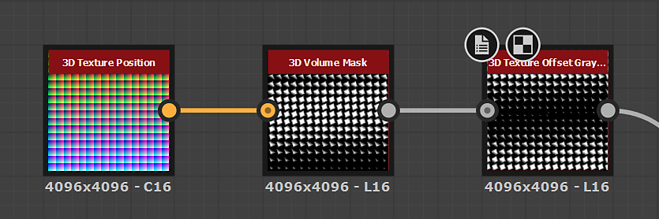

# 3Dテクスチャオフセット

<table>
<tr style="border: 0;">
<td width="33.33%" style="border: 0;" valign="top">

<table>
<tr style="border: 0;">
<td style="border: 0;" valign="top">

{width="200px"}

</td>
<td style="border: 0;" valign="top">

{width="200px"}

</td>
</tr>
</table>

<b>イン：</b>フィルター/変換

</td>
<td width="100.00%" style="border: 0;" valign="top">

## 説明

**3Dテクスチャオフセット**&#x200B;ノードは、**入力**&#x200B;に接続された&#x200B;*3Dテクスチャ*&#x200B;によって記述されるオブジェクトの&#x200B;**X**、**Y**&#x200B;および&#x200B;**Z**&#x200B;軸の&#x200B;*オフセット変換*&#x200B;を適用します。

</td>
</tr>
</table>

## 入力

|  |  |
|:---|:---|
| <b>入力</b> <i>グレースケール/カラー</i> | 3Dオブジェクトを表す<i>3Dテクスチャ</i>。 オブジェクトは通常、<i>単位キューブ</i>で記述されます。 |

## パラメーター

|  |  |
|:---|:---|
| <b>オフセット</b> <i>浮動小数点3</i> | <b>入力</b>に接続された<i>3Dテクスチャ</i>によって記述されたオブジェクトに適用された<i>ワールド空間</i>のオフセットの量です。 |

## 例

<table style="margin-top: 32px; margin-bottom: 32px">
    <tr style="border: 0">
        <td style="border: 0; background: transparent">
            
        </td>
        <td style="border: 0; background: transparent">
            
        </td>
    </tr>
</table>
