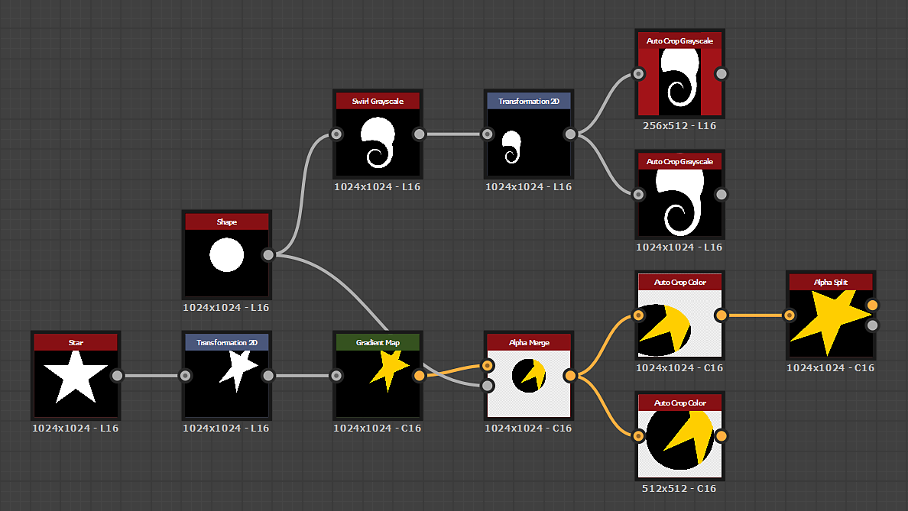

# 自動切り抜き

<table>
<tr style="border: 0;">
<td width="33.33%" style="border: 0;" valign="top">

<table>
<tr style="border: 0;">
<td style="border: 0;" valign="top">

{width="200px"}

</td>
<td style="border: 0;" valign="top">

{width="200px"}

</td>
</tr>
</table>

<b>イン：</b>フィルター/変形

</td>
<td width="100.00%" style="border: 0;" valign="top">

## 説明

**自動切り抜き**&#x200B;ノードは、コンテンツがサイズ変更されずに画像の&#x200B;*中央*&#x200B;に配置されるか、または画像の範囲&#x200B;*に合わせて*&#x200B;サイズが変更されるように、**入力**&#x200B;を調整します。

画像の内容は、**X**&#x200B;および&#x200B;**Y**&#x200B;の&#x200B;*最初と最後のピクセル*&#x200B;に適合するボックスで定義され、その値は0 *より*&#x200B;高い（つまり黒以外）値です。 **カラー**&#x200B;のバージョンでは、ボックスを定義するRGBとアルファチャンネルを選択できます。

</td>
</tr>
</table>

## パラメーター

|  |  |
|:---|:---|
| <b>モード</b> <i>整数</i> | 適用する切り抜き方法を設定します。  - <i>正方形の切り抜き</i>：画像を切り抜いて、シェイプが完全に含まれる最小<i>正方形</i>画像の中心になるようにします。 - <i>自動の切り抜き</i>：画像を完全に含まれる最小<i>正方形または非正方形</i>画像の中心になるようにします。 - <i>全体像</i> <i>縦横比</i> （幅と長さの比率） - <i>塗りつぶし(伸縮)</i>：画像は、画像の<i>フルスパン</i>にサイズ変更されます</i><i> |
| <b>アルファを使用</b> <i>ブール値</i> | <b>入力</b>のアルファチャンネルを使用して、切り抜く画像のコンテンツの<i>境界</i>を指定します。 <i>False</i>に設定すると、代わりに黒のピクセルが使用されます。  <i>注意：</i>このパラメーターは、ノードの<b>Color</b>バージョンでのみ使用できます。 |
| <b>フィルターモード</b> <i>整数</i> | ピクセル間の<i>補間</i>が  - <i>最も近い</i>：正確に<i>同じ</i>値（高速） - <i>バイリニア</i>: <i>より滑らかな</i>外観 - <i>自動</i>：切り抜き用に選択した<b>モード</b>に応じて、上の2つのモードのうち最も適切なモードを使用します |

## 例

<table style="margin-top: 32px; margin-bottom: 32px">
    <tr style="border: 0">
        <td style="border: 0; background: transparent">
            
        </td>
        <td style="border: 0; background: transparent">
            
        </td>
        <td style="border: 0; background: transparent">
            
        </td>
        <td style="border: 0; background: transparent">
            
        </td>
        <td style="border: 0; background: transparent">
            
        </td>
        <td style="border: 0; background: transparent">
            
        </td>
    </tr>
</table>
