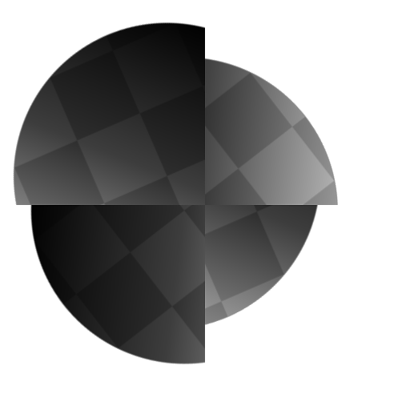
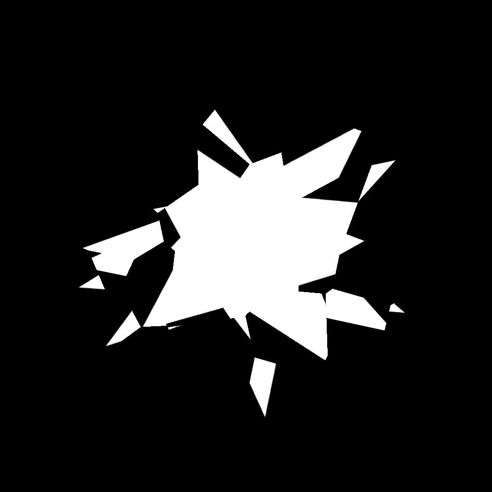

# 不均等な回転

<table>
<tr style="border: 0;">
<td width="41.60%" style="border: 0;" valign="top">

<table>
<tr style="border: 0;">
<td style="border: 0;" valign="top">

{width="200px"}

</td>
<td style="border: 0;" valign="top">

{width="200px"}

</td>
</tr>
</table>

**イン：**&#x200B;フィルター*/変形*

**中級**

</td>
<td width="58.30%" style="border: 0;" valign="top">

## 説明

**Non-Uniform Rotation**&#x200B;ノードは、**回転マップ**&#x200B;入力を使用して&#x200B;**入力**&#x200B;を回転します。

画像の値は、*ターン数*&#x200B;を表します。 **ピボットの位置**&#x200B;の値または&#x200B;**ピボットの位置マップ**&#x200B;の入力で指定された場所を基準にして回転が行われます。\
**回転マップ**&#x200B;の正の値を入力すると、*時計回り*&#x200B;に回転します。

</td>
</tr>
</table>

## パラメーター

### 入力

* **入力** *グレースケール/カラー*\
  回転する入力グレースケールイメージ。
* **回転マップ** *グレースケール*&#x200B;ローテーションの量を&#x200B;*ターン数*&#x200B;で制御するために使用されるマップです。 サンプリングされた値は、**回転角度乗数**&#x200B;に対して乗算されます。 負の値を指定すると、*反時計回り*&#x200B;に回転します。
* **回転ピボットの位置マップ** *色*\
  回転&#x200B;*ピボット*&#x200B;の位置を指定するために使用される画像です。 **X/Y**&#x200B;位置は、画像の&#x200B;**R/G**&#x200B;チャネルにマップされます。

### パラメーター

* **回転角度乗数** *浮動小数*\
  **回転マップ**&#x200B;入力の強さを調整します。
* **回転角度のオフセット** *浮動小数*\
  指定した追加回転量を適用します。
* **ピボットの位置マップを使用** *ブーリアン*\
  *ビットマップ入力*&#x200B;を使用して、回転ピボットの位置を指定します。 **X/Y**&#x200B;位置は、**位置マップ**&#x200B;入力の&#x200B;**R/G**&#x200B;チャネルにマップされます。
* **ピボットの位置** *浮動小数2*\
  画像を回転するピボットの位置。
* **背景色** *浮動小数/浮動小数4*\
  タイリングが&#x200B;**高さと高さのタイリング**&#x200B;に設定されていない場合に、画像の境界の&#x200B;*外側*&#x200B;に表示される背景色です。
* **フィルターリングモード** *整数*\
  ピクセル間の&#x200B;*補間*&#x200B;でサンプリングされた結果を処理する方法を定義します。
  * *最も近い*: *同じ*&#x200B;値を正確にサンプリングします（高速）
  * *バイリニア*：結果にバイリニアのフィルターを適用して、*より滑らかな*&#x200B;外観にします

## サンプル画像

<table>
<tr style="border: 0;">
<td style="border: 0;" valign="top">

{width="768px"}

</td>
<td style="border: 0;" valign="top">

{width="256px"}

</td>
<td style="border: 0;" valign="top">

{width="256px"}

</td>
</tr>
</table>
