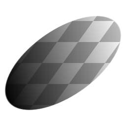

# ゆがみ

<table>
<tr style="border: 0;">
<td style="border: 0;" valign="top">

{width="128px"}

{width="128px"}

## ゆがみ（グレースケール）

**場所：** *フィルター/変換*

**単純**

</td>
<td style="border: 0;" valign="top">

## 説明

入力画像を歪ませます。

## パラメーター

* **軸**: *水平、垂直*&#x200B;垂直方向または水平方向のゆがみを選択します。
* **量**: *-1.0 - 1.0*&#x200B;ゆがみの量。
* **整列**: *中央、左上、右下*&#x200B;ゆがみ変形の原点を設定します。

## サンプル画像

</td>
</tr>
</table>
