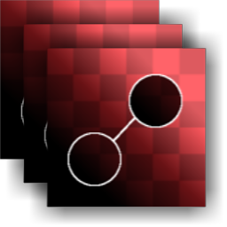

# マルチクローンパッチ

<table>
<tr style="border: 0;">
<td style="border: 0;" valign="top">

{width="128px"}

{width="128px"}

## マルチクローンパッチ（グレースケール）

**イン：** *マテリアルフィルター/スキャン処理*

**複合**

</td>
<td style="border: 0;" valign="top">

## 説明

このノードは、[クローンパッチ](../../../../../../compositing-graphs/nodes-reference-for-com/node-library/material-filters/scan-processing/clone-patch/clone-patch.md)の複数入力バージョンです。 最大8個の入力をリンクし、これらすべての入力に対してまったく同じクローン・パッチ操作を実行します。 主に、マルチアングルの写真での使用が意図されています。この写真を[マルチアングルからアルベド](../../../../../../compositing-graphs/nodes-reference-for-com/node-library/material-filters/scan-processing/multi-angle-to-albedo/multi-angle-to-albedo.md)または[マルチアングルから標準](../../../../../../compositing-graphs/nodes-reference-for-com/node-library/material-filters/scan-processing/multi-angle-to-normal/multi-angle-to-normal.md)と組み合わせます。

>[!NOTE]
>
> 詳細については、[コピーパッチ](../../../../../../compositing-graphs/nodes-reference-for-com/node-library/material-filters/scan-processing/clone-patch/clone-patch.md)を参照してください。マテリアルバージョンについては、[マテリアルコピーパッチ](../../../../../../compositing-graphs/nodes-reference-for-com/node-library/material-filters/scan-processing/material-clone-patch/material-clone-patch.md)を参照してください。

## パラメーター

### パラメーター

* **入力数**: *1 ～ 8*&#x200B;同じパッチ操作を受け取る入力の量を設定します。
* **標準（色のみ）**: **False/True**&#x200B;入力が標準マップであるかどうか、および描画を標準マップとして扱うかどうかを設定します。
* **シェイプ**: **正方形、ディスク**&#x200B;スタンプのシェイプを設定します。 ベースとしてのみ使用されます。
* **エッジ**
  * **しきい値**: *0.0 ～ 1.0*&#x200B;ブレンドした領域が到達する範囲を設定します。 この効果は、ターゲット領域のシェイプに沿ってステップ状に大きくなります。背景が均一の場合、ほとんど効果がありません*。*
  * **ぼかし**: *0.0 ～ 2.0*&#x200B;より緩やかな変化が必要な場合に備えて、スタンプ領域のエッジをぼかします。
  * **Smoothness**: *0.0 ～ 2.0*&#x200B;印鑑の形状のエッジを丸めて、アウトラインの流れを滑らかにします。
  * **グリッド解像度**: *1 - 11*&#x200B;ブレンド分析の品質解像度を設定します。 値が大きいほど、ブレンドの精度は高くなります。
* **変換**
  * **ソースマトリックス**: *（変換マトリックス）*ソースを変換します（スケールと回転）。 カンバス上では実行できません。これらのパラメーターのみを変更してください。
  * **ソースオフセット**: *-0.5 - 0.5*&#x200B;ソースの場所を変換します。 カンバス上では実行できません。これらのパラメーターのみを変更してください。 *このパラメーターは、変更するメインのパラメーターである可能性があります。*
  * **ターゲット行列**: *（変換行列）*ターゲットの位置を変換します（スケールと回転）。 カンバス上のギズモを使用しても実行できます。
  * **ターゲットオフセット**: *-0.5 - 0.5*&#x200B;ターゲットの場所を変換します。 カンバス上のギズモを使用しても実行できます。

## サンプル画像

|  |
| --- |
| このページに添付された画像はありません。 |

</td>
</tr>
</table>
