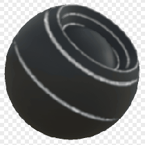

# エッジぼかし

<table>
<tr style="border: 0;">
<td style="border: 0;" valign="top">

{width="128px"}

## エッジぼかし

**イン：** *メッシュベースのジェネレーター**/マスクジェネレーター*

**単純**

</td>
<td style="border: 0;" valign="top">

## 説明

ベイク済みマップとユーザー設定に基づいて白黒マスクを生成します。 [Painter](https://support.allegorithmic.com/documentation/display/SPDOC/Substance+Painter)の[スマートマスク](https://support.allegorithmic.com/documentation/display/SPDOC/Smart+Materials+and+Masks)に似ています。

このマスクは、ベイク処理された曲率マップに基づいてエッジをハイライトします。 これは、非常に単純なマスクジェネレータの1つです。

## パラメーター

### 入力

* **曲率**: *グレースケール入力*\
  効果の基になるベイク済みマップです。
* **マスク（オプション）**: *グレースケール入力*\
  ノードのエフェクトのマスクに使用するマスクスロット。

### パラメーター

* **レベル**: *0.0 ～ 1.0*\
  エッジのハイライトの度合いを設定します。
* **コントラスト**: *0.0 ～ 1.0*\
  結果のコントラストを調整します。
* **ぼかしの半径**: *0.0 ～ 8.0*&#x200B;ハイライトされたエッジのぼかしの量を設定します。

## サンプル画像

</td>
</tr>
</table>
