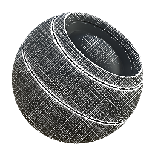

# 繊維ガラスEdge Wear

<table>
<tr style="border: 0;">
<td style="border: 0;" valign="top">

{width="128px"}

## 繊維ガラスEdge Wear

**イン：** *メッシュベースのジェネレーター**/マスクジェネレーター*

**中級**

</td>
<td style="border: 0;" valign="top">

## 説明

ベイク済みマップとユーザー設定に基づいて白黒マスクを生成します。 [Painter](https://support.allegorithmic.com/documentation/display/SPDOC/Substance+Painter)の[スマートマスク](https://support.allegorithmic.com/documentation/display/SPDOC/Smart+Materials+and+Masks)に似ています。

グラスファイバーのタイプの摩耗を特に意図したマスクを表し、おそらく布に使用することができます。 繊維はタイル状で繰り返し使用されるため、必要に応じてトリプレーナ混合を有効にすることができます。

## パラメーター

### 入力

* **曲率**: *グレースケール入力*\
  エッジのハイライトに使用するベイク済みマップ。 必須！
* **環境オクルージョン**: *グレースケール入力*\
  閉塞領域のマスクに使用するベイク済みマップ。 必須ではありませんが、間違いなくお勧めします。
* **経年劣化入力**: *グレースケール入力*\
  ファイバパターンをオーバーライドするオプションのカスタムスロット。
* **マスク（オプション）**: *グレースケール入力*\
  ノードのエフェクトのマスクに使用するマスクスロット。
* **ワールドスペース標準**: *カラー入力*\
  Triplanarにのみ使用されます。
* **位置**: *カラー入力*\
  Triplanarにのみ使用されます。

### パラメーター

* **磨耗のレベル**: *0.0 ～ 1.0*[ヒストグラムスキャン](../../../../../../compositing-graphs/nodes-reference-for-com/node-library/filters/adjustments/histogram-scan/histogram-scan.md)と同様に、磨耗を徐々に明らかにします。
* **磨耗のコントラスト**: *0.0 ～ 1.0*&#x200B;効果の全体的なコントラストを設定します。
* **エッジのSmoothness**: *0.0 ～ 16.0*&#x200B;ハイライトされたエッジから裁ち落としとブラーを設定します。
* **経年劣化量**: *0.0 ～ 1.0*&#x200B;エッジ間でブレンドするファイバー効果の量を設定します。 これをWear Levelと一緒に調整して、最大限に制御します。
* **アンビエントオクルージョンのマスク**: *0.0 ～ 1.0* AOが効果を隠す影響度を設定します。
* **曲率の重み**: *0.0 ～ 1.0*&#x200B;曲率による凸状エッジの影響量を設定します。
* **カスタム経年劣化を使用**: *False/True*&#x200B;組み込みのファイバーをカスタムマップで上書きします。
* **三平面を使用**: *偽/真*[三平面を有効にして](../../../../../../compositing-graphs/nodes-reference-for-com/node-library/mesh-based-generators/utilities-mesh-based-gen/tri-planar/tri-planar.md)縫い目を隠します。
* **三平面のブレンドコントラスト**: *0.0 ～ 1.0*&#x200B;三平面効果のコントラストを制御します。

## サンプル画像

</td>
</tr>
</table>
