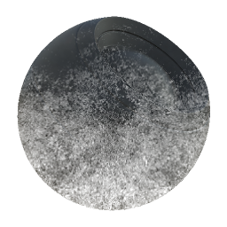

# 地面Dirt

<table>
<tr style="border: 0;">
<td width="33.33%" style="border: 0;" valign="top">

{width="128px"}

<b>In:</b> メッシュベースのジェネレーター> マスクジェネレーター

</td>
<td width="100.00%" style="border: 0;" valign="top">

## 説明

ベイク済みマップとユーザー設定に基づいて白黒マスクを生成します。 [Painter](https://support.allegorithmic.com/documentation/display/SPDOC/Substance+Painter)の[スマートマスク](https://support.allegorithmic.com/documentation/display/SPDOC/Smart+Materials+and+Masks)に似ています。

このマスクは、[下から上へ](../../../../../../compositing-graphs/nodes-reference-for-com/node-library/mesh-based-generators/mask-generators/bottom-to-top/bottom-to-top.md)または[Dirt](../../../../../../compositing-graphs/nodes-reference-for-com/node-library/mesh-based-generators/mask-generators/dust/dust.md)の反対に、最初から積み上げられたDustを表します。 カスタムマップは上書きされません。

</td>
</tr>
</table>

## 入力

|  |  |
|:---|:---|
| <b>位置</b> <i>グレースケール入力</i> | 効果のベースにするベイクした位置マップ。 必須！ |
| <b>マスク（オプション）</b> <i>グレースケール入力</i> | ノードのエフェクトのマスクに使用するマスクスロット。 |

## パラメーター

|  |  |
|:---|:---|
| <b>レベル</b> <i>0.0 - 1.0</i> | Dirtの全体的な外観レベルを設定します。 |
| <b>コントラスト</b> <i>0.0 - 1.0</i> | 結果のコントラストを調整します。 |
| <b>Height</b> <i>0.0 - 1.0</i> | Dirtを表示するHeight（縦横比固定）を設定します。 |

## 例

<table style="margin-top: 32px; margin-bottom: 32px">
    <tr style="border: 0">
        <td style="border: 0; background: transparent">
            
        </td>
    </tr>
</table>
