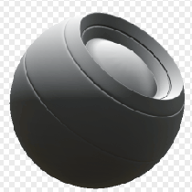

# サンブリーチ

<table>
<tr style="border: 0;">
<td style="border: 0;" valign="top">

{width="128px"}

## サンブリーチ

**イン：** *メッシュベースのジェネレーター**/マスクジェネレーター*

**単純**

</td>
<td style="border: 0;" valign="top">

## 説明

ベイク済みマップとユーザー設定に基づいて白黒マスクを生成します。 [Painter](https://support.allegorithmic.com/documentation/display/SPDOC/Substance+Painter)の[スマートマスク](https://support.allegorithmic.com/documentation/display/SPDOC/Smart+Materials+and+Masks)に似ています。

このマスクは[ライト](../../../../../../compositing-graphs/nodes-reference-for-com/node-library/mesh-based-generators/mask-generators/light/light.md)に似ていますが、AOもサポートされており、効果の上に明るい白レベルとフェードレベルを表すマスクになります。

## 入力

* **標準のワールドスペース**: *カラー入力*
* **環境オクルージョン**: *グレースケール入力*\
  内部エフェクトおよびマスクに使用されるベイク済みマップ。
* **マスク（オプション）**: *グレースケール入力*\
  ノードのエフェクトのマスクに使用するマスクスロット。

## パラメーター

* **レベル**: *0.0 ～ 1.0*\
  漂白の総量を設定し、効果をさらに下げます。
* **コントラスト**: *0.0 ～ 1.0*\
  結果のコントラストを調整します。
* **オクルージョン**: *0.0 ～ 1.0*&#x200B;最終結果に対するAOの影響を設定します。

## サンプル画像

</td>
</tr>
</table>
