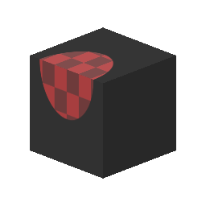

# 3D平面投影

<table>
<tr style="border: 0;">
<td style="border: 0;" valign="top">

## 3D平面投影（カラー）

**In:** *メッシュベースのジェネレーター**/Utilities*

**複合**

</td>
<td style="border: 0;" valign="top">

## 説明

ベイク処理されたメッシュデータ（位置マップとワールド法線マップ）に基づいて平面投影を実行します。 元のUVマッピングに関係なく、継ぎ目全体にデカールを投影して配置できます。

## パラメーター

### 入力

* **位置マップ**: *カラー入力*&#x200B;固定された位置マップ
* **ワールドスペース法線**: *カラー入力*&#x200B;ベイク処理されたワールドスペース法線マップ
* **投影されたテクスチャ**: *色入力*&#x200B;ターゲットに投影する入力テクスチャ。

### パラメーター

* **配置**
  * **プロジェクト入力**: *UV位置、ワールド空間の位置*&#x200B;投影位置を2D/UVまたは3D/ワールド空間のどちらで設定するかを選択します。
  * **ターゲットUV位置**:\
    UV位置入力のみで、位置マップの2Dビューでポイントを選択するのに最適です。
  * **ターゲット位置**: *（カラー値）*ワールド空間の位置を入力した場合のみ、正確な3D座標を定義できます。
  * **ターゲット法線**: *（カラー値）*
  * **回転**: *0.0 ～ 1.0\
    投影されたテクスチャを法線に沿って回転させます。*
  * **スケール**: *0.0 ～ 1.0*\
    投影されるテクスチャのグローバルスケールを設定します。
  * **サイズ**: *0.0 ～ 2.0*&#x200B;投影されたテクスチャに対して不均等な拡大/縮小を実行します。
* **マスク**
  * **最大深度**: *0.0 ～ 1.0*&#x200B;投影されたテクスチャがカットオフされるときの深さを制御します。
  * **深度のフェード**: *0.0 ～ 1.0*&#x200B;カットオフ深度の変化を急な場合やフェードする場合に設定します。
  * **法線のしきい値**: *-1.0 - 1.0*&#x200B;投影法線に正確に位置合わせされていないサーフェスのトレショルドを設定します。
  * **通常フェード**: *0.0 ～ 1.0*&#x200B;突然またはフェードに揃っていないサーフェスのトランジションを設定します。

## サンプル画像

</td>
</tr>
</table>
