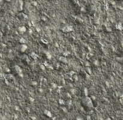

# コケ風化

<table>
<tr style="border: 0;">
<td style="border: 0;" valign="top">

{width="128px"}

## コケ風化

**イン：** *メッシュベースのジェネレーター**/耐候性*

**複合**

</td>
<td style="border: 0;" valign="top">

## 説明

これは完全なマテリアル効果で、複数のチャンネルで同時に機能します。 このエフェクトは、伝播を1つのコントロールで制御して、オーバーグロウンモスエフェクトを生成します。

このエフェクトは、ベイク処理されたワールド空間の位置マップと追加のハイトマップで最適に機能します。 これは正確な要件ではありませんが、効果をより信頼できる配置に貸します。

完全なマテリアルを扱う場合は、[リンク作成モード](https://support.allegorithmic.com/documentation/display/SD5/Link+Creation+Modes)を正しく理解してください。

## パラメーター

### 入力

* **位置**: *カラー入力*\
  ベイクワールドスペースの位置。
* **Height** : *グレースケール入力*\
  追加のHeightmap入力。
* **マスク** : *グレースケール入力*\
  ノードのエフェクトのマスクに使用するマスクスロット。 「マスク」パラメーターで切り替えることができます。

### パラメーター

* **チャネル**
  * この領域でマテリアルチャンネルのオンとオフを切り替えます。たとえば、メタリック/ラフネスの代わりにSpecular/光沢マップを使用する場合などです。
* **詳細**
  * **標準の形式**: *DirectX、OpenGL*\
    異なるノーマルマップ形式に切り替えます（グリーンチャンネルを反転します）。
  * **マスク**: *False/True*\
    マスクマップの使用のオン/オフを切り替えます。
* **効果**
  * **コケの伝播**: *0.0 ～ 1.0*&#x200B;コケの広がりを設定します。 わずかな被覆率から、厚く厚い暗いコケまで、段階的に成長します。
* **ブレンド**
  * **拡散反射光の強度**: *0.0 ～ 1.0*\
    拡散反射光のブレンド強度。
  * **基本色の適用度**: *0.0 - 1.0*\
    ベースカラーのブレンド強度。
  * **法線の強度**: *0.0 ～ 1.0*\
    法線のブレンド強度。
  * **Specularの適用度**: *0.0 ～ 1.0*\
    Specularのブレンド強度。
  * **光沢強度**: *0.0 ～ 1.0*\
    光沢のブレンド強度。
  * **粗さ強度**: *0.0 ～ 1.0*\
    粗さのブレンド強度。
  * **周囲オクルージョンの強さ**: *0.0 ～ 1.0*\
    アンビエントオクルージョンのブレンド強度。
  * **Heightの強さ**: *0.0 ～ 1.0*\
    Heightのブレンド強度。

## サンプル画像

</td>
</tr>
</table>
