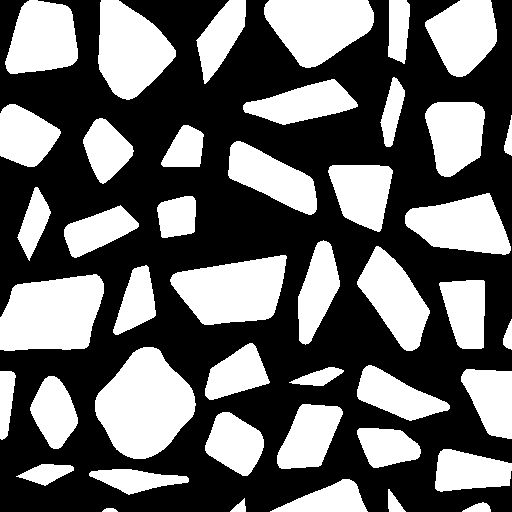

# パスにマスク

<table>
<tr style="border: 0;">
<td width="33.33%" style="border: 0;" valign="top">

<b>イン：</b>スプラインおよびパスツール>パスツール

</td>
<td width="100.00%" style="border: 0;" valign="top">

## 説明

グレースケール入力パターン<b>Mask</b>を、出力<b>Paths</b>でエンコードされたパスセグメントの一覧に変換します。

生成されたパスの開始位置と、リスト内でのパスの順序を制御できます。

生成されたパスは、専用ノード（例： [パス2D変形](../../../../../../compositing-graphs/nodes-reference-for-com/node-library/spline-paths-tools/path-tools/path-2d-transform/path-2d-transform.md)、[パスワープ](../../../../../../compositing-graphs/nodes-reference-for-com/node-library/spline-paths-tools/path-tools/paths-warp/paths-warp.md)）を使用してさらに処理するか、[スプラインへのパス](../../../../../../compositing-graphs/nodes-reference-for-com/node-library/spline-paths-tools/path-tools/paths-to-spline/paths-to-spline.md)ノードを使用してスプラインに変換し、それらに沿ってシェイプをマップまたは散乱することができます。

</td>
</tr>
</table>

>[!NOTE]
>
> パスのエンコードに使用される方法については、[パス形式の仕様](../../../../../../compositing-graphs/nodes-reference-for-com/node-library/spline-paths-tools/path-tools/paths-format-spe/paths-format-specifications.md)のページで説明しています。

## 入力

|  |  |
|:---|:---|
| <b>マスク</b> <i>グレースケール</i> | パスのリストに変換する入力パターン。 |

## 出力

|  |  |
|:---|:---|
| <b>プレビュー</b> <i>色</i> | マスクの上に合成され、パラメーターの効果を確認するのに役立つプレビュー。 |
| <b>パス</b> <i>色</i> | カラー画像でエンコードされたパスのリスト。 各パスは、エンコードされたセグメントのリストを記述します。 結果は、別のパス処理ノードを使用して処理するか、[Paths to Spline](../../../../../../compositing-graphs/nodes-reference-for-com/node-library/spline-paths-tools/path-tools/paths-to-spline/paths-to-spline.md)ノードに送信して、さらにスプラインとして処理することができます。 |

## パラメーター

|  |  |
|:---|:---|
| <b>スムーズマスク</b> <i>フロート</i> | 定型入力にスムージングを適用します。 入力パターンのエッジが非常にシャープで、通常は斑点が生じる場合に便利です。 |
| <b>マスクのしきい値</b> <i>浮動小数</i> | 図形の外側（値&lt;マスクのしきい値）と内側（値>マスクのしきい値）を分割するために使用される<b>マスク</b>のグレースケール値。 |
| <b>パスの小数点以下の桁数</b> <i>フロート</i> | 生成されるセグメントの量を暗黙的に制御します。 高いデシメーションを設定すると、丸いシェイプが多少多角形になりますが、デシメーションを設定すると、ピクセルごとにほぼ1つのセグメントが生成されます。 適度な量を設定すると、直線の中間点を大量に作成することなく、直線と曲線の両方のシェイプとより良く一致します。 |
| <b>開いているパスを閉じる</b> <i>ブーリアン</i> | オープンパスの開始パスと終了頂点の間にセグメントを作成します。 これを無効にすると、パターンを横切る不要な線が予期しない方法で修正される可能性がありますが、パスが閉じられなくなる可能性があります。 |
| <b>コーナーのしきい値</b> <i>フロート</i> | パスにエンコードされた各頂点には、ハード（角）かスムーズ（滑らか）かを示すフラグを保持できます。 このパラメーターを使用すると、隣接するセグメント間の角度に応じて、コーナーの大きさを変更できます。 <i>注意：</i>この&#39;corner&#39;フラグは現在、既存のノードではサポートされていませんが、[Path 頂点プロセッサー](../../../../../../compositing-graphs/nodes-reference-for-com/node-library/spline-paths-tools/path-tools/paths-vertex-processor/paths-vertex-processor.md)ノードで使用できます。 [パスのプレビュー](../../../../../../compositing-graphs/nodes-reference-for-com/node-library/spline-paths-tools/path-tools/preview-paths/preview-paths.md)ノードで角を表示することもできます。 |
| <b>パスのスタートアップモード</b> <i>整数</i> | 複数のスプラインノードがスプラインの始点と終点を使用するため、生成された<b>頂点を専用ノードを使用してスプライン</b>に変換する場合、どのパスを生成するかを選択する方式です。 *– 最も鋭い頂点:*&#x200B;前と次の頂点で最も角度が低い頂点&#x200B; *– 指定された頂点を超えた方向の最後の頂点:*&#x200B;指定された位置から最最も近近近頂点&#x200B; *頂点 * startup function:*カスタム関数を使用して、各Pathの開始として使用する頂点を選択します  * |
| <b>スタートアップの方向</b> <i>フロート</i> | 起動頂点を選択する方向を示す角度です。 パスごとに、この方向の最後の頂点が選択されます。 値は、X左方向のベクトルを回転するために使用される&#x200B;*ターン数*&#x200B;です。 つまり、0は方向ベクトル(-1, 0)を設定し、0.25 （90度）は方向ベクトル(0, 1)を設定します。 <i>注意：</i>このパラメーターは、<b>Path Startup Mode</b>が&#39;指定された方向の極端な頂点&#39;に設定されている場合に使用できます |
| <b>スタートアップターゲットの位置</b> <i>浮動小数点2</i> | イメージ内でスタートアップ頂点を選択する場所。 各頂点について、選択された<b>経路起動モード</b>に従って、この場所に最も近いパスまたは最も遠いパスが選択されます。 <i>注意：</i>このパラメーターは、<b>経路起動モード</b>が&#39;指定された場所に最も近い頂点&#39;または&#39;指定された場所から最も遠い頂点&#39;に設定されている場合に使用できます |
| <b>スタートアップ関数</b> <i>フロート</i> | 起動頂点を選択するために使用する関数。 Float値を返します。 各頂点に対して関数が実行され、関数が&#x200B;*最高の結果*&#x200B;を返す頂点が選択されます。 使用可能な変数： *-* 頂点.cornerness(浮動小数)*:*&#x200B;コーナーになる候補としての頂点のスコア&#x200B; *-* 頂点.pos(浮動小数2)*:*&#x200B;画像空間の頂点の場所 <i>注意：</i>このパラメーターは、パスのスタートアップモードが&#39;指定された場所に最も近い頂点&#39;または&#39;カスタムスタートアップ関数&#39;に設定されている場合に使用できます |
| <b>注文モード</b> <i>整数</i> | 生成されたパスを並べ替える方法。 パスの位置またはサイズのパス&#39; *境界ボックス* (Bbox)は、パスを並べ替える基準として使用できます。 複数のスプラインノードがスプラインの順序を使用するため、生成された<b>パスを専用ノードを使用してスプライン</b>に変換する場合に、これは大きな影響を与えます。 *– 従来（高速）:*&#x200B;このノードでの方法は、パフォーマンスをを大幅に向上&#x200B; *- By Bboxの中心位置：*&#x200B;パスのパスパスの順序bbox、指定された方向に沿って最初から最後まで&#x200B; *- BboxによるBboxの左上隅の位置に従って、指定された方向に沿って最初から最後まで* - Bboxサイズ – 最大から最小まで&#x200B;*パスはBboxのサイズに従って、最大から最小まで *- Bboxサイズ – 最小から最大まで&#x200B;*パスはBboxのサイズに従従って並べられますlargest * – カスタム順序関数：*カスタム関数を使用してパスを順序付けます * |
| <b>順序の指定</b> <i>フロート</i> | パスを最初から最後まで並べる方向を示す角度。 値は、X左方向のベクトルを回転するために使用される&#x200B;*ターン数*&#x200B;です。 つまり、0は方向ベクトル(-1, 0)を設定し、0.25（90度）は方向ベクトル(0, 1)を設定します。 |
| <b>順序付け関数</b> <i>フロート</i> | パスの並べ替えに使用する関数。 Float値を返します。 パスは、この関数の値に従って&#x200B;*昇順*&#x200B;に並べ替えられます。 つまり、各Pathの関数の結果は、Pathを並べ替えるために使用された&#x200B;*並べ替えキー*&#x200B;です。 使用可能な変数： * bbox.center (浮動小数2): Path Bboxの中心 * bbox.topleft (浮動小数2): Path Bboxの左上隅 * bbox.size (浮動小数2): Path Bboxのサイズ（X：幅、Y:Height） |

## 例

<table>
<tr style="border: 0;">
<td style="border: 0;" valign="top">

<table>
  <tr>
    <td>
      
       <i>前</i>
    </td>
    <td>
      
       <i>後</i>
    </td>
  </tr>
</table>

</td>
<td style="border: 0;" valign="top">

<table>
  <tr>
    <td>
      
       <i>前</i>
    </td>
    <td>
      
       <i>後</i>
    </td>
  </tr>
</table>

</td>
</tr>
</table>

<table>
<tr style="border: 0;">
<td style="border: 0;" valign="top">

{zoomable="yes"}

</td>
<td style="border: 0;" valign="top">

{zoomable="yes"}

</td>
</tr>
</table>

<table>
<tr style="border: 0;">
<td style="border: 0;" valign="top">

{zoomable="yes"}

</td>
<td style="border: 0;" valign="top">

{zoomable="yes"}

</td>
</tr>
</table>
