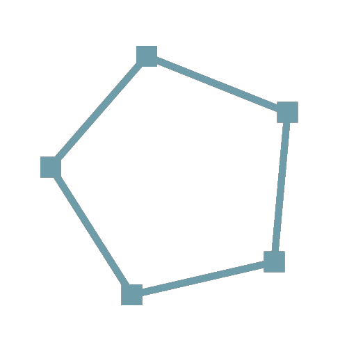

# 経路2D変形

<table>
<tr style="border: 0;">
<td width="33.33%" style="border: 0;" valign="top">

<b>イン：</b>スプラインおよびパスツール>パスツール

</td>
<td width="100.00%" style="border: 0;" valign="top">

## 説明

ギズモを使用してパスを変形します。

</td>
</tr>
</table>

## 入力

|  |  |
|:---|:---|
| <b>パス</b> <i>色</i> | エンコードされたセグメントパスのリスト。 この入力を[マスクの結果にパス](../../../../../../compositing-graphs/nodes-reference-for-com/node-library/spline-paths-tools/path-tools/mask-to-paths/mask-to-paths.md)または別のパス処理ノードに接続します。 |

## 出力

|  |  |
|:---|:---|
| <b>パス</b> <i>色</i> | 変形パス。 [パスのプレビュー](../../../../../../compositing-graphs/nodes-reference-for-com/node-library/spline-paths-tools/path-tools/preview-paths/preview-paths.md)を使用して、結果がどんな結果になるかを把握したり、別のパス処理ノードを使用したり、[スプラインへのパス](../../../../../../compositing-graphs/nodes-reference-for-com/node-library/spline-paths-tools/path-tools/paths-to-spline/paths-to-spline.md)に入力して、さらにスプラインとして処理したりすることができます。 |

## パラメーター

|  |  |
|:---|:---|
| <b>マトリックスの変形</b> <i>浮動小数4</i> | スプラインに適用される変換行列。 マトリックスパラメーターは、次の3つの方法で編集できます。 *– 変換ギズモ：*&#x200B;スプライン2D変形ノードが選択された場合、[2D ビュー](../../../../../../interface/2d-view/2d-view.md)に表示されたギズモのハンドルを微調整します。 *– 回転/伸縮:*&#x200B;スプラインの回転と伸縮を個別に制御します。 値は常に現在の変換に対して相対的に適用されることに注意してください。 例えば、50%の幅を2回適用すると、幅が25%になります。 *– 行列の値：* <b>行列の値を編集</b>ボタンをクリックして、行列の生の数値を直接入力します。 |
| <b>オフセット</b> <i>浮動小数2</i> | 位置オフセットをX（水平）およびY（垂直）のスプラインに適用します。 |

## 例

<table>
<tr style="border: 0;">
<td style="border: 0;" valign="top">

<table>
  <tr>
    <td>
      
       <i>前</i>
    </td>
    <td>
      
       <i>後</i>
    </td>
  </tr>
</table>

</td>
<td style="border: 0;" valign="top">

<table>
  <tr>
    <td>
      
       <i>前</i>
    </td>
    <td>
      
       <i>後</i>
    </td>
  </tr>
</table>

</td>
</tr>
</table>
