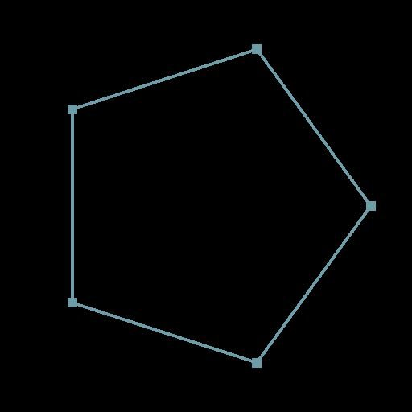

# 多角形のパス

<table>
<tr style="border: 0;">
<td width="33.33%" style="border: 0;" valign="top">

<b>イン：</b>スプラインおよびパスツール>パスツール

</td>
<td width="100.00%" style="border: 0;" valign="top">

## 説明

パス形式でプリミティブ（多角形）を生成します。

[パス2D変換](../../../../../../compositing-graphs/nodes-reference-for-com/node-library/spline-paths-tools/path-tools/path-2d-transform/path-2d-transform.md)ノードを使用して、プリミティブを正確に配置します。

</td>
</tr>
</table>

## 出力コネクタ

<b>パス</b> *色*\
1つのエンコードされたパスのリストが含まれ、エンコードされたセグメントのリストが記述されます。\
これは、直接使用したり変更したりするためにインデントされません。 互換性のあるノードを見つけるためのパスを検索します。

## パラメーター

<b>辺の数</b> *整数*\
ヒント： 100 ～ 1000の数値を入力して、円を生成します。

## 例

<table>
<tr style="border: 0;">
<td style="border: 0;" valign="top">

</td>
<td style="border: 0;" valign="top">

</td>
</tr>
</table>
