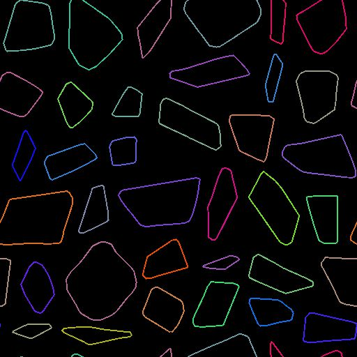

# スプラインへのパス

<table>
<tr style="border: 0;">
<td width="33.33%" style="border: 0;" valign="top">

<b>イン：</b>スプラインおよびパスツール>パスツール

</td>
<td width="100.00%" style="border: 0;" valign="top">

## 説明

[スプラインレンダリング](../../../../../../compositing-graphs/nodes-reference-for-com/node-library/spline-paths-tools/spline-tools/spline-render/spline-render.md)ノードを使用して視覚化でき、[スプラインノード](../../../../../../compositing-graphs/nodes-reference-for-com/node-library/spline-paths-tools/spline-tools/spline-tools.md)を使用して処理できるスプラインにパスを変換します。

</td>
</tr>
</table>

>[!NOTE]
>
> スプラインは曲線であるため、パスのシャープさを維持することはできません。 パスをスプラインに変換する場合は、シェイプの滑らかさが期待できます。

>[!TIP]
>
> このノードは、[Mask to Paths](../../../../../../compositing-graphs/nodes-reference-for-com/node-library/spline-paths-tools/path-tools/mask-to-paths/mask-to-paths.md)ノードの後で、マスクをスプラインに変換するチェーンを形成するために使用できます。

## 入力

|  |  |
|:---|:---|
| <b>パス</b> <i>色</i> | エンコードされたセグメントパスのリスト。 この入力を[マスクの結果にパス](../../../../../../compositing-graphs/nodes-reference-for-com/node-library/spline-paths-tools/path-tools/mask-to-paths/mask-to-paths.md)または別のパス処理ノードに接続します。 |

## 出力

|  |  |
|:---|:---|
| <b>スプライン座標</b> <i>色</i> | カラー画像のRGBAチャンネルでエンコードされた入力スプラインの点の座標： <b>R</b> - X位置 <b>G</b> - Y位置 <b>B</b> - Height <b>A</b> – パックデータ：  *記号：スプラインが閉じている（負）か開いている（正）;  *絶対値: Thickness + 1。 |
| <b>スプラインデータ</b> <i>色</i> | <b>color</b>画像のRGBAチャンネルでエンコードされた入力スプラインの追加データ： <b>R</b> - 正接 X <b>G</b> - 正接 Y <b>B</b> – 未使用 <b>A</b> – 未使用 |
| <b>スプラインの量</b> <i>整数</i> | 入力スプラインの数。 |

## パラメーター

|  |  |
|:---|:---|
| <b>スプラインの精度</b> <i>整数</i> | Paths入力の各パスでサンプリングされた頂点数の2を底とする対数(log2)で、対応するスプラインを構築します。 |

## 例

<table>
<tr style="border: 0;">
<td style="border: 0;" valign="top">

<table>
  <tr>
    <td>
      
       <i>前</i>
    </td>
    <td>
      
       <i>後</i>
    </td>
  </tr>
</table>

</td>
<td style="border: 0;" valign="top">

<table>
  <tr>
    <td>
      
       <i>前</i>
    </td>
    <td>
      
       <i>後</i>
    </td>
  </tr>
</table>

</td>
</tr>
</table>
