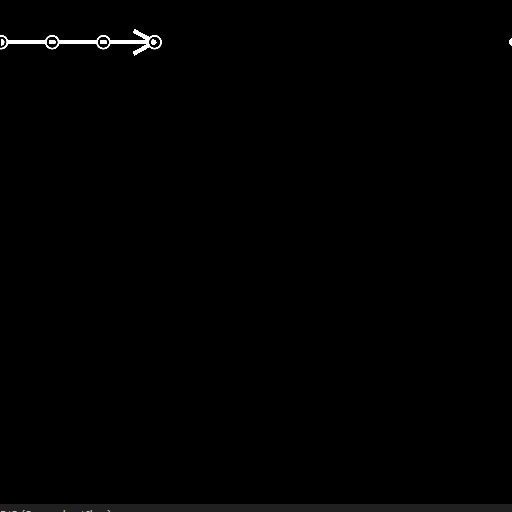

# ポイントリスト

<table>
<tr style="border: 0;">
<td width="33.33%" style="border: 0;" valign="top">

<b>イン：</b>スプラインおよびパスツール> スプラインツール

</td>
<td width="100.00%" style="border: 0;" valign="top">

## 説明

スプラインによってトラバースされる点のリストを生成します。

既存のポイントリストが<b>Point</b>入力に指定されている場合、生成されたリストが入力リストに追加されます。

</td>
</tr>
</table>

>[!TIP]
>
> このノードを使用して、[スプライン（多角形）](../../../../../../compositing-graphs/nodes-reference-for-com/node-library/spline-paths-tools/spline-tools/spline-poly-quadratic/spline-poly-quadratic.md)ノードに点を指定し、スプラインを作成できます。

>[!IMPORTANT]
>
> <b>ポイントリスト</b>と<b>ポイント番号</b>コネクタは、<b>スプライン座標</b>、<b>スプラインデータ</b>および<b>スプライン量</b>コネクタと&#x200B;*互換性がありません*。これらのコネクタは異なるデータに依存しています。

## 入力

|  |  |
|:---|:---|
| <b>プレビュー</b> <i>グレースケール</i> | ポイントをグレースケールイメージとしてプレビューします。 |
| <b>ポイントリストの入力</b> <i>色</i> | カラー画像のRGBAチャンネルでエンコードされた入力ポイントの一覧： <b>R</b> - X位置 <b>G</b> - Y位置 <b>B</b> - Height <b>A</b> – パックデータ：  * 整数部分： Smoothness;  *小数部分： Thickness。 |
| <b>ポイント番号の入力</b> <i>整数</i> | 入力ポイントの数。 |

## 出力

|  |  |
|:---|:---|
| <b>プレビュー</b> <i>グレースケール</i> | ポイントをグレースケールイメージとしてプレビューします。 |
| <b>ポイントリスト</b> <i>色</i> | カラー画像のRGBAチャンネルでエンコードされたポイントの出力リスト： <b>R</b> - X位置 <b>G</b> - Y位置 <b>B</b> - Height <b>A</b> – パックデータ：  * 整数部分： Smoothness;  *小数部分： Thickness。 |
| <b>ポイント番号</b> <i>整数</i> | 出力されるポイント数。 |

## パラメーター

|  |  |
|:---|:---|
| <b>ポイント番号</b> <i>整数</i> | 生成されたポイントの数。 |
| <b>グローバルSmoothness調整</b> <i>フロート</i> | すべてのポイントのSmoothnessの値に均等オフセットを適用します。 結果のSmoothness値は[0;1]の範囲に固定されます。 |
| <b>ポイントのプロパティ</b> |  |
| <b>p#プロパティ</b> <i>浮動小数点3</i> | p#点のプロパティを設定します。 *- Height:*&#x200B;値が小さいほどHeightが低い、またはより深い場所を表す点のSmoothnessを調整します。 *– ロケーション：*&#x200B;スプラインの滑らかさの開始点をp#でオフセットします。値が0の場合、硬い軌道になり、完全に滑らかな1になります。 *- Thickness:*&#x200B;スプラインのThicknessをp#で調整します。 Thicknessは、特定のスプラインノードによって使用されます。 |
| <b>点の座標</b> |  |
| <b>p#</b> <i>浮動小数点2</i> | テクスチャ空間のp#ポイントの位置を設定します。 |
| <b>プレビュー</b> |  |
| <b>ラベルの表示</b> <i>ブール値</i> | 各ポイントについて、「プレビュー」出力でポイントの横にポイント名が表示されます。 |
| <b>ラベルサイズ</b> <i>Float</i> （&#39;Show Labels&#39;が&#39;True&#39;に設定されている場合に使用可能） | テクスチャ空間の各ポイントのラベルのサイズです。0.1はテクスチャの幅の10分の1です。 |
| <b>ポイントの表示</b> <i>ブール値</i> | 「プレビュー」出力にポイントが表示されます。 |
| <b>ポイントサイズ</b> <i>Float</i> （&#39;Show Points&#39;が&#39;True&#39;に設定されている場合に使用可能） | テクスチャ空間のポイントの半径。0.1はテクスチャの幅の10分の1です。 |

## 例

<table>
<tr style="border: 0;">
<td style="border: 0;" valign="top">

</td>
<td style="border: 0;" valign="top">

</td>
</tr>
</table>
