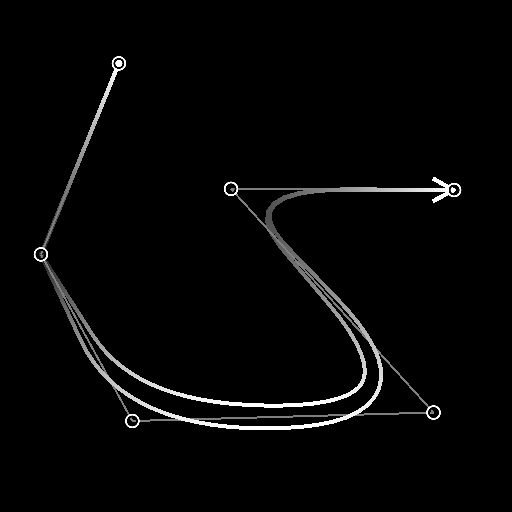

# ポイントリスト

<table>
<tr style="border: 0;">
<td width="33.33%" style="border: 0;" valign="top">

<b>イン：</b>スプラインおよびパスツール> スプラインツール

</td>
<td width="100.00%" style="border: 0;" valign="top">

## 説明

スプラインによってトラバースされる点のリストを生成します。

既存のポイントリストが<b>Point</b>入力に指定されている場合、生成されたリストが入力リストに追加されます。

</td>
</tr>
</table>

>[!TIP]
>
> このノードを使用して、[スプライン（多角形）](../../../../../../compositing-graphs/nodes-reference-for-com/node-library/spline-paths-tools/spline-tools/spline-poly-quadratic/spline-poly-quadratic.md)ノードに点を指定し、スプラインを作成できます。

>[!IMPORTANT]
>
> <b>ポイントリスト</b>と<b>ポイント番号</b>コネクタは、<b>スプライン座標</b>、<b>スプラインデータ</b>および<b>スプライン量</b>コネクタと&#x200B;*互換性がありません*。これらのコネクタは異なるデータに依存しています。

## 入力コネクタ

<b>プレビュー&#x200B;</b>*グレースケール*&#x200B;ポイントをグレースケール画像としてプレビューします。

<b>ポイントリストの入力</b> *色*\
カラー画像のRGBAチャンネルでエンコードされた入力ポイントのリスト：\
<b>R</b> - X位置\
<b>G</b> - Y位置\
<b>B</b> -Height\
<b>A</b> – パックされたデータ：\
*整数部：Smoothness;\
*分数部：Thickness

<b>ポイント番号の入力</b> *整数*\
入力ポイントの数。

## 出力コネクタ

<b>プレビュー&#x200B;</b>*グレースケール*&#x200B;ポイントをグレースケール画像としてプレビューします。

<b>ポイントリスト&#x200B;</b>*色*\
カラー画像のRGBAチャンネルでエンコードされたポイントの出力リスト\
<b>R</b> - X位置\
<b>G</b> - Y位置\
<b>B</b> -Height\
<b>A</b> – パックされたデータ：\
*整数部：Smoothness;\
*分数部：Thickness

<b>ポイント番号&#x200B;</b>*整数*\
出力されるポイント数。

## パラメーター

<b>ポイント番号</b> *整数*&#x200B;生成されたポイントの数です。

<b>グローバルSmoothness調整</b> *浮動小数点*&#x200B;すべてのポイントのSmoothness値に均一のオフセットを適用します。\
結果のSmoothness値は[0;1]の範囲に固定されます。

+++ポイントのプロパティ
<b>p#プロパティ</b> *浮動小数点3* p#ポイントのプロパティを設定します。\
*- Height:*&#x200B;値が低いほどHeightが低く、深いほど、ポイントの位置を調整します。\
*- Smoothness:*&#x200B;スプラインのスムージングの開始をp#にオフセットします。この場合、値0を指定すると硬い軌道になり、1を指定すると完全に滑らかになります。\
*- Thickness:* p#でスプラインのThicknessを調整します。 Thicknessは、特定のスプラインノードによって使用されます。

+++

+++点の座標
<b>p#</b> *フロート2*&#x200B;テクスチャ空間のp#ポイントの位置を設定します。

+++

+++プレビュー
<b>ラベルの表示</b> *ブール値*\
各ポイントについて、「プレビュー」出力でポイントの横にポイント名が表示されます。

<b>ラベルサイズ</b> *Float* （&#39;Show Labels&#39;が&#39;True&#39;に設定されている場合に使用可能）\
テクスチャ空間の各ポイントのラベルのサイズです。0.1はテクスチャの幅の10分の1です。

<b>ポイントの表示</b> *ブール値*\
「プレビュー」出力にポイントが表示されます。

<b>ポイントサイズ</b> *Float* （&#39;Show Points&#39;が&#39;True&#39;に設定されている場合に使用可能）\
テクスチャ空間のポイントの半径。0.1はテクスチャの幅の10分の1です。

+++

## 例

<table>
<tr style="border: 0;">
<td style="border: 0;" valign="top">

</td>
<td style="border: 0;" valign="top">

</td>
</tr>
</table>
