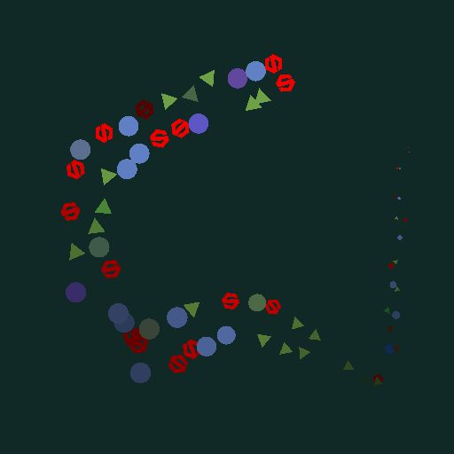

# スプラインカラーの散乱

<table>
<tr style="border: 0;">
<td width="33.33%" style="border: 0;" valign="top">

イン：スプラインおよびパスツール> スプラインツール

</td>
<td width="100.00%" style="border: 0;" valign="top">

## 説明

指定されたパターンを入力スプラインに沿って、入力された背景上に描画します。

</td>
</tr>
</table>

このノードは、パターンの分散方法を制御するための詳細なカスタマイズオプションを提供します

グラフの他のノードからのイメージを使用してスキャッタリングの一部を制御し、結果のダイナミックな側面をさらに強調することができます。

>[!NOTE]
>
> [スプライングレースケールの散乱](../../../../../../compositing-graphs/nodes-reference-for-com/node-library/spline-paths-tools/spline-tools/scatter-spline-grayscale/scatter-on-spline-grayscale.md)も参照してください。

## 入力コネクタ

<b>背景&#x200B;</b>*グレースケール* （プライマリ）スプラインを描画するグレースケールイメージです。

<b>スプライン座標&#x200B;</b>*色*&#x200B;入力スプラインの点の座標は、カラー画像のRGBAチャンネルでエンコードされます。\
<b>R</b> - X位置\
<b>G</b> - Y位置\
<b>B</b> -Height\
<b>A</b> – パックされたデータ：\
*記号：スプラインが閉じている（負）か、開いている（正）;\
*絶対値：Thickness + 1。

<b>スプラインデータ</b> *色*&#x200B;カラー画像のRGBAチャンネルでエンコードされた入力スプラインの追加データです。\
<b> R</b> – 接線X\
<b> G</b> – 接線Y\
<b> B</b> – 未使用\
<b> A</b> – 未使用

<b>スプラインの量</b> *整数*&#x200B;入力スプラインの数です。

<b>パターン入力#</b> *グレースケール*&#x200B;スプラインに沿って散布するパターンです。

<b>地図の縮尺</b> *グレースケール*&#x200B;散布パターンのスケールを制御するマップです。 このマップの効果は、[スケールマップ入力マルチプライヤ]パラメータによって制御され、[サイズ]領域の他のパラメータと組み合わされます。

<b>Heightマップ</b> *グレースケール*&#x200B;散布パターンのHeightをコントロールするマップです。 このマップの効果は、[Height入力マルチプライヤ]パラメータによって制御され、[カラー]領域の他の[カラー]パラメータと組み合わされます。

<b>マスクマップ</b> *グレースケール*&#x200B;散布パターンのマスクを制御するマップです。 このマップの効果は、「Mask Map Threshold」パラメータによって制御され、「Color」グループの他の「Mask」パラメータと組み合わされます。

## 出力コネクタ

<b>出力</b> *グレースケール*&#x200B;入力された背景上の入力スプラインに沿って散乱されたパターンを表す画像です。

## パラメーター

<b>スプライン入力</b> *整数*&#x200B;散布パターンに使用するスプラインを選択する方法：
* *すべてのスプライン*：入力リストのすべてのスプラインを使用します；
* *単一のスプライン*：入力リストから指定されたスプラインのみを使用します。
* *スプライン範囲*：入力リストから指定された範囲のスプラインのみを使用します。

<b>スプラインインデックス</b> *整数* （&#39;スプライン入力&#39;が&#39;単一スプライン&#39;に設定されている場合に使用可能）散布パターンに使用する必要があるスプラインのリストインデックスです。

<b>スプライン範囲</b> *Integer2* （&#39;スプライン入力&#39;が&#39;スプライン範囲&#39;に設定されている場合に使用可能）散布パターンに使用するスプラインを含むリストインデックスの範囲。

<b>散乱モード</b> *整数*&#x200B;スプラインに沿ってパターンを散布する方法。各スプラインのパターンの量に影響します。
* シェイプの量：等間隔に指定された量のパターンが散布されます。
* シェイプの間隔：指定した偶数の間隔に合わせて、パターンの数が自動的に調整されます。\
  どちらの場合も、最初と最後のパターンは各スプラインの始点と終点に正確に配置されます。

<b>シェイプの量</b> *整数* （「散乱モード」が「シェイプの量」に設定されている場合に使用可能）各スプラインに沿って散布されるパターンの等間隔の量。

<b>スプラインに沿ったシェイプの分布</b> *整数* （&#39;散乱モード&#39;が&#39;シェイプの量&#39;に設定されている場合に使用可能）スプラインに沿ってパターンを分布する方法：
* *ソースから*:パターンの間隔は、スプライン点の接線の影響を受けます。スプライン点の接線は、長い接線を持つ点の近くでシェイプがさらに離れています。
* *均一*:パターンは、その接線と軌道に関係なく、スプラインに沿って均等な間隔で配置されます。

<b>図形の間隔</b> *フロート* （&#39;散乱モード&#39;が&#39;図形の間隔&#39;に設定されている場合に使用可能）最初と最後のパターンが各スプラインの最初と最後に接している間に、パターンの間隔を設定するための、スプラインに沿った最小距離。

<b>開始</b> *フロート*&#x200B;スプラインの始点から、散布が開始する位置までポイントをオフセットします。 この値は、各スプラインの正規化された長さです。

<b>終了</b> *フロート*&#x200B;スプラインの始点からスキャッタリングの終点までのオフセットを指定します。 この値は、各スプラインの正規化された長さです。

<b>図形の基点</b> *フロート2*&#x200B;スプライン接線空間のパターンXおよびYの基点をオフセットします。\
基点がスプライン上に配置されるものであることを考慮すると、これによってパターンがスプラインに沿って、またはスプラインに垂直にオフセットされます。\
注意：ピボットの位置は、「スケール」および「回転（ピボット）」パラメーターの効果に影響を与えます。

+++パターン
<b>パターン</b> *整数*&#x200B;スプラインに沿って散布するパターン：\
*– パターン入力*: &#39;パターン入力#&#39;入力に指定されたパターンを使用してください。\
* – 正方形；
* ディスク；
* 放物面；
* ベルだ。
* ガウス；
* ソーン；
* ピラミッド；
* れんが、
* グラデーション；
* ウェーブ；
* ハーフ・ベル。
* ベルは跳ねた
* 三日月。
* カプセル；
* 円錐；
* グラデーションw. offset;
* 半球*

<b>パターンの入力番号</b> *Integer* （&#39;Pattern&#39;が&#39;Pattern Input&#39;に設定されている場合に使用可能）分散する入力パターンのインデックスを選択します。

<b>パターン入力の分布</b> *整数* （&#39;Pattern&#39;が&#39;Pattern Input&#39;に設定されている場合に使用可能）特定のスプラインに分散する入力パターンを選択するために使用するメソッド：\
*– ランダム*:パターンがランダムに選択されています。\
*– スプラインに沿って*:パターンインデックスはスプラインに沿って徐々に増加します。\
*– パターンインデックス*：各スプラインに沿って入力パターンのインデックスをループします。\
*– スプラインインデックス*：入力スプラインの一覧で、1つのスプラインから次のスプラインへの入力パターンのインデックスをループします。

<b>ディストリビューションのジッター</b> *フロート* （&#39;パターン入力分布&#39;が&#39;スプラインに沿って&#39;設定されている場合に使用可能）選択したスプライン上のパターンインデックスをランダムに増加または減少させます。

<b>最初のパターンを上書き</b> *ブール値*&#x200B;各スプラインの先頭に配置するパターンのインデックスを手動で選択します。

<b>最初のパターン入力インデックス</b> *整数* （&#39;最初のパターンのオーバーライド&#39;が&#39;True&#39;に設定されている場合に使用可能）各スプラインの先頭に配置する必要があるパターンのインデックス。

<b>最後のパターンを上書き</b> *ブール値*&#x200B;各スプラインの最後に配置するパターンのインデックスを手動で選択します。

<b>最後のパターン入力インデックス</b> *整数* （&#39;最後のパターンのオーバーライド&#39;が&#39;True&#39;に設定されている場合に使用可能）各スプラインの最後に配置する必要があるパターンのインデックス。

+++

+++重複
<b>配布モード</b> *Integer*&#x200B;重複するパターンを配置するために使用されたメソッド：\
*– 線形*：重複は、パターンの元の位置からスプラインの法線に沿って等間隔に配置されます。\
*– 円形*：複製は、パターンの元の位置でスプラインを中心とした仮想円に沿って配置されます。

<b>重複する金額</b> *整数*&#x200B;重複したパターンの数です。

<b>オフセット</b> *Float2* （&#39;分布モード&#39;が&#39;線形&#39;に設定されている場合に使用可能）スプラインの接線（平行）および法線（垂直）に沿って重複する位置にオフセットを適用します。\
スプラインの反対側にある重複は、反対方向に移動します。

<b>オフセット中心</b> *Float2* （&#39;分布モード&#39;が&#39;線形&#39;に設定されている場合に使用可能）X （平行）およびY （垂直）上のスプラインに沿った複製にオフセットを適用します。

<b>広がり角度</b> *浮動小数点* （&#39;分布モード&#39;が&#39;円形&#39;に設定されている場合に使用可能）複製が分散される仮想円の円弧を、その円弧の角度として指定します（1は完全な円です）。

<b>オフセット距離</b> *フロート* （&#39;分布モード&#39;が&#39;円形&#39;に設定されている場合に使用可能）複製が分配される仮想円の半径。

<b>回転</b> *フロート*&#x200B;仮想円を回転して複製を配分します。

<b>オフセット開始/終了減衰</b> *フロート2*&#x200B;重複にオフセットを適用する場合に、スプラインの中点から始点および終点までの距離に影響を与えます。\
つまり、スプラインの端に近い複製のオフセットが減少します。

<b>Thicknessによるオフセット減衰</b> *フロート*&#x200B;重複にオフセットを適用するときのスプラインのThicknessの係数です。\
つまり、Thicknessが低いスプラインの部分の複製に対してオフセットが減少します。

+++

+++サイズ
<b>サイズモード</b> *整数*&#x200B;散布パターンのサイズを設定する方法：\
*– 標準*:サイズはグローバルな&#39;Scale&#39;パラメーターを使用して均一に制御されます。\
*– スプラインのThicknessを使用*:サイズはスプラインのThicknessによって決定されます。

<b>Thicknessの影響</b> *整数* （&#39;サイズモード&#39;が&#39;スプラインのThicknessを使用&#39;に設定されている場合に使用可能）スプラインのThicknessによって駆動されるパターンのスケールの軸を指定します：
* X軸とY軸：Thickness度はX軸とY軸の両方のサイズに対して乗算されます。
* X:ThicknessはX軸のサイズのみに対して乗算されます。
* Y:ThicknessはY軸のサイズのみに対して乗算されます。\
  乗算しない場合、パターンの元の比率が画像のフルスパンになります。\
  これは、「X」モードでは、Y軸のサイズが画像のフルスパンであることを意味し、Sizeパラメーターを使用して微調整する必要があります。 「Y」モードを使用する場合にX軸のサイズに適用されるものと同じです。

<b>サイズ</b> *フロート2*&#x200B;他のパラメーターによって調整される前のXおよびYのパターンの元のサイズです。

<b>サイズがランダム</b> *浮動小数点2*&#x200B;指定した値までのランダム乗数を適用して、XおよびYのパターンサイズを小さくします。

<b>Thicknessスケール</b> *フロート* （&#39;サイズモード&#39;が&#39;スプラインのThicknessを使用&#39;に設定されている場合に使用可能）スプラインのThicknessによって駆動される場合のパターンのスケールの追加マルチプライヤ。

<b>スケール</b> *フロート* （&#39;サイズモード&#39;が&#39;標準&#39;に設定されている場合に使用可能）すべてのパターンのサイズのグローバルコントロールです。1はイメージの全範囲です。\
拡大/縮小は、パターンの基点に対して相対的に適用されます。 ピボットの位置は、&#39;Shape Pivot&#39;パラメーターを使用してオフセットできます。

<b>ランダムに拡大・縮小</b> *浮動小数点*&#x200B;指定した値までのランダム乗数を適用して、パターンのサイズを小さくします。

<b>スケールマップの入力乗数</b> *浮動小数点*&#x200B;スケールマップの入力の強さを制御します。 このマップは、パターンの現在のサイズの乗数として機能します。\
このマップの効果は、「サイズ」グループの他のパラメーターと組み合わされます。

<b>入力サンプリングモードのスケール</b> *テクスチャ空間*&#x200B;スケールマップの値をスプラインにマッピングする方法：\
*– テクスチャ空間*：値は、テクスチャのUV座標を使用してテクスチャに配置されるスプラインに適用されます。 これによって、スプラインに値が「その場で」適用されます。\
*– スプラインに沿った水平*：値は、エンコードされたスプラインの座標に直接適用されます（「スプライン座標」の入力を参照）。各行は上から下に異なるスプラインに適用されます。\
*– 時間 スプラインに沿って（ランダム偏差） オフセットX)*：値は、エンコードされたスプラインの座標に直接（スプライン座標の入力を参照）適用され、各スプラインのスケールマップ内のランダムな水平オフセット（スプライン座標の各行）を伴います。\
*– 時間 スプラインに沿って（ランダム偏差） オフセットY)*：値は、エンコードされたスプラインの座標に直接適用され（スプライン座標の入力を参照）、各スプラインのスケールマップ内のランダムな垂直オフセット（スプライン座標の各行）を伴います。

<b>減衰の開始/終了</b> *フロート2*&#x200B;パターンを拡大/縮小するときの、スプラインの中点から始点および終点までの距離の係数。\
つまり、スプラインの端に近いパターンのサイズが小さくなります。

+++

+++位置
<b>ローカルオフセット</b> *フロート2*&#x200B;スプラインの接線（平行）と法線（垂直）に沿って、パターンの位置にオフセットを適用します。

<b>ローカルオフセットランダム</b> *フロート2*&#x200B;スプラインの接線（平行）と法線（垂直）に沿って、パターンの位置に追加のランダムオフセットを適用します。

<b>ローカルオフセットランダム中心</b> *フロート2*[ローカルオフセットランダム]パラメータによって適用されたランダムオフセットの中心を、スプラインの接線（平行）と法線（垂直）に沿ってオフセットします。

<b>ローカルオフセットの開始減衰/終了減衰</b> *フロート2*&#x200B;位置オフセットをパターンに適用するときに、スプラインの中点からその始点および終点までの距離に影響を与えます。\
つまり、スプラインの端に近いパターンのオフセットが減少します。

<b>Thicknessによるローカルオフセット減衰</b> *フロート*&#x200B;パターンにオフセットを適用するときのスプラインのThicknessの係数です。\
つまり、Thicknessが低いスプラインの部分の複製に対してオフセットが減少します。

<b>スプライン上のオフセット</b> *フロート*&#x200B;スプラインに沿ってパターンに位置オフセットを適用します。

<b>スプライン上のランダムオフセット</b> *フロート*&#x200B;スプラインに沿ってパターンに追加の位置オフセットを適用します。

+++

+++回転
<b>接線に位置合わせ</b> *ブール値*&#x200B;スプラインの方向に合わせてパターンの位置を回転します。

<b>回転（ピボット）</b> *フロート*&#x200B;軸を中心にパターンを回転させます。\
ピボットの位置は、&#39;Shape Pivot&#39;パラメーターを使用してオフセットできます。

<b>ランダムな回転（ピボット）</b> *浮動小数点*&#x200B;軸の周りのパターンにランダムな回転を追加します。\
ピボットの位置は、&#39;Shape Pivot&#39;パラメーターを使用してオフセットできます。

<b>回転ランダム中心（基点）</b> *フロート*&#x200B;パターンの中心を基準に回転します。この中心は、「回転ランダム」パラメーターで適用されたランダムな回転です。

<b>回転（中央）</b> *フロート*&#x200B;パターンの中心を基準にしてパターンを回転させます。

<b>ランダムな回転（中央）</b> *フロート*&#x200B;パターンの中央にランダムな回転を追加します。

<b>回転ランダム中心（中央）</b> *フロート*&#x200B;回転ランダムパラメーターで適用されたランダムな回転の中心を基準に、パターンの中心を中心に回転します。

+++

+++カラー
<b>背景色</b> *フロート4*&#x200B;出力する画像の背景色です。

<b>描画モード</b> *整数*&#x200B;パターンの色を、背景と他の重なり合うパターンの両方とブレンドする方法です：\
*- Add*:カラーを追加します。
* *Alphaブレンド* :パターンのアルファチャンネルを使用して、単純な透明度のブレンドを適用します。 最後に描いたパターンが前面に表示されます。

<b>カラーモード</b> *整数*&#x200B;各パターンの色を選択してブレンドする方法：\
*– ベースカラー*:ベースカラーはすべてのパターンに適用されます。
* *位置*:テクスチャ空間でのパターンの位置を使用して色を制御し、X座標とY座標がそれぞれ赤と緑のチャンネルにマップされます。

<b>図形の基本色</b> *Float4*&#x200B;パターンの基本色です。

<b>カラー入力乗数</b> *浮動小数点*&#x200B;カラーマップの入力の強さを制御します。 このマップは、パターンの現在の色の乗数として機能します。\
このマップの効果は、「カラー」グループの他のパラメーターと組み合わされます。\
注意：出力カラーは、すべてのカラー乗数の重み付けされた結果です。

<b>カラーマップ入力サンプリングモード</b> *整数*&#x200B;カラーマップの値をスプラインにマッピングする方法：\
*– テクスチャ空間*：値は、テクスチャのUV座標を使用してテクスチャに配置されるスプラインに適用されます。 これによって、スプラインに値が「その場で」適用されます。\
*– スプラインに沿った水平*：値は、エンコードされたスプラインの座標に直接適用されます（「スプライン座標」の入力を参照）。各行は上から下に異なるスプラインに適用されます。\
*– 時間 スプラインに沿って（ランダム偏差） オフセットX)*：値は、エンコードされたスプラインの座標に直接（スプライン座標の入力を参照）適用され、各スプラインのカラーマップでランダムな水平オフセットを伴います（つまり、スプライン座標の各行）。\
*– 時間 スプラインに沿って（ランダム偏差） オフセットY)*：値は、エンコードされたスプラインの座標に直接適用され（「スプライン座標」の入力を参照）、各スプラインのカラーマップ（つまり、「スプライン座標」の各行）にランダムな垂直オフセットが設定されます。

<b>ランダムな色</b> *浮動小数点4*&#x200B;指定した値まで、ランダムなオフセットをHSVスペースのパターンのカラーとそのアルファに適用します。\
*注意：*&#x200B;出力カラーは、すべてのカラー乗数の加重結果です。

<b>ランダムな色の中心</b> *浮動小数点*&#x200B;ランダムカラーで適用されたランダムオフセットの範囲にオフセットを適用します\
値–1は、すべてのランダム値が大きいことを意味し、値1は、すべてのランダム値が小さいことを意味します。

<b>スプラインThickness乗数</b> *浮動小数*&#x200B;各パターンの色とスプラインのThicknessを乗じた値です。\
注意：出力カラーは、すべてのカラー乗数の重み付けされた結果です。

<b>シェイプのスケール乗数</b> *浮動小数点*&#x200B;各パターンの色にスケールを掛ける際の強度です。\
注意：出力カラーは、すべてのカラー乗数の重み付けされた結果です。

<b>図形インデックス乗数</b> *浮動小数点*&#x200B;各パターンの色を正規化されたインデックスに掛ける強度です。\
注意：出力カラーは、すべてのカラー乗数の重み付けされた結果です。

<b>スプラインHeight乗数</b> *浮動小数*&#x200B;各パターンの色とスプラインのHeightを乗じた値です。\
注意：出力カラーは、すべてのカラー乗数の重み付けされた結果です。

<b>ランダムな輝度</b> *浮動小数*&#x200B;指定した値までのランダム乗数を適用して、パターンの輝度を下げます。\
注意：出力カラーは、すべてのカラー乗数の重み付けされた結果です。

<b>スプラインThickness乗数</b> *浮動小数*&#x200B;各パターンのアルファ値に、その場所にあるスプラインのThicknessを掛ける強さを指定します。\
注意：出力カラーは、すべてのカラー乗数の重み付けされた結果です。

<b>シェイプのスケール乗数</b> *浮動小数点*&#x200B;各パターンのアルファ値にスケールを掛ける際の強度です。\
注意：出力カラーは、すべてのカラー乗数の重み付けされた結果です。

<b>図形インデックス乗数</b> *浮動小数点*&#x200B;各パターンのアルファを正規化されたインデックスに掛ける強度。\
注意：出力カラーは、すべてのカラー乗数の重み付けされた結果です。

<b>スプラインHeight乗数</b> *浮動小数*&#x200B;各パターンのアルファ値に、その場所にあるスプラインのHeightを掛ける強さを指定します。\
注意：出力カラーは、すべてのカラー乗数の重み付けされた結果です。

<b>ランダムな輝度</b> *実数*&#x200B;指定した値までのランダム乗数を適用して、パターンのアルファ値を減らします。\
注意：出力カラーは、すべてのカラー乗数の重み付けされた結果です。

<b>ランダムなマスク</b> *フロート*&#x200B;パターンのランダムマスクの範囲を調整します。0はパターンがマスクされていないことを示し、1はすべてのパターンがマスクされていることを示します。

<b>マスクマップのしきい値</b> *浮動小数点*&#x200B;この閾値を下回るマスクマップの値は黒として処理され、閾値を上回る値は白として処理されます。\
つまり、この値より下のマスクマップ領域のすべてのパターンがマスクされます。

<b>マスクマップの入力サンプリングモード</b> *整数*&#x200B;マスクマップの値をスプラインにマッピングする方法：\
*– テクスチャ空間*：値は、テクスチャのUV座標を使用してテクスチャに配置されるスプラインに適用されます。 これによって、スプラインに値が「その場で」適用されます。\
*– スプラインに沿った水平*：値は、エンコードされたスプラインの座標に直接適用されます（「スプライン座標」の入力を参照）。各行は上から下に異なるスプラインに適用されます。\
*– 時間 スプラインに沿って（ランダム偏差） オフセットX)*：値は、エンコードされたスプラインの座標に直接（スプライン座標の入力を参照）適用され、各スプラインのスケールマップ内のランダムな水平オフセット（スプライン座標の各行）を伴います。\
*– 時間 スプラインに沿って（ランダム偏差） オフセットY)*：値は、エンコードされたスプラインの座標に直接適用され（スプライン座標の入力を参照）、各スプラインのスケールマップ内のランダムな垂直オフセット（スプライン座標の各行）を伴います。

<b>マスクマップを反転</b> *ブール値*&#x200B;マスクマップの値を&#39;1マイナス&#39;操作(1 - x)で反転します。

<b>マスクを反転</b> *ブール値*&#x200B;パターンのマスクを反転します。

+++

<b>非正方形の修正</b> *ブール値*&#x200B;点の位置を調整して、非正方形の解像度でスプラインのシェイプを保持します。

## 例

<table>
<tr style="border: 0;">
<td style="border: 0;" valign="top">

<table>
  <tr>
    <td>
      
       <i>前</i>
    </td>
    <td>
      
       <i>後</i>
    </td>
  </tr>
</table>

</td>
<td style="border: 0;" valign="top">

<table>
  <tr>
    <td>
      
       <i>前</i>
    </td>
    <td>
      
       <i>後</i>
    </td>
  </tr>
</table>

</td>
</tr>
</table>

<table>
<tr style="border: 0;">
<td style="border: 0;" valign="top">

</td>
<td style="border: 0;" valign="top">

</td>
</tr>
</table>
