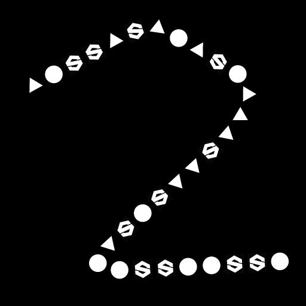

# スプライングレースケールの散乱

<table>
<tr style="border: 0;">
<td width="33.33%" style="border: 0;" valign="top">

<b>イン：</b>スプラインおよびパスツール> スプラインツール

</td>
<td width="100.00%" style="border: 0;" valign="top">

## 説明

指定されたパターンを入力スプラインに沿って、入力された背景上に描画します。

</td>
</tr>
</table>

このノードは、パターンの分散方法を制御するための詳細なカスタマイズオプションを提供します。

グラフの他のノードからのイメージを使用してスキャッタリングの一部を制御し、結果のダイナミックな側面をさらに強調することができます。

>[!NOTE]
>
> [スプラインの色の散乱](../../../../../../compositing-graphs/nodes-reference-for-com/node-library/spline-paths-tools/spline-tools/scatter-on-spline-color/scatter-on-spline-color.md)も参照してください。

## 入力

|  |  |
|:---|:---|
| <b>背景</b> <i>グレースケール</i> （プライマリ） | スプラインを描画するグレースケールイメージ。 |
| <b>スプライン座標</b> <i>色</i> | カラー画像のRGBAチャンネルでエンコードされた入力スプラインの点の座標： <b>R</b> - X位置 <b>G</b> - Y位置 <b>B</b> - Height <b>A</b> – パックデータ：  – 記号：スプラインが閉じている（負）か開いている（正）; -絶対値: Thickness + 1。 |
| <b>スプラインデータ</b> <i>色</i> | カラー画像のRGBAチャンネルでエンコードされた入力スプラインの追加データ。 <b>R</b> -正接X <b>G</b> -正接Y <b>B</b> – 未使用 <b>A</b> – 未使用 |
| <b>スプラインの量</b> <i>整数</i> | 入力スプラインの数。 |
| <b>パターン入力#</b> <i>グレースケール</i> | スプラインに沿って散布するパターン。 |
| <b>地図の縮尺</b> <i>グレースケール</i> | 散布パターンのスケールを制御するマップ。 このマップの効果は、[スケールマップ入力マルチプライヤ]パラメータによって制御され、[サイズ]領域の他のパラメータと組み合わされます。 |
| <b>Heightマップ</b> <i>グレースケール</i> | 散布パターンのHeightを制御するマップ。 このマップの効果は、[Height入力マルチプライヤ]パラメータによって制御され、[カラー]領域の他の[カラー]パラメータと組み合わされます。 |
| <b>マスクマップ</b> <i>グレースケール</i> | 散布パターンのマスクを制御するマップ。 このマップの効果は、「Mask Map Threshold」パラメータによって制御され、「Color」グループの他の「Mask」パラメータと組み合わされます。 |

## 出力

|  |  |
|:---|:---|
| <b>出力</b> <i>グレースケール</i> | 入力の背景上の入力スプラインに沿って散乱されたパターンを表すイメージ。 |

## パラメーター

|  |  |
|:---|:---|
| <b>スプライン入力</b> <i>整数</i> | スキャッタリングパターンに使用するスプラインの選択方法：  - <i>すべてのスプライン</i>：入力リストのすべてのスプラインを使用します。 - <i>単一スプライン</i>：入力リストから指定されたスプラインのみを使用します。 - <i>スプライン範囲</i>：入力リストから指定された範囲のスプラインのみを使用します。 |
| <b>スプラインインデックス</b> <i>整数</i> （&#39;スプライン入力&#39;が&#39;単一スプライン&#39;に設定されている場合に使用可能） | スキャッタリングパターンに使用するスプラインのリストインデックスです。 |
| <b>スプライン範囲</b> <i>整数2</i> （&#39;スプライン入力&#39;が&#39;スプライン範囲&#39;に設定されている場合に使用可能） | 散布パターンに使用するスプラインを含むリストインデックスの範囲。 |
| <b>散乱モード</b> <i>整数</i> | 各スプラインのパターンの量に影響を与える、スプラインに沿ってパターンを散布する手法。   – シェイプの量：等間隔に指定された量のパターンを散布します。  – シェイプの間隔：指定された均等間隔に合わせて、パターンの数が自動調整されます。  どちらの場合も、最初と最後のパターンは各スプラインの始点と終点に正確に配置されます。 |
| <b>シェイプの量</b> <i>整数</i> （&#39;散乱モード&#39;が&#39;図形の量&#39;に設定されている場合に使用可能） | 各スプラインに沿って均等に配置されたパターンの量です。 |
| <b>スプラインに沿ったシェイプの分布</b> <i>整数</i> （&#39;散乱モード&#39;が&#39;図形の量&#39;に設定されている場合に使用可能） | スプラインに沿ってパターンを分布する方法：  - <i>ソースから</i>:パターンの間隔は、スプライン点の正接の影響を受けます。スプライン点では、シェイプは長い正接を持つ点の近くでさらに離れています。 - <i>均一</i>:パターンは、正接と軌道に関係なく、スプラインに沿って均等に配置されています。 |
| <b>図形の間隔</b> <i>浮動小数</i> （&#39;散乱間隔&#39;が&#39;図形モード&#39;に設定されている場合に使用可能） | 各スプラインの始点と終点に最初と最後のパターンを配置しながら、パターンの間隔を空けるスプラインに沿った最小距離。 |
| <b>開始</b> <i>フロート</i> | スプラインの始点から、スキャタリングが開始する点をオフセットします。 この値は、各スプラインの正規化された長さです。 |
| <b>終了</b> <i>フロート</i> | スキャタリングが終了するスプラインの始点から点をオフセットします。 この値は、各スプラインの正規化された長さです。 |
| <b>図形の基点</b> <i>浮動小数点2</i> | スプライン正接スペースのパターンXおよびYの基点をオフセットします。 基点をスプラインに配置すると、スプラインに沿って、またはスプラインに垂直にパターンがオフセットされます。 注：基点の位置は、&#39;スケール&#39;および&#39;回転（基点）&#39;パラメーターの効果に影響します。 |
| <b>パターン</b> |  |
| <b>パターン</b> <i>整数</i> | スプラインに散在する必要があるパターン：  - <i>パターン入力</i>: &#39;パターン入力#&#39;入力に指定されたパターンを使用してください；  – 正方形；  – ディスク； - 放物面;  – ベル；  – ガウス； - とげ; - ピラミッド; - レンガ; - グラデーション;  – 波； - ハーフベル; - うね付きベル; - 三日月 円錐; - カプセル; - グラデーション; - w. オフセット；  – 半球。 |
| <b>パターンの入力番号</b> <i>整数</i> （&#39;Pattern&#39;が&#39;Pattern Input&#39;に設定されている場合に使用可能） | 散布する入力パターンのインデックスを選択します。 |
| <b>パターン入力の分布</b> <i>整数</i> （&#39;Pattern&#39;が&#39;Pattern Input&#39;に設定されている場合に使用可能） | 特定のスプラインに分散させる入力パターンの選択に使用するメソッド：  - <i>ランダム</i>:パターンがランダムに選択されます。 - <i>スプラインに沿って</i>:パターンインデックスは、スプラインに沿って徐々に増加します。 - <i>パターンインデックス</i>：各スプラインに沿って入力パターンのインデックスをループします。 - <i>スプラインインデックス</i>：入力スプラインの一覧の間でで入力パターンのインデックスををループします。 |
| <b>ディストリビューションのジッター</b> <i>浮動小数</i> （&#39;パターン入力分布&#39;が&#39;スプラインに沿う&#39;に設定されている場合に使用可能） | スプラインで選択したパターンのインデックスをランダムに増加または減少させます。 |
| <b>最初のパターンを上書き</b> <i>ブール値</i> | 各スプラインの始点に配置するパターンのインデックスを手動で選択します。 |
| <b>最初のパターン入力インデックス</b> <i>整数</i> （&#39;最初のパターンを上書き&#39;が&#39;True&#39;に設定されている場合に使用できます） | 各スプラインの始点に配置するパターンのインデックス。 |
| <b>最後のパターンを上書き</b> <i>ブール値</i> | 各スプラインの終端に配置するパターンのインデックスを手動で選択します。 |
| <b>最後のパターン入力インデックス</b> <i>整数</i> （&#39;最後のパターンを上書き&#39;が&#39;True&#39;に設定されている場合に使用できます） | 各スプラインの終端に配置するパターンのインデックス。 |
| <b>重複</b> |  |
| <b>配布モード</b> <i>整数</i> | 重複したパターンを配置するために使用される方法：   - <i>線形</i>：重複は、パターンの元の位置からスプラインの法線に沿って等間隔に配置されます。 - <i>円形</i>：重複は、パターンの元の位置でスプラインを中心とした仮想円に沿って配置されます。 |
| <b>重複する金額</b> <i>整数</i> | 複製されたパターンの数。 |
| <b>オフセット</b> <i>浮動小数2</i> （&#39;配布モード&#39;が&#39;リニア&#39;に設定されている場合に使用可能） | スプラインの正接（平行）および法線（垂直）に沿った複製の位置にオフセットを適用します。 スプラインの反対側にある複製は、反対方向に移動します。 |
| <b>オフセット中心</b> <i>浮動小数2</i> （&#39;配布モード&#39;が&#39;リニア&#39;に設定されている場合に使用可能） | X（平行）およびY（垂直）上のスプラインに沿った複製にオフセットを適用します。 |
| <b>広がり角度</b> <i>浮動小数</i> （&#39;Distribution Mode&#39;が&#39;Circular&#39;に設定されている場合に利用可能） | 複製が分配される仮想円の円弧。この円弧の角度で、1は完全な円です。 |
| <b>オフセット距離</b> <i>浮動小数</i> （&#39;Distribution Mode&#39;が&#39;Circular&#39;に設定されている場合に利用可能） | 複製が分配される仮想円の半径。 |
| <b>回転</b> <i>フロート</i> | 仮想円を回転させて、それに沿って複製を分配します。 |
| <b>オフセット開始/終了減衰</b> <i>浮動小数点2</i> | 複製にオフセットを適用するときの、スプラインの中点からその始点と終点までの距離の係数。 これは、スプラインの端に近い複製のオフセットが減少することを意味します。 |
| <b>Thicknessによるオフセット減衰</b> <i>フロート</i> | 重複にオフセットを適用するときのスプラインのThicknessの係数。 つまり、Thicknessが低いスプラインの部分の複製に対してオフセットが減少します。 |
| <b>サイズ</b> |  |
| <b>サイズモード</b> <i>整数</i> | 分散パターンのサイズを設定する方式です：  - <i>標準</i>:サイズはグローバルな&#39;Scale&#39;パラメーターを使用して均一に制御されます； - <i>スプラインのThicknessを使用</i>:サイズはスプラインのThicknessによって決まります。 |
| <b>Thicknessの影響</b> <i>整数</i> （&#39;サイズモード&#39;が&#39;スプラインのThicknessを使用&#39;に設定されている場合に使用可能） | パターンの尺度のどの軸をスプラインのThicknessによって決定するかを指定します。  - XとY: ThicknessはXとYの両方の軸のサイズに対して乗算されます。 - X: ThicknessはXの軸のみのサイズに対して乗算されます。 - Y: ThicknessはYの軸のみのサイズに対して乗算されます。  乗算しない場合、パターンの元の尺度は画像の全範囲です。 つまり、&#39;X&#39;モードでは、Y軸のサイズは画像のフルスパンであり、Sizeパラメーターを使用して微調整する必要があります。 「Y」モードを使用する場合のX軸のサイズにも同じことが適用されます。 |
| <b>サイズ</b> <i>浮動小数点2</i> | 他の調整が他のパラメーターによって行われる前のXおよびYのパターンの元のサイズ。 |
| <b>サイズがランダム</b> <i>浮動小数点2</i> | 指定された値までのランダム乗数を適用して、XおよびYのパターンサイズを小さくします。 |
| <b>Thicknessスケール</b> <i>浮動小数</i> （&#39;サイズモード&#39;が&#39;スプラインのThicknessを使用&#39;に設定されている場合に使用可能） | スプラインのThicknessによって駆動される場合のパターンのスケールの追加マルチプライヤ。 |
| <b>スケール</b> <i>浮動小数</i> （&#39;Size Mode&#39;が&#39;Normal&#39;に設定されている場合に利用可能） | すべてのパターンのサイズのグローバルコントロールです。1は画像のフルスパンです。 拡大/縮小はパターンの基点に対して相対的に適用されます。 ピボットの位置は、&#39;Shape Pivot&#39;パラメーターを使用してオフセットできます。 |
| <b>ランダムに拡大・縮小</b> <i>フロート</i> | 指定した値までのランダム乗数を適用して、パターンのサイズを小さくします。 |
| <b>スケールマップの入力乗数</b> <i>フロート</i> | スケールマップの入力の強さを制御します。 このマップは、パターンの現在のサイズの乗数として機能します。 このマップの効果は、&#39;Size&#39;グループの他のパラメーターと組み合わされます。 |
| <b>入力サンプリングモードのスケール</b> <i>テクスチャ容量</i> | スケールマップの値をスプラインにマッピングする方式：  - <i>テクスチャ空間</i>：値は、テクスチャのUV座標を使用してテクスチャに配置する場合にスプラインに適用されます。 これにより、値がスプラインに「その場で」適用されます。 - <i>スプラインに沿った水平</i>：値は、エンコードされたスプラインの座標に直接適用されます（「スプライン座標」の入力を参照）。ここで、各行は上から下まで異なるスプラインに適用されます。 - <i>Hor。 スプラインに沿って（ランダム偏差） オフセットX)</i>：値は、エンコードされたスプラインの座標に直接適用され（スプライン座標の入力を参照）、各スプラインのスケールマップ内のランダムな水平オフセット（スプライン座標の各行）で使用されます。 - <i>水平 スプラインに沿って（ランダム偏差） オフセットY)</i>：値は、エンコードされたスプラインの座標に直接適用され（スプライン座標の入力を参照）、各スプラインのスケールマップ内のランダムな垂直オフセット（スプライン座標の各行）を伴います。 |
| <b>減衰の開始/終了</b> <i>浮動小数点2</i> | パターンを尺度変更するときの、スプラインの中点からその始点および終点までの距離の係数。 これは、スプラインの端に近いパターンのサイズが小さくなることを意味します。 |
| <b>位置</b> |  |
| <b>ローカルオフセット</b> <i>浮動小数点2</i> | スプラインの正接（平行）と法線（垂直）に沿って、パターンの位置にオフセットを適用します。 |
| <b>ローカルオフセットランダム</b> <i>浮動小数点2</i> | スプラインの正接（平行）と法線（垂直）に沿って、パターンの位置にランダムオフセットを適用します。 |
| <b>ローカルオフセットランダム中心</b> <i>浮動小数点2</i> | [ローカルオフセットランダム]パラメータによって適用されたランダムオフセットの中心を、スプラインの正接（平行）と法線（垂直）に沿ってオフセットします。 |
| <b>ローカルオフセットの開始減衰/終了減衰</b> <i>浮動小数点2</i> | 位置オフセットをパターンに適用する際の、スプラインの中点から始点および終点までの距離の係数。 これは、スプラインの端に近いパターンのオフセットが減少することを意味します。 |
| <b>Thicknessによるローカルオフセット減衰</b> <i>フロート</i> | パターンにオフセットを適用するときのスプラインのThicknessの係数。 つまり、Thicknessが低いスプラインの部分の複製に対してオフセットが減少します。 |
| <b>スプライン上のオフセット</b> <i>フロート</i> | スプラインに沿ってパターンに位置オフセットを適用します。 |
| <b>スプライン上のランダムオフセット</b> <i>フロート</i> | スプラインに沿ってパターンに追加の位置オフセットを適用します。 |
| <b>回転</b> |  |
| <b>接線に位置合わせ</b> <i>ブール値</i> | スプラインの方向に合わせて、パターンの位置を回転します。 |
| <b>回転（ピボット）</b> <i>フロート</i> | 軸を中心にパターンを回転させます。 ピボットの位置は&#39;Shape Pivot&#39;パラメーターを使用してオフセットできます。 |
| <b>ランダムな回転（ピボット）</b> <i>フロート</i> | ピボットの周囲のパターンにランダムな回転を追加します。 ピボットの位置は&#39;Shape Pivot&#39;パラメーターを使用してオフセットできます。 |
| <b>回転ランダム中心（基点）</b> <i>フロート</i> | パターンの中心を中心に回転します。[回転ランダム]パラメータによって適用されるランダムな回転の中心が基点になります。 |
| <b>回転（中央）</b> <i>フロート</i> | パターンの中心を基準にパターンを回転します。 |
| <b>ランダムな回転（中央）</b> <i>フロート</i> | パターンの中心を基準にしてパターンをランダムに回転させます。 |
| <b>回転ランダム中心（中央）</b> <i>フロート</i> | [回転ランダム]パラメータによって適用されたランダムな回転の中心を中心にパターンの中心を回転します。 |
| <b>色</b> |  |
| <b>描画モード</b> <i>整数</i> | 背景とその他の重なり合うパターンの両方とパターンの色をブレンドする方法：   - <i>最大</i>：最も明るい色を使用します； - <i>追加</i>：色を一緒に追加します。 |
| <b>図形の基本色</b> <i>フロート</i> | パターンのbase color。 |
| <b>図形のBase color乗数</b> <i>フロート</i> | パターンの形状Base colorの強さ。 注意：出力カラーは、すべてのカラー乗数の重み付けされた結果です。 |
| <b>スプラインThickness乗数</b> <i>フロート</i> | 各パターンの色が、その場所でのスプラインのThicknessに対して乗算される強さ。 注意：出力カラーは、すべてのカラー乗数の重み付けされた結果です。 |
| <b>図形インデックス乗数</b> <i>フロート</i> | 各パターンの色が正規化されたインデックスに対して乗算される強度です。 注意：出力される色は、すべての色の乗数の重み付けされた結果です。 |
| <b>半球のHeightモード</b> <i>整数</i> （&#39;Pattern&#39;が&#39;Phempiral&#39;に設定されている場合に利用可能） | スプラインのHeightが分散している半球体パターンに与える効果：  - <i>オフセット</i>:スプラインのHeightが半球体のHeightに追加されます。 - <i>スケール</i>:スプラインのHeightが半球体のHeightに対して乗算されます。 |
| <b>スプラインHeight乗数</b> <i>フロート</i> | 各パターンの色が、その場所でのスプラインのHeightに対して乗算される強さ。 注意：出力カラーは、すべてのカラー乗数の重み付けされた結果です。 |
| <b>シェイプのスケール乗数</b> <i>フロート</i> | 各パターンの色がそのスケールに対して乗算される強度です。 注意：出力される色は、すべての色の乗数の重み付けされた結果です。 |
| <b>ランダムな輝度</b> <i>フロート</i> | 指定された値までランダム乗数を適用して、パターンの輝度を下げます。 注意：出力カラーは、すべてのカラー乗数の重み付けされた結果です。 |
| <b>Height入力乗数</b> <i>フロート</i> | 高さマップ入力の強さを制御します。 このマップは、パターンの現在の輝度の乗数として機能します。 このマップの効果は、&#39;Color&#39;グループの他のパラメーターと組み合わされます。 注意：出力カラーは、すべてのカラー乗数の重み付けされた結果です。 |
| <b>Heightマップ入力サンプリングモード</b> <i>整数</i> | 高さマップの値をスプラインにマッピングする方式：  - <i>テクスチャ空間</i>：値は、テクスチャのUV座標を使用してテクスチャに配置する場合にスプラインに適用されます。 これにより、値がスプラインに「その場で」適用されます。 - <i>スプラインに沿った水平</i>：値は、エンコードされたスプラインの座標に直接適用されます（「スプライン座標」の入力を参照）。ここで、各行は上から下まで異なるスプラインに適用されます。 - <i>Hor。 スプラインに沿って（ランダム偏差） オフセットX)</i>：値は、エンコードされたスプラインの座標に直接適用され（スプライン座標の入力を参照）、各スプラインのスケールマップ内のランダムな水平オフセット（スプライン座標の各行）で使用されます。 - <i>水平 スプラインに沿って（ランダム偏差） オフセットY)</i>：値は、エンコードされたスプラインの座標に直接適用され（スプライン座標の入力を参照）、各スプラインのスケールマップ内のランダムな垂直オフセット（スプライン座標の各行）を伴います。 |
| <b>ランダムなマスク</b> <i>フロート</i> | パターンのランダムマスクの範囲を調整します。0はパターンがマスクされていないことを、1はすべてのパターンがマスクされていることを示します。 |
| <b>マスクマップのしきい値</b> <i>フロート</i> | このスレッショルド値を下回るMask Mapの値は黒として処理され、しきい値を上回る値は白として処理されます。 これは、この値より下のマスクマップの領域にあるすべてのパターンがマスクされることを意味します。 |
| <b>マスクマップの入力サンプリングモード</b> <i>整数</i> | マスクマップの値をスプラインにマッピングする方式：  - <i>テクスチャ空間</i>：値は、テクスチャのUV座標を使用してテクスチャに配置する場合にスプラインに適用されます。 これにより、値がスプラインに「その場で」適用されます。 - <i>スプラインに沿った水平</i>：値は、エンコードされたスプラインの座標に直接適用されます（「スプライン座標」の入力を参照）。ここで、各行は上から下まで異なるスプラインに適用されます。 - <i>Hor。 スプラインに沿って（ランダム偏差） オフセットX)</i>：値は、エンコードされたスプラインの座標に直接適用され（スプライン座標の入力を参照）、各スプラインのスケールマップ内のランダムな水平オフセット（スプライン座標の各行）で使用されます。 - <i>水平 スプラインに沿って（ランダム偏差） オフセットY)</i>：値は、エンコードされたスプラインの座標に直接適用され（スプライン座標の入力を参照）、各スプラインのスケールマップ内のランダムな垂直オフセット（スプライン座標の各行）を伴います。 |
| <b>マスクマップを反転</b> <i>ブール値</i> | 「1 - x」のマイナス演算を使用して、マスクマップの値を反転します。 |
| <b>マスクを反転</b> <i>ブール値</i> | パターンのマスクを反転します。 |
| <b>非正方形の修正</b> <i>ブール値</i> | 非正方形の解像度でスプラインのシェイプを保持するために、ポイントの位置を調整します。 |

## 例

<table>
<tr style="border: 0;">
<td style="border: 0;" valign="top">

<table>
  <tr>
    <td>
      
       <i>前</i>
    </td>
    <td>
      
       <i>後</i>
    </td>
  </tr>
</table>

</td>
<td style="border: 0;" valign="top">

<table>
  <tr>
    <td>
      
       <i>前</i>
    </td>
    <td>
      
       <i>後</i>
    </td>
  </tr>
</table>

</td>
</tr>
</table>

<table>
<tr style="border: 0;">
<td style="border: 0;" valign="top">

</td>
<td style="border: 0;" valign="top">

</td>
</tr>
</table>
