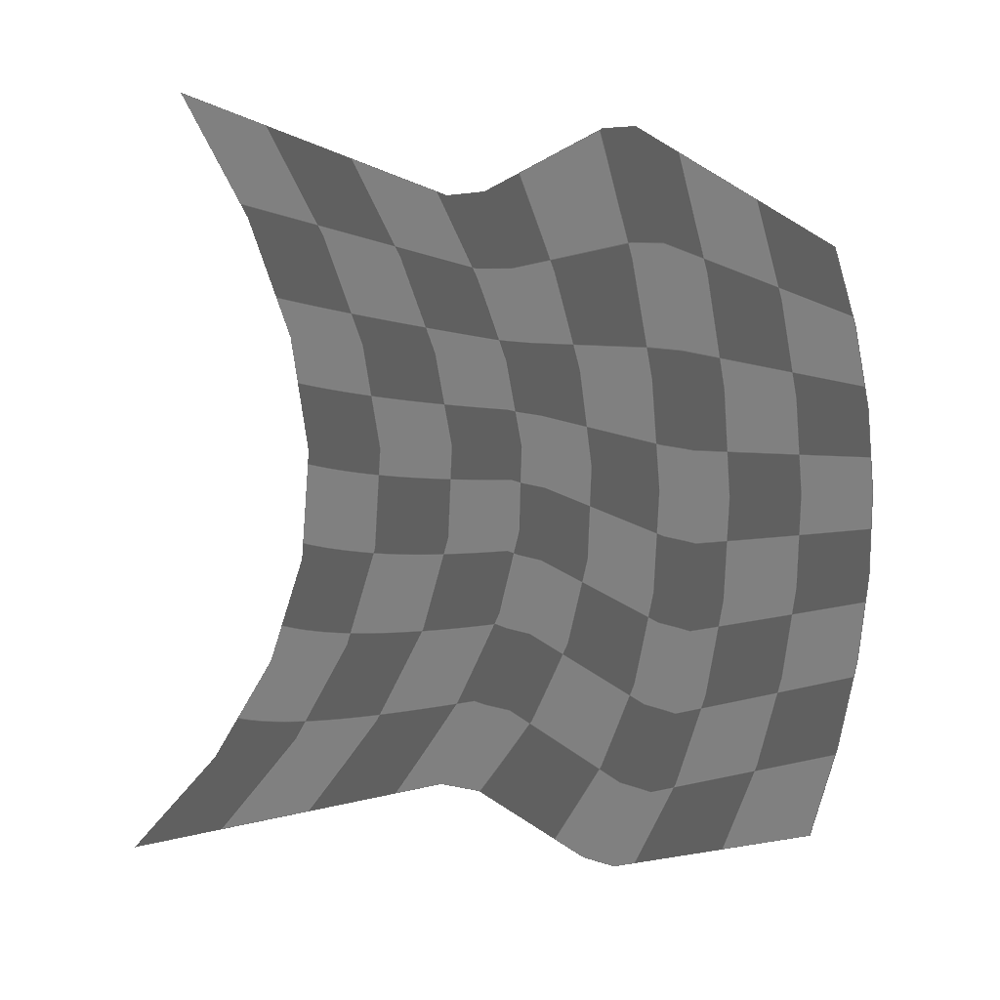
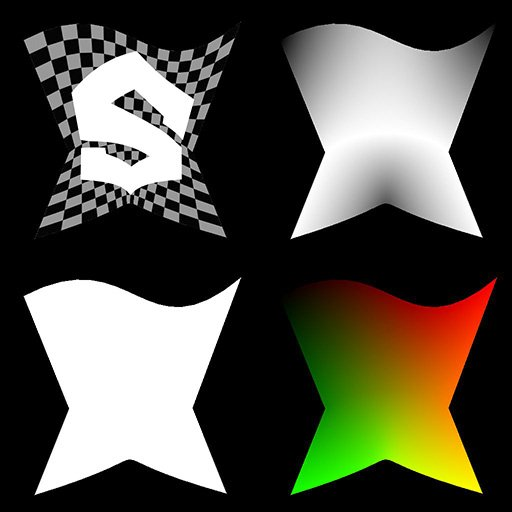

# スプラインブリッジマッパーのグレースケール

<table>
<tr style="border: 0;">
<td width="33.33%" style="border: 0;" valign="top">

<b>イン：</b>スプラインおよびパスツール> スプラインツール

</td>
<td width="100.00%" style="border: 0;" valign="top">

## 説明

入力スプラインのリスト全体にグレースケールイメージをマッピングし、イメージが順番にスプラインを横切るようにします。

</td>
</tr>
</table>

>[!TIP]
>
> マッピングは、リストの最初のスプラインから最後のスプラインに進み、リスト内のこれらのスプラインの順序に厳密に従って中間スプラインを横断します。
> 
> したがって、事前にスプラインを追加する順序に注意する必要があります。

>[!NOTE]
>
> [スプラインブリッジマッパーの色](../../../../../../compositing-graphs/nodes-reference-for-com/node-library/spline-paths-tools/spline-tools/spline-bridge-mapper-col/spline-bridge-mapper-color.md)も参照してください。

## 入力

|  |  |
|:---|:---|
| <b>スプライン座標</b> <i>色</i> | カラー画像のRGBAチャンネルでエンコードされた入力スプラインの点の座標： <b>R</b> - X位置 <b>G</b> - Y位置 <b>B</b> - Height <b>A</b> – パックデータ：  – 記号：スプラインが閉じている（負）か開いている（正）; -絶対値: Thickness + 1。 |
| <b>スプラインデータ</b> <i>色</i> | カラー画像のRGBAチャンネルでエンコードされた入力スプラインの追加データ。 <b>R</b> -正接X <b>G</b> -正接Y <b>B</b> – 未使用 <b>A</b> – 未使用 |
| <b>スプラインの量</b> <i>整数</i> | 入力スプラインの数。 |
| <b>カラーマップ</b> <i>グレースケール</i> | 入力スプラインにマップする必要がある入力グレースケールイメージ。 |

## 出力

|  |  |
|:---|:---|
| <b>色</b> <i>グレースケール</i> | 入力カラー画像をスプラインにマッピングした結果(グレースケールイメージ)。 |
| <b>Height</b> <i>グレースケール</i> | グレースケールイメージとして、スプラインにマッピングされたスプラインのHeight。 |
| <b>UV</b> <i>色</i> | カラー画像の赤(U)チャンネルと緑(V)チャンネルでエンコードされた、マッピングされた画像のUV（座標）。 |
| <b>マスク</b> <i>グレースケール</i> | スプライン間のマッピングのマスク。 |

## パラメーター

|  |  |
|:---|:---|
| <b>セグメント数</b> <i>整数</i> | スプラインは、イメージ座標が通過する前にセグメントに簡略化されます。 セグメントの数が多いほど、曲線に沿ったマッピングがスムーズになります。 |
| <b>UVの伸縮を縮小</b> <i>ブール値</i> | 1つのスプラインから次のスプラインへのイメージ座標の補間方法を調整し、スプライン間の距離が不均等な場合の伸縮を最小限に抑えます。 |
| <b>UV スケール</b> <i>浮動小数点2</i> | 画像座標の尺度を調整します。 値を大きくすると、画像がより密集してタイルされます。 |
| <b>UV回転</b> <i>フロート</i> | イメージ座標を中心を基準に回転します。 |

## 例

<table>
<tr style="border: 0;">
<td style="border: 0;" valign="top">

<table>
  <tr>
    <td>
      
       <i>前</i>
    </td>
    <td>
      
       <i>後</i>
    </td>
  </tr>
</table>

</td>
<td style="border: 0;" valign="top">

</td>
</tr>
</table>

<table>
<tr style="border: 0;">
<td style="border: 0;" valign="top">

</td>
<td style="border: 0;" valign="top">

</td>
</tr>
</table>
