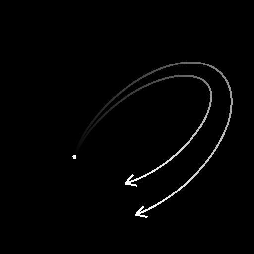

# スプライン円

<table>
<tr style="border: 0;">
<td width="33.33%" style="border: 0;" valign="top">

<b>イン：</b>スプラインおよびパスツール> スプラインツール

</td>
<td width="100.00%" style="border: 0;" valign="top">

## 説明

円のシェイプの単一のスプラインを生成します。

</td>
</tr>
</table>

## 入力

|  |  |
|:---|:---|
| <b>プレビュー</b> <i>グレースケール</i> | 入力スプラインをグレースケールイメージとしてプレビューします。 |
| <b>スプライン座標</b> <i>色</i> | カラー画像のRGBAチャンネルでエンコードされた入力スプラインの点の座標： <b>R</b> - X位置 <b>G</b> - Y位置 <b>B</b> - Height <b>A</b> – パックデータ：  – 記号：スプラインが閉じている（負）か開いている（正）; -絶対値: Thickness + 1。 |
| <b>スプラインデータ</b> <i>色</i> | カラー画像のRGBAチャンネルでエンコードされた入力スプラインの追加データ。 <b>R</b> -正接X <b>G</b> -正接Y <b>B</b> – 未使用 <b>A</b> – 未使用 |
| <b>スプラインの量</b> <i>整数</i> | 入力スプラインの数。 |

## 出力

|  |  |
|:---|:---|
| <b>プレビュー</b> <i>グレースケール</i> | 出力スプラインをグレースケールイメージとしてプレビューします。 |
| <b>スプライン座標</b> <i>色</i> | 出力スプラインの座標がカラー画像のRGBAチャンネルにエンコードされました。 <b>R</b> - X位置 <b>G</b> - Y位置 <b>B</b> - Height <b>A</b> – パックデータ：  – 記号：スプラインが閉じている（負）か開いている（正）; -絶対値: Thickness + 1。 |
| <b>スプラインデータ</b> <i>色</i> | カラー画像のRGBAチャンネルでエンコードされた出力スプラインの追加データ。 <b>R</b> -正接X <b>G</b> -正接Y <b>B</b> – 未使用 <b>A</b> – 未使用 |
| <b>スプラインの量</b> <i>整数</i> | 出力スプラインの数。 |

## パラメーター

|  |  |
|:---|:---|
| <b>円の半径</b> <i>フロート</i> | テクスチャ空間の円の半径を調整します。 |
| <b>円の事前回転</b> <i>フロート</i> | 「サイズ」を適用する前に、基準円に回転を適用します。 |
| <b>円のサイズ</b> <i>浮動小数点2</i> | 円の水平方向のサイズ(X)と垂直方向のサイズ(Y)を調整します。 |
| <b>回転後の円</b> <i>フロート</i> | [サイズ]を適用した後で、ベース円に回転を適用します。 |
| <b>円の位置</b> <i>浮動小数点2</i> | テクスチャ空間の円の中心の位置を設定します。 |
| <b>Thicknessの開始</b> <i>フロート</i> | 円の始点のThicknessを調整します。 このThicknessは、スプラインに沿って終了Thicknessまで補間されます。 注： Thicknessは特定のスプラインノードによって使用されます。 |
| <b>エンドThickness</b> <i>フロート</i> | 円の終点のThicknessを調整します。 このThicknessは、スプラインに沿って開始Thicknessまで補間されます。 注： Thicknessは特定のスプラインノードによって使用されます。 |
| <b>Heightの開始</b> <i>フロート</i> | 値が小さいほどHeightが低くなり、値が小さいほど深くなる、円の開始点の位置を調整します。 このHeightは、スプラインに沿って終了Heightまで補間されます。 |
| <b>エンドHeight</b> <i>フロート</i> | 円の終点のHeightを調整します。この値が小さいほど、位置が低くなり、深くなります。 このHeightは、開始Heightからスプラインに沿って補間されます。 |
| <b>トリミング</b> <i>浮動小数点2</i> | スプラインの始点と終点を円に沿ってオフセットします。 これらの値は正規化されます。 |
| <b>らせん状</b> <i>フロート</i> | 円の始点を半径から中心に移動します。 次に、中心からの距離がスプラインに沿ってスプラインの終点まで補間されます。 この値は正規化されます。 |
| <b>らせん旋回</b> <i>フロート</i> | 緩和曲線の中心を中心に巻き付ける巻き付け数を定義します。 |
| <b>スパイラルパワー</b> <i>フロート</i> | 緩和曲線の描画に使用する中心からの距離にパワーカーブを適用します。 1より大きい値を指定すると、緩和曲線の大部分が中心に近い状態を維持します。 |
| <b>方向を反転</b> <i>ブール値</i> | スプラインの方向を反転します。 |
| <b>均一な分布</b> <i>ブール値</i> | Trueの場合、スプラインの点は始点から終点まで等間隔になります。 |
| <b>入力スプラインを追加</b> <i>ブール値</i> | 生成されたスプラインを、<b>スプライン</b>入力に接続されたスプラインの一覧の最後に追加します。 |
| <b>非正方形の修正</b> <i>ブール値</i> | 点の位置とThicknessを調整して、非正方形の解像度でスプラインの形状を保持します。 これは均一な分布にも影響を与えます。 |
| <b>プレビュー</b> |  |
| <b>方向ヘルパーの表示</b> <i>ブール値</i> | プレビュー出力で、スプラインの始点に点を表示し、終点に矢印を表示します。 |
| <b>Thicknessの封筒を表示</b> <i>ブール値</i> | スプラインのThicknessのエッジに追加の線分を表示します。 |
| <b>セグメント数</b> <i>整数</i> | プレビュー出力でスプラインのビジュアライゼーションを描画するために使用するセグメントの数を調整します。 値が大きいほど、線は滑らかになります。 |
| <b>Thickness (px)</b> <i>フロート</i> | プレビュー出力のスプラインビジュアライゼーションのThicknessをピクセル単位で調整します。 |

## 例

<table>
<tr style="border: 0;">
<td style="border: 0;" valign="top">

</td>
<td style="border: 0;" valign="top">

</td>
</tr>
</table>

<table>
<tr style="border: 0;">
<td style="border: 0;" valign="top">

</td>
<td style="border: 0;" valign="top">

</td>
</tr>
</table>
