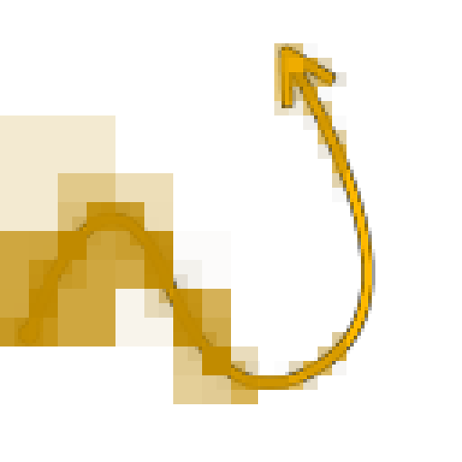

# スプラインレンダリング

<table>
<tr style="border: 0;">
<td style="border: 0;" valign="top">

<table>
<tr style="border: 0;">
<td width="33.33%" style="border: 0;" valign="top">

<b>イン：</b>スプラインおよびパスツール> スプラインツール

</td>
<td width="100.00%" style="border: 0;" valign="top">

## 説明

入力<b>スプライン</b>に沿ったセグメントの文字列を、入力<b>背景</b>上に描画します。

</td>
</tr>
</table>

## 入力コネクタ

<b>背景&#x200B;</b>*グレースケール*&#x200B;スプラインを描画するグレースケールイメージです。

<b>スプライン座標</b> *色*&#x200B;入力スプラインの点の座標は、カラー画像のRGBAチャンネルでエンコードされています：\
<b> R</b> - X位置\
<b> G</b> - Y位置\
<b> B</b> - Height\
    <b>A</b> – パックされたデータ：\
        *記号：スプラインが閉じている（負）か、開いている（正）;\
        *絶対値：Thickness + 1。

<b>スプラインデータ</b> *色*&#x200B;カラー画像のRGBAチャンネルでエンコードされた入力スプラインの追加データです。\
<b> R</b> – 接線X\
<b> G</b> – 接線Y\
<b> B</b> – 未使用\
<b> A</b> – 未使用

<b>スプラインの量</b> *整数*&#x200B;入力スプラインの数です。

## 出力コネクタ

<b>出力</b> *グレースケール*\
入力スプラインをバックグラウンドの上に描画した結果イメージ。

## パラメーター

<b>モード</b> *整数*&#x200B;描画するスプラインの選択方法：
* *スプラインリストの描画*：入力リストのすべてのスプラインを描画します。
* *単一スプラインの描画*：入力リストから指定されたスプラインのみを描画します；
* *スプライン範囲の描画*：入力リストから指定された範囲のスプラインのみを描画します。

<b>スプラインインデックスの描画</b> *整数* （&#39;Mode&#39;が&#39;Draw Single Spline&#39;に設定されている場合に使用可能）描画する必要があるスプラインのインデックスです。

<b>スプライン範囲の描画</b> *Integer2* （&#39;Mode&#39;が&#39;Draw Spline Range&#39;に設定されている場合に使用可能）描画する必要があるスプラインのインデックスの範囲。

<b>方向ヘルパーの表示</b> *ブール値*&#x200B;各スプラインに対して、スプラインの始点に点を描画し、終点に矢印を描画します。

<b>セグメント数</b> *整数*&#x200B;スプラインに沿って描画されるセグメントの数を調整します。\
値が大きいほど、線は滑らかになります。

<b>エンベロープスプラインの量</b> *整数*\
各スプラインのThicknessに沿って描画する重複セグメントの数。

<b>開始</b> *フロート*&#x200B;描画するスプラインの始点をオフセットします。\
この値は、スプラインの正規化された長さを表します。

<b>終了</b> *フロート*&#x200B;描画するスプラインの端をオフセットします。\
この値は、スプラインの正規化された長さを表します。

<b>Thicknessサイズモード</b> *整数*&#x200B;描画された線分のThicknessを計算する方法：
* *イメージ*：この値はテクスチャ空間で正規化されます。1はイメージの全幅です。 Thicknessはテクスチャの解像度を基準とします。
* *ピクセル*：値はテクスチャ内の絶対ピクセル数で、1は完全なピクセルです。 Thicknessは、テクスチャ解像度とは別のものです。

<b>Thickness （画像）</b> *フロート* （&#39;Thicknessサイズモード&#39;がImageに設定されている場合に使用可能）描画されたセグメントのThicknessです。テクスチャ空間で正規化されています。1はイメージの全幅です。

<b>Thickness (px)</b> *フロート* （&#39;Thicknessサイズモード&#39;がピクセルに設定されている場合に使用可能）描画されたセグメントのThicknessを、テクスチャ内の絶対ピクセル数で指定します（1は完全ピクセル）。

<b>ジョイントを有効にする</b> *ブール値*&#x200B;スプラインに沿って描画された個々のセグメント間のギャップをディスクで埋めます。

<b>非正方形の補正&#x200B;</b>*ブール値*&#x200B;ポイントの位置とThicknessを調整して、非正方形の解像度でスプラインのシェイプを保持します。\
これは均一な分布にも影響を与えます。

+++カラー
<b>背景の適用度</b> *浮動小数点*&#x200B;値に背景入力イメージを掛け合わせます。

<b>スプラインスタイル</b> *整数*&#x200B;スプラインに色を付けるために使用されるメソッド：
* *実線*：均一なグレースケール値を使用してセグメントが描画されます。
* *グラデーション*：最初から最後まで、セグメントの各文字列に沿って、黒から白へのグラデーションが適用されます。
* *Height*:スプラインのHeightは、セグメントを描画するためのグレースケール値として使用されます。

<b>スプラインの色</b> *浮動小数点*&#x200B;セグメントの描画に使用する均一のグレースケール値です。\
「実線」以外のスプラインスタイルを選択すると、この色はスタイル設定された色に対して乗算されます。

<b>ランダムな輝度</b> *浮動小数点*&#x200B;スプラインのカットされていないセグメントの文字列ごとに、その文字列の描画に使用するグレースケール値に、指定した範囲でランダムオフセットを適用します。

<b>描画モード</b> *整数*&#x200B;スプラインに沿って描画された背景と重なり合うセグメントの色をブレンドする方法：
* *最大*：最も明るい値が使用されています；
* *追加*：値が一緒に追加されます。

+++

+++ランダムなセグメント
<b>ランダムセグメントの開始</b> *フロート*&#x200B;スプラインの始点に近いセグメントの文字列が切り取られる確率を調整します。

<b>ランダムセグメントの終了</b> *フロート*&#x200B;スプラインの端に近いセグメントの文字列が切り取られる確率を調整します。

<b>ランダムオフセット</b> *フロート*&#x200B;各カットセグメントの法線に沿って適用されるディスプレイスメントの最大値を設定します。\
StartとEndの両方が0に設定されている場合、このパラメータは無効です。

<b>ランダムオフセットの中心</b> *フロート*&#x200B;各カットセグメントに適用されたランダムなディスプレイスメントの中心を、その法線に沿ってオフセットします。

+++

## 例

<table>
<tr style="border: 0;">
<td style="border: 0;" valign="top">

<table>
  <tr>
    <td>
      
       <i>前</i>
    </td>
    <td>
      
       <i>後</i>
    </td>
  </tr>
</table>

</td>
<td style="border: 0;" valign="top">

<table>
  <tr>
    <td>
      
       <i>前</i>
    </td>
    <td>
      
       <i>後</i>
    </td>
  </tr>
</table>

</td>
</tr>
</table>

<table>
<tr style="border: 0;">
<td style="border: 0;" valign="top">

<table>
  <tr>
    <td>
      
       <i>前</i>
    </td>
    <td>
      
       <i>後</i>
    </td>
  </tr>
</table>

</td>
<td style="border: 0;" valign="top">

</td>
</tr>
</table>

</td>
<td style="border: 0;" valign="top">

</td>
<td style="border: 0;" valign="top">

</td>
</tr>
</table>
