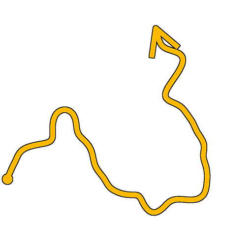

# スプラインワープ

<table>
<tr style="border: 0;">
<td style="border: 0;" valign="top">

<table>
<tr style="border: 0;">
<td width="33.33%" style="border: 0;" valign="top">

<b>イン：</b>スプラインおよびパスツール> スプラインツール

</td>
<td width="100.00%" style="border: 0;" valign="top">

## 説明

入力の強さマップまたはベクトルマップに基づいて、入力スプラインを変位させます。

ワープエフェクトの強度は、減衰コントロールを使用してスプラインに沿って調整できます。

</td>
</tr>
</table>

## 入力コネクタ

<b>プレビュー</b> *グレースケール*&#x200B;入力スプラインをグレースケールイメージとしてプレビューします。

<b>スプライン座標</b> *色*&#x200B;入力スプラインの点の座標は、カラー画像のRGBAチャンネルでエンコードされています：\
<b> R</b> - X位置\
<b> G</b> - Y位置\
<b> B</b> - Height\
<b>A</b> – パックされたデータ：\
*記号：スプラインが閉じている（負）か、開いている（正）;\
*絶対値：Thickness + 1。

<b>スプラインデータ</b> *色*&#x200B;カラー画像のRGBAチャンネルでエンコードされた入力スプラインの追加データです。\
<b> R</b> – 接線X\
<b> G</b> – 接線Y\
<b> B</b> – 未使用\
<b> A</b> – 未使用

<b>スプラインの量</b> *整数*&#x200B;入力スプラインの数です。

<b>強度マップ</b> *グレースケール* （[ベクターマップの使用]が&#39;False&#39;に設定されている場合に使用可能）\
入力スプラインのワープ効果の方向と強度を制御するために使用される入力グレースケールイメージ。\
イメージ内の各ピクセルのカラーは、イメージのスパン全体に対する法線（つまり、スプラインに垂直な方向）に沿ってスプラインの点を置き換えるための乗数を指定します。\
[0; 1]の値は、マルチプライヤとして読み込まれた場合、[-1; 1]の範囲に再マップされます。0と1は、スプラインを同じ距離だけ、反対方向に置き換えます。 0.5は、スプラインを所定の位置に残します。

<b>ベクターマップ</b> *グレースケール* （&#39;ベクトルマップの使用&#39;が&#39;True&#39;に設定されている場合に使用可能）入力スプラインのワープ効果の方向と強さを制御するために使用される入力カラー画像。\
画像内の各ピクセルのカラーは、赤(X)および緑(Y)チャンネルでエンコードされる座標のベクトル(X、Y)を指定します。 +Xが右、+Yが下。\
画像内の[0; 1]の値は、ベクトル座標として読み込まれると、[-1; 1]の範囲に再マップされます。0 red displaces points leftと0 green displaces points upです。 0.5赤と緑は、スプラインを所定の位置に残します。

<b>減衰曲線</b> *グレースケール*&#x200B;最初のピクセル行の値を使用して曲線を表す画像です。\
Use Attenuation CurveパラメータがTrueに設定されている場合、この入力を使用して、スプラインの開始付近と終了付近のワープエフェクトの減衰を制御します。\
このカーブは減衰のプロファイルを提供します。行の最初のピクセルはスプラインの始点でのワープ効果の強度で、最後のピクセルは終点での強度です。 グレースケールの値は適用度です。\
カーブノードを使用してカーブを作成できます。

## 出力コネクタ

<b>プレビュー</b> *グレースケール*&#x200B;出力スプラインをグレースケールイメージとしてプレビューします。

<b>スプライン座標</b> *色*&#x200B;出力スプラインの点の座標は、色画像のRGBAチャンネルでエンコードされます。\
<b>R</b> - X位置\
<b>G</b> - Y位置\
<b>B</b> -Height\
<b>A</b> – パックされたデータ：\
*記号：スプラインが閉じている（負）か、開いている（正）;\
*絶対値：Thickness + 1。

<b>スプラインデータ</b> *カラー*&#x200B;カラー画像のRGBAチャンネルでエンコードされた出力スプラインの追加データ。\
<b>R</b> – 接線X\
<b>G</b> – 接線Y\
<b>B</b> – 未使用\
<b>A</b> – 未使用

<b>スプラインの量</b> *整数*&#x200B;出力スプラインの数です。

## パラメーター

<b>ワープの強さ</b> *フロート*&#x200B;スプラインを移動する際の強度です。

<b>ワープの中心</b> *浮動小数*&#x200B;スプラインをそのままにしておくことに対応する強度マップ値を指定します。\
値を0または1に設定すると、スプラインは一方の側にのみ移動できます。

<b>サンプリングモード</b> *整数*&#x200B;強度マップまたはベクトルマップの値をスプラインにマッピングする方法：\
*– テクスチャ空間*：値は、テクスチャのUV座標を使用してテクスチャに配置されるスプラインに適用されます。 これによって、スプラインに値が「その場で」適用されます。\
*– スプラインに沿った水平*：値は、エンコードされたスプラインの座標に直接適用されます（「スプライン座標」の入力を参照）。各行は上から下に異なるスプラインに適用されます。\
*– 時間 スプラインに沿って（ランダム偏差） オフセットX)*：値は、エンコードされたスプラインの座標に直接（スプライン座標の入力を参照）適用され、各スプラインのスケールマップ内のランダムな水平オフセット（スプライン座標の各行）を伴います。\
*– 時間 スプラインに沿って（ランダム偏差） オフセットY)*：値は、エンコードされたスプラインの座標に直接適用され（スプライン座標の入力を参照）、各スプラインのスケールマップ内のランダムな垂直オフセット（スプライン座標の各行）を伴います。

<b>ベクターマップを使う</b> *ブール値*&#x200B;スプラインを置き換える方法を、ディスプレイスメントの方向を指定するベクトルマップ入力の使用に切り替えます。\
画像内の各ピクセルのカラーは、赤(X)および緑(Y)チャンネルでエンコードされる座標のベクトル(X、Y)を指定します。 +Xが右、+Yが下。\
画像内の[0; 1]の値は、ベクトル座標として読み込まれると、[-1; 1]の範囲に再マップされます。0 red displaces points leftと0 green displaces points upです。 0.5赤と緑は、スプラインを所定の位置に残します。

<b>減衰曲線を使用</b> *ブール値*&#x200B;減衰カーブの入力画像でエンコードされたカーブを使用して、スプラインに沿ったワープ効果の強度を制御します。<b></b>

<b>照度マップのタイル表示</b> *フロート* （&#39;サンプリングモード&#39;が&#39;テクスチャ空間&#39;に設定されていない場合に使用可能）スプライン座標に直接マップされるときに、強度マップのタイリングを調整します（[スプライン座標]の入力を参照）。<b></b>

<b>減衰の開始</b> *浮動小数* （[減衰曲線を使用]が[偽]に設定されている場合に使用可能）スプラインの開始付近のワープ効果の減衰の乗数。\
値が1の場合は、スプラインの始点にワープが適用されません。

<b>減衰の終了</b> *浮動小数* （[減衰曲線を使用]が[偽]に設定されている場合に使用可能）スプラインの端近くのワープ効果の減衰の乗数。\
値が1の場合、スプラインの最後にワープが適用されません。<b></b>

<b>接線を再計算</b> *ブール値* Trueの場合、ワープ効果の適用後にスプラインの接線が再計算されます。\
これにより、「スプライン上の散乱」や「スプラインフローマッパー」などのノードで使用する場合に、スプラインの接線が軌道と一致した状態を保つことができます。

+++プレビュー
<b>セグメント数</b> *整数*&#x200B;プレビュー出力でスプラインの視覚化を描画するために使用するセグメントの数を調整します。\
値が大きいほど、線は滑らかになります。

<b>方向ヘルパーの表示</b> *ブール値*&#x200B;プレビュー出力のスプラインの始点に点を表示し、終点に矢印を表示します。

<b>Thicknessの封筒を表示</b> *ブール値*\
スプラインのThicknessのエッジに追加の線分を表示します。

<b>Thickness (px)</b> *フロート*&#x200B;プレビュー出力のスプラインの表示Thicknessをピクセル単位で調整します。

<b>背景プレビューの適用度</b> *フロート*\
背景プレビューの入力画像に対して乗算される値。

+++

## 例

<table>
<tr style="border: 0;">
<td style="border: 0;" valign="top">

<table>
  <tr>
    <td>
      
       <i>前</i>
    </td>
    <td>
      
       <i>後</i>
    </td>
  </tr>
</table>

</td>
<td style="border: 0;" valign="top">

<table>
  <tr>
    <td>
      
       <i>前</i>
    </td>
    <td>
      
       <i>後</i>
    </td>
  </tr>
</table>

</td>
</tr>
</table>

<table>
<tr style="border: 0;">
<td style="border: 0;" valign="top">

</td>
<td style="border: 0;" valign="top">

</td>
</tr>
</table>

</td>
<td style="border: 0;" valign="top">

</td>
<td style="border: 0;" valign="top">

</td>
</tr>
</table>
