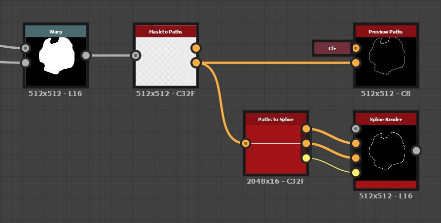
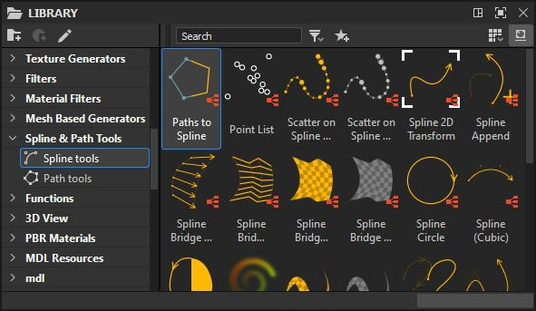
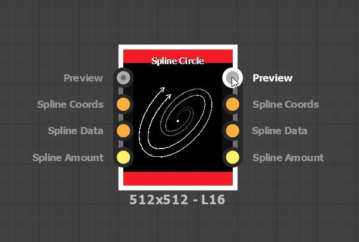

# パスとスプラインツールの操作

「パスとスプライン」ツールセットは、イメージの描画、マップ、散乱に使用される解に依存しないシェイプとカーブを作成および編集できるノードの集まりです。

## 概要

### パスとスプラインとは

<b>パス</b>は、直線に接続された一連のポイントです。

<b>スプライン</b>は、制御点とそれらの点の接線によって軌道が形成される滑らかな曲線です。\
各点は、イメージのマッピング、ワープ、およびスキャタリングを制御するために使用されるスプラインのHeightとThicknessアトリビュートも制御します。

それぞれ、閉じたシェイプや開いたシェイプを作成できます。

<table>
<tr style="border: 0;">
<td width="100.00%" style="border: 0;" valign="top">

### ノード出力

ノードは、パスとスプラインを表す<b>エンコードされたデータ</b>を含む画像を出力します。

例えば、右側の画像は、[Paths Polygon](../../../../../compositing-graphs/nodes-reference-for-com/node-library/spline-paths-tools/path-tools/paths-polygon/paths-polygon.md)ノードによって出力された画像を表しています。

</td>
<td width="33.33%" style="border: 0;" valign="top">

</td>
</tr>
</table>

そのため、彼らが作り出す画像はグラフィック要素として直接使用することはできません。 ツールセット内の他のノードで処理してグラフィック結果に変換し、Substanceグラフに使用できるその他のノードで使用できるようにする必要があります。

パスとスプラインを操作しながら、パス用の専用[パスのプレビュー](../../../../../compositing-graphs/nodes-reference-for-com/node-library/spline-paths-tools/path-tools/preview-paths/preview-paths.md)ノードと、スプライン用の専用<b>プレビュー</b>出力を使用して、画像にマッピングされたこれらのオブジェクトをプレビューできます。

<table>
<tr style="border: 0;">
<td width="100.00%" style="border: 0;" valign="top">

### 2D表示の操作

ツールセットのノードの数が非常に多いため、コントロールギズモを使用して[2Dビュー](../../../../../interface/2d-view/2d-view.md)で直接編集を行うことができます。 これらのギズモには、位置ギズモおよび変換マトリックスが含まれる。

たとえば、[スプライン（3次）](../../../../../compositing-graphs/nodes-reference-for-com/node-library/spline-paths-tools/spline-tools/spline-cubic/spline-cubic.md)や[スプライン（多角形）](../../../../../compositing-graphs/nodes-reference-for-com/node-library/spline-paths-tools/spline-tools/spline-poly-quadratic/spline-poly-quadratic.md)などのスプライン生成ノードを使用すると、スプラインの制御点を移動できます。 パスの場合、[パスのクワッド変換](../../../../../compositing-graphs/nodes-reference-for-com/node-library/spline-paths-tools/path-tools/quad-transform-on-path/quad-transform-on-path.md)を選択すると、同様のコントロールが表示されます。

</td>
<td width="33.33%" style="border: 0;" valign="top">

</td>
</tr>
</table>

### Performance

パスとスプラインツールは集中的な計算を必要とするため、ツールセットを使用する際には、最高のパフォーマンスと応答性を確保するために、次のいくつかの設定に注意する必要があります。

1. ツールセットは、GPU上で高速に実行される<b>Substance engine</b>機能を幅広く利用します。 そのため、次のシステムに対応するエンジンのGPUバージョンを使用してください： <b>Direct3D</b> (Windows)または<b>OpenGL</b> (macOS)。\
   エンジンを切り替えるには、<b>F9</b>キーを押すか、メインメニューバーの<b>ツール/エンジンを切り替え…</b>に移動します。
1. その場合は、[環境設定](../../../../../interface/preferences-window/preferences-window.md)の<b>グラフ</b>セクションで<b>コンテキスト編集</b>をオフにすることを強くお勧めします（このウィンドウにアクセスするには、メインメニューバーの<b>編集/環境設定…</b>に移動します）。\
   コンテキスト内編集では、ホストグラフのコンテキストでインスタンスノードを開くことができます。これは明らかに非常に便利ですが、ツールセットのイメージキャッシュによって必要とされる計算を指数関数的に増加させる副作用があります。

これら2つの設定のいずれかを推奨状態に変更すると、パフォーマンスが大幅に向上します。

## パスツール

### パスの生成

[パス多角形](../../../../../compositing-graphs/nodes-reference-for-com/node-library/spline-paths-tools/path-tools/paths-polygon/paths-polygon.md)は、指定された半径と辺の数の多角形の形状のパスを生成します。

または、[Mask to Paths](../../../../../compositing-graphs/nodes-reference-for-com/node-library/spline-paths-tools/path-tools/mask-to-paths/mask-to-paths.md)ノードを使用して、グレースケール画像からパスを抽出できます。\
これは現在、複雑な図形を作成する唯一の方法です。[パスグラフノード](../../../../../compositing-graphs/nodes-reference-for-com/nodes-reference-for-substance-compositing-graphs.md)のライブラリ全体を利用して、最終的にSubstanceに変換される図形を作成できます。

{width="600px"}

### パスの編集

[パス2Dの変形](../../../../../compositing-graphs/nodes-reference-for-com/node-library/spline-paths-tools/path-tools/path-2d-transform/path-2d-transform.md)、[パスのワープ](../../../../../compositing-graphs/nodes-reference-for-com/node-library/spline-paths-tools/path-tools/paths-warp/paths-warp.md)および[パスの四角形変形](../../../../../compositing-graphs/nodes-reference-for-com/node-library/spline-paths-tools/path-tools/quad-transform-on-path/quad-transform-on-path.md)では、パスのシェイプを編集できます。

[パスの選択](../../../../../compositing-graphs/nodes-reference-for-com/node-library/spline-paths-tools/path-tools/paths-select/paths-select.md)ノードを使用して、インデックスまたは長さでパスを選択することで、不要なパスを削除することもできます。

[パス頂点プロセッサー](../../../../../compositing-graphs/nodes-reference-for-com/node-library/spline-paths-tools/path-tools/paths-vertex-processor/paths-vertex-processor.md)ノードを使用すると、パスの各ポイントでより複雑な処理を実行できます。 [よりシンプルなバージョン](../../../../../compositing-graphs/nodes-reference-for-com/node-library/spline-paths-tools/path-tools/paths-vertex-processor-1/paths-vertex-processor-simple.md)が存在し、細かい調整が可能です。

<table>
<tr style="border: 0;">
<td width="100.00%" style="border: 0;" valign="top">

### パスのプレビューノード

パスノードの結果のプレビューは、専用の[パスのプレビュー](../../../../../compositing-graphs/nodes-reference-for-com/node-library/spline-paths-tools/path-tools/preview-paths/preview-paths.md)ノードを使用して実行されます。\
このノードには出力がありません。 ノード上のLMBをダブルクリックして、[2Dビュー](../../../../../interface/2d-view/2d-view.md)にプレビューを表示します。

個別のパスにはプレビューで一意のカラーが使用され、各パスを簡単に区別できます。

</td>
<td width="33.33%" style="border: 0;" valign="top">

</td>
</tr>
</table>

### スプラインへのパス

[[スプラインへのパス]](../../../../../compositing-graphs/nodes-reference-for-com/node-library/spline-paths-tools/path-tools/paths-to-spline/paths-to-spline.md)ノードを使用してパスをスプラインに変換することで、パスを持つスプライン専用のツールセット全体を活用できます。

スプラインは曲線であるため、パスのシャープさを維持することはできません。 パスをスプラインに変換する場合は、シェイプの滑らかさが期待できます。

パスを通してスプラインツールセットを活用する場合に非常に便利な組み合わせは、次のとおりです。

<b>マスク/パスにマスク/スプラインへのパス</b>

### パス形式の仕様

パスノードは、カラー画像にエンコードされたパスのデータを出力するので、「パスをプレビュー」ノードは必須です。\
このエンコードは、[パス形式の仕様](../../../../../compositing-graphs/nodes-reference-for-com/node-library/spline-paths-tools/path-tools/paths-format-spe/paths-format-specifications.md)ページで説明されている仕様に従っています。

この仕様を使用して、この形式を使用して独自のノードを作成し、[パス頂点プロセッサー](../../../../../compositing-graphs/nodes-reference-for-com/node-library/spline-paths-tools/path-tools/paths-vertex-processor/paths-vertex-processor.md)のノードを最大限に活用できます。

## スプラインツール

### スプラインの生成

スプラインは、[スプライン円](../../../../../compositing-graphs/nodes-reference-for-com/node-library/spline-paths-tools/spline-tools/spline-circle/spline-circle.md)、[スプライン（3次）](../../../../../compositing-graphs/nodes-reference-for-com/node-library/spline-paths-tools/spline-tools/spline-cubic/spline-cubic.md)、[スプライン（多角形）](../../../../../compositing-graphs/nodes-reference-for-com/node-library/spline-paths-tools/spline-tools/spline-poly-quadratic/spline-poly-quadratic.md)などのノードを使用して生成できます。 これらのノードを使用すると、ノードに応じて異なるコントロールを使用して、任意の軌道のスプラインを描画できます。

または、[[スプラインへのパス]](../../../../../compositing-graphs/nodes-reference-for-com/node-library/spline-paths-tools/path-tools/paths-to-spline/paths-to-spline.md)ノードを使用して、パスからスプラインを抽出することもできます。\
スプラインは曲線であるため、パスのシャープさを維持することはできません。 パスをスプラインに変換する場合は、シェイプの滑らかさが期待できます。

パスを通してスプラインツールセットを活用する場合に非常に便利な組み合わせは、次のとおりです。

<b>マスク/パスにマスク/スプラインへのパス</b>

スプラインを使用すると、より多くのスプラインを生成することもできます。 たとえば、[スプラインブリッジ（2スプライン）](../../../../../compositing-graphs/nodes-reference-for-com/node-library/spline-paths-tools/spline-tools/spline-bridge-2-splines/spline-bridge-2-splines.md)と[スプラインブリッジ（一覧）](../../../../../compositing-graphs/nodes-reference-for-com/node-library/spline-paths-tools/spline-tools/spline-bridge-list/spline-bridge-list.md)は、スプラインの一覧を順番にトラバースするスプラインを生成します。

### スプラインを編集する

[スプライン2D変形](../../../../../compositing-graphs/nodes-reference-for-com/node-library/spline-paths-tools/spline-tools/spline-2d-transform/spline-2d-transform.md)および[スプラインワープ](../../../../../compositing-graphs/nodes-reference-for-com/node-library/spline-paths-tools/spline-tools/spline-warp/spline-warp.md)を使用すると、スプラインのシェイプを編集できます。

不要なスプラインを削除するには、インデックスでパスを選択したり、[スプライン選択](../../../../../compositing-graphs/nodes-reference-for-com/node-library/spline-paths-tools/spline-tools/spline-select/spline-select.md)ノードを使用してスプラインをトリムします。

[スプラインサンプルThickness](../../../../../compositing-graphs/nodes-reference-for-com/node-library/spline-paths-tools/spline-tools/spline-sample-height/spline-sample-height.md)と[スプラインサンプルHeight](../../../../../compositing-graphs/nodes-reference-for-com/node-library/spline-paths-tools/spline-tools/spline-sample-thickness/spline-sample-thickness.md)を使用すると、軌道に加えて、スプラインのHeightとThicknessのプロパティを事後に調整することができます。

最後に、[スプライン結合リスト](../../../../../compositing-graphs/nodes-reference-for-com/node-library/spline-paths-tools/spline-tools/spline-merge-list/spline-merge-list.md)ノードにより、個別のスプラインを1つのスプラインに結合できます。

### スプラインを追加する

スプラインを作成および編集するとき、複数のスプラインを一度に調整または使用するために、複数のスプラインを組み合わせる必要がある場合があります。

スプラインは、<b>順序リスト</b>として保存および処理されることに注意してください。

スプラインの結合は、[スプライン追加](../../../../../compositing-graphs/nodes-reference-for-com/node-library/spline-paths-tools/spline-tools/spline-append/spline-append.md)ノードを使用して行われます。 追加とは、注文されたエンティティの最後に何かを追加する行為です。 実際、ノードは、最初のセットの最後に2番目のセットを追加することによって、2つのスプラインのリストを組み合わせます。

したがって、スプラインを追加する順序を考慮することは非常に重要です。

これは、[スプラインブリッジ（一覧）](../../../../../compositing-graphs/nodes-reference-for-com/node-library/spline-paths-tools/spline-tools/spline-bridge-list/spline-bridge-list.md)、[スプラインブリッジマッパー](../../../../../compositing-graphs/nodes-reference-for-com/node-library/spline-paths-tools/spline-tools/spline-bridge-mapper-gra/spline-bridge-mapper-grayscale.md)、[スプライン結合リスト](../../../../../compositing-graphs/nodes-reference-for-com/node-library/spline-paths-tools/spline-tools/spline-merge-list/spline-merge-list.md)など、スプラインを結合する必要があるノードに影響を与えます。

### スプライン入力および出力

スプラインは、1つのノードから別のノードに、コネクタのグループを使用して渡されます。

* <b>スプライン座標&#x200B;</b>*色*&#x200B;入力スプラインの点の座標は、カラー画像のRGBAチャンネルでエンコードされます。
* <b>スプラインデータ&#x200B;</b>*色*&#x200B;カラー画像のRGBAチャンネルにエンコードされた入力スプラインの追加データ。
* <b>スプラインの量&#x200B;</b>*整数*&#x200B;入力スプラインの数です。

ソースノードの各出力コネクタは、ターゲットノードの名前が一致する入力コネクタに接続されている必要があります。

これらの接続を高速化するには、<b>マテリアル</b>を使用するか、<b>マテリアルを圧縮</b>します [リンク作成モード](../../../../../interface/the-graph-view/link-creation-modes/link-creation-modes.md)。 これにより、1回の操作で3つのスプラインコネクタを接続できます。

<table>
<tr style="border: 0;">
<td style="border: 0;" valign="top">

### プレビュー出力

ほとんどのノードには、イメージ内のスプラインをレンダリングする<b>プレビュー</b>出力が用意されており、それらの軌跡とプロパティを確認することができます。

このプレビューは、<b>プレビュー</b>グループのパラメーターを使用して、ノードパラメーターで調整できます。

</td>
<td style="border: 0;" valign="top">

</td>
</tr>
</table>

<table>
<tr style="border: 0;">
<td width="100.00%" style="border: 0;" valign="top">

### セグメントとしてレンダリング

スプラインは、固有の解像度を持たない曲線です。つまり、無限に拡大または縮小でき、データの格納に使用する精度を正確に表すことには限界があります。

スプラインをピクセルとして描画するには、ツールセットを使用して、スプラインの軌道に沿って描画された直線またはセグメントに単純化します。

</td>
<td width="33.33%" style="border: 0;" valign="top">

</td>
</tr>
</table>

つまり、イメージ内のスプラインの描画に使用されるセグメントの数に注意が必要な場合があります。セグメントの数が少なすぎて滑らかな曲線を描画できないか、セグメントの数が多すぎてターゲットの解像度に対して無駄になっている可能性があります。

イメージ内にスプラインを描画するノードには、そのセグメントの量を制御できる<b>Segments Amount</b>パラメーターがあります。 値が大きいほど曲線は滑らかになりますが、パフォーマンスが低下します。

### スプラインからイメージを作成する

スプラインのオーサリングと編集が完了したら、そのスプラインを使用して残りのSubstanceグラフノードを活用できるイメージを作成できます。

スプラインを使用してグラフィックスを生成するには、主に次の3つの方法があります。

* [スプラインレンダリング](../../../../../compositing-graphs/nodes-reference-for-com/node-library/spline-paths-tools/spline-tools/spline-render/spline-render.md)または[スプライン塗りつぶし](../../../../../compositing-graphs/nodes-reference-for-com/node-library/spline-paths-tools/spline-tools/spline-fill/spline-fill.md)ノードで、シェイプとプロパティを使用してスプラインをレンダリングします。
* [スプラインマッパー](../../../../../compositing-graphs/nodes-reference-for-com/node-library/spline-paths-tools/spline-tools/spline-mapper-grayscale/spline-mapper-grayscale.md)、[スプラインブリッジマッパー](../../../../../compositing-graphs/nodes-reference-for-com/node-library/spline-paths-tools/spline-tools/spline-bridge-mapper-gra/spline-bridge-mapper-grayscale.md)および[スプラインフローマッパー](../../../../../compositing-graphs/nodes-reference-for-com/node-library/spline-paths-tools/spline-tools/spline-flow-mapper/spline-flow-mapper.md)などのマッピングノードを使用して、スプラインに沿ってイメージをマップします。
* スプライン[&#128279;](../../../../../compositing-graphs/nodes-reference-for-com/node-library/spline-paths-tools/spline-tools/scatter-spline-grayscale/scatter-on-spline-grayscale.md)ノードの散乱を使用して、スプラインに沿って散乱パターンを作成します。
