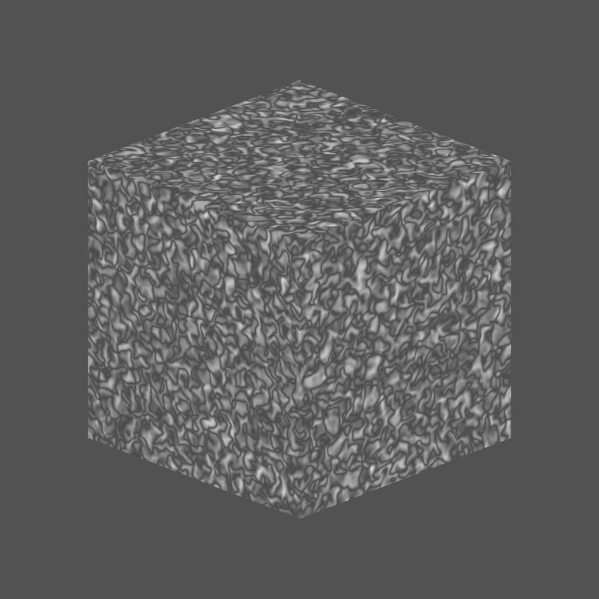

# 3Dパーリンノイズフラクタル

<table>
<tr style="border: 0;">
<td width="33.33%" style="border: 0;" valign="top">

{width="200px"}

<b>内：</b> テクスチャジェネレータ> ノイズ

</td>
<td width="100.00%" style="border: 0;" valign="top">

## 説明

<b>3Dパーリンノイズフラクタル</b>ノードは、<b>位置マップ</b>入力に基づいて、3D空間に<i>フラクタル</i>パーリンノイズを生成します。

このノードは、実際のベイク済みマップではなく、[Cube 3D GBuffers](../../../../../../compositing-graphs/nodes-reference-for-com/node-library/texture-generators/patterns/cube-3d-gbuffers/cube-3d-gbuffers.md)を入力としてテストできます（下図の例を参照）。

</td>
</tr>
</table>

>[!WARNING]
>
> このノイズは、<i>GPUエンジンのみ</i> （<b>Direct3D</b>または<b>OpenGL</b>）で使用することを目的としています。 <b>ツール/エンジンの切り替え…</b>に移動するか、<b>F9</b>キーを押して、目的のエンジンを選択します。

## パラメーター

|  |  |
|:---|:---|
| <b>反転</b> <i>ブール値</i> | 出力イメージを反転します。 |
| <b>スケール</b> <i>フロート</i> | フラクタル3Dパーリンノイズの尺度をコントロールします。 |
| <b>サイズ</b> <i>浮動小数点3</i> | <b>X</b>、<b>Y</b>および<b>Z</b>軸のフラクタル3Dパーリンノイズのサイズを制御します。 値が均一でないと、<i>伸縮</i>効果が発生します。 |
| <b>オフセット</b> <i>浮動小数点3</i> | <b>X</b>、<b>Y</b>および<b>Z</b>軸のフラクタル3Dパーリンノイズの<i>position</i>にオフセットを適用します。 |
| <b>ゆがみの適用度</b> <i>フロート</i> | フラクタル3Dパーリンノイズに適用される<i>ワープ効果</i>の強さを制御します。 |
| <b>ゆがみスケール乗数</b> <i>フロート</i> | <b>ゆがみの強さ</b>で制御されるワープ効果で使用される<i>変形パターン</i>のスケールを制御します。 |
| <b>最小レベル</b> <i>整数</i> | フラクタルパターンで使用される繰り返しの最小<i>レベル</i>です。 最小値/最大値の範囲が広いほど、より多くの周波数範囲で変化が生じる<i>豊富なパターン</i>になります。 |
| <b>最大レベル</b> <i>整数</i> | フラクタルパターンで使用される繰り返しの最大<i>レベル</i>です。 最小値/最大値の範囲が広いほど、より多くの周波数範囲で変化が生じる<i>豊富なパターン</i>になります。 |
| <b>粗さ</b> <i>フロート</i> | フラクタルパターンでの<i>バランス</i>の低い繰り返しと高い繰り返し<i>レベル</i>を制御します。  <i>注意</i>: <b>0</b>の値を指定すると、<i>行にない</i>出力で、その後に他の低い値が続きます。 これは予期される動作です。 |
| <b>空隙性</b> <i>フロート</i> | 適用されたフラクタルパターン<i>がスペースを塗りつぶす方法</i>を制御します。 <i>高い</i>値を指定すると、パターンのギャップが<i>少なくなり</i>、ノイズが<i>密度が高く</i>なります。 |
| <b>グローバル不透明度</b> <i>フロート</i> | フラクタル3Dパーリンノイズ値の<i>範囲</i>を制御します。<b>基準</b>値<i>前後</i>。 |
| <b>ベースライン</b> <i>フロート</i> | <i>オフセット</i>を、3Dパーリンノイズ値の分布の基準<i>輝度</i>値に適用します。 |
| <b>コントラスト</b> <i>フロート</i> | 3Dパーリンノイズのコントラストを調整します。 |
| <b>絶対</b> <i>ブール値</i> | 3Dパーリンノイズの絶対値を使用します。 これにより、値<i>が0.5</i>未満の場合に、値の分布が<i>反転</i>します。 |
| <b>タイリングを有効にする</b> <i>ブール値</i> | 3Dパーリンのノイズを調整して、結果のパターンがX、Y、Z軸で<i>繰り返される</i>ようにします。 |

## 例

<table style="margin-top: 32px; margin-bottom: 32px">
    <tr style="border: 0">
        <td style="border: 0; background: transparent">
            
        </td>
        <td style="border: 0; background: transparent">
            
        </td>
        <td style="border: 0; background: transparent">
            
        </td>
    </tr>
</table>
