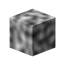

# 3Dパーリンノイズ

<table>
<tr style="border: 0;">
<td width="41.60%" style="border: 0;" valign="top">

{width="200px"}

**インチ：** *テクスチャジェネレーター**/ノイズ*

**中級**

</td>
<td width="58.30%" style="border: 0;" valign="top">

## 説明

**3Dパーリンノイズ**&#x200B;ノードは、**位置マップ**&#x200B;の入力に基づいて、3D空間でパーリンノイズを生成します。

このノードは、実際のベイク済みマップではなく、[Cube 3D GBuffers](../../../../../../compositing-graphs/nodes-reference-for-com/node-library/texture-generators/patterns/cube-3d-gbuffers/cube-3d-gbuffers.md)を入力としてテストできます（下図の例を参照）。

>[!WARNING]
>
> このノイズは、*GPUエンジンのみ* （**Direct3D**&#x200B;または&#x200B;**OpenGL**）で使用することを目的としています。 **ツール/エンジンの切り替え…**&#x200B;に移動するか、**F9**&#x200B;キーを押して、目的のエンジンを選択します。

</td>
</tr>
</table>

## パラメーター

* **反転** *ブール値*\
  出力イメージを反転します。
* **スケール** *浮動小数*\
  3Dパーリンノイズの尺度をコントロールします。
* **サイズ** *浮動小数点3*\
  **X**、**Y**&#x200B;および&#x200B;**Z**&#x200B;軸の3Dパーリンノイズのサイズを制御します。 値が均一でないと、*伸縮*&#x200B;効果が発生します。
* **オフセット** *浮動小数点3*\
  **X**、**Y**&#x200B;および&#x200B;**Z**&#x200B;軸の3Dパーリンノイズの&#x200B;*位置*&#x200B;にオフセットを適用します。
* **ゆがみの適用度** *浮動小数点*\
  3Dパーリンノイズに適用される&#x200B;*ワープ効果*&#x200B;の強さを制御します。
* **ゆがみスケール乗数** *浮動小数点*\
  **ゆがみの強さ**&#x200B;で制御されるワープ効果で使用される&#x200B;*変形パターン*&#x200B;のスケールを制御します。
* **ベースライン** *浮動小数*\
  *オフセット*&#x200B;を、3Dパーリンノイズ値の分布の基準&#x200B;*輝度*&#x200B;値に適用します。
* **コントラスト** *浮動小数点*\
  3Dパーリンノイズのコントラストを補正します。
* **絶対** *ブーリアン*\
  3Dパーリンノイズの絶対値を使用します。 これにより、値&#x200B;*が0.5*&#x200B;未満の場合に、値の分布が&#x200B;*反転*&#x200B;します。
* **タイリングを有効にする** *ブーリアン*\
  3Dパーリンノイズを調整して、作成されるパターン&#x200B;*がX、Y、Z軸に繰り返し*&#x200B;されるようにします。

## サンプル画像

<table>
<tr style="border: 0;">
<td style="border: 0;" valign="top">

{width="256px"}

</td>
<td style="border: 0;" valign="top">

{width="256px"}

</td>
<td style="border: 0;" valign="top">

{width="256px"}

</td>
</tr>
</table>
