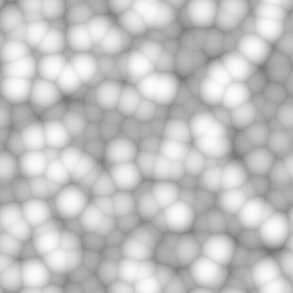

# セル 1

<table>
<tr style="border: 0;">
<td width="33.33%" style="border: 0;" valign="top">

{width="200px"}

<b>イン：</b> テクスチャジェネレーター> ノイズ

</td>
<td width="100.00%" style="border: 0;" valign="top">

## 説明

<b>セル</b>の城壁ノイズのバリエーションです。

ユーザーが選択したパターンは、Max描画モードを使用して散布され、オーバーレイされます。

参照： [セル 2](../../../../../../compositing-graphs/nodes-reference-for-com/node-library/texture-generators/noises/cells-2/cells-2.md)、[セル 3](../../../../../../compositing-graphs/nodes-reference-for-com/node-library/texture-generators/noises/cells-3/cells-3.md)、[セル 4](../../../../../../compositing-graphs/nodes-reference-for-com/node-library/texture-generators/noises/cells-4/cells-4.md)

</td>
</tr>
</table>

## 出力

|  |  |
|:---|:---|
| <b>出力</b> <i>グレースケール</i> | 生成されるノイズをグレースケールビットマップとして指定します。 |

## パラメーター

|  |  |
|:---|:---|
| <b>スケール</b> <i>整数</i> | ノイズタイルの作成に使用するグリッドの区画。    値を大きくすると、より多くのタイルが描画され、ノイズが濃くなります。 |
| <b>障害</b> <i>浮動小数</i> | ノイズの成分を置き換えます。    これを使用してノイズをアニメートできます。 |
| <b>速度の乱れ</b> <i>浮動小数</i> | <b>Disorder</b>パラメーターによって適用されるディスプレイスメントの間隔を調整します。    これを使用して、ノイズをアニメートするときのディスプレイスメント速度をコントロールできます。 |
| <b>異方性の乱れ</b> <i>浮動小数</i> | <b>Disorder</b>パラメーターによって適用されるディスプレイスメントの方向の範囲を制御します。値を大きくすると、より狭く、より明確な方向になります。    方向は、<b>Disorder anisotropy angle</b>パラメーターによって制御されます。 |
| <b>anisotropy angleの乱れ</b> <i>浮動小数</i> | &#39;Disorder 異方性&#39;パラメーターが0でない場合に、<b>Disorder</b>パラメーターによって適用されるディスプレイスメントの向きを制御します。 |
| <b>パターン</b> <i>整数</i> | 生成された画像に散乱したベース形状。 |
| <b>パターンサイズ</b> <i>浮動小数2</i> | セル内の散乱パターンのサイズの乗数。1.0はセルの完全なスパンです。 |
| <b>パターンスケール</b> <i>浮動小数</i> | <b>パターンサイズ</b>の乗数。1.0は完全なサイズです。 |
| <b>輝度ランダム</b> <i>浮動小数</i> | セルからランダムに減算した輝度の範囲を指定します。1はセル範囲全体です。 |
| <b>角度</b> <i>浮動小数</i> | セルの方向の設定に使用する角度を指定します。この値は、水平方向の右から数えたターン数で指定します。 |
| <b>角度ランダム</b> <i>浮動小数</i> | <b>角度</b>の値に適用されるランダムな変動の最大量（ターン数）。 |
| <b>タイルのオフセット</b> <i>浮動小数2</i> | ノイズのレンダリングに使用される無限平面の部分の位置を制御します。 |
| <b>非正方形の拡張</b> <i>ブール値</i> | 非正方形の画像では、生成されたタイルを正方形に保ち、ノイズの生成を画像の境界まで拡張します。 |

## 例

<table>
<tr style="border: 0;">
<td style="border: 0;" valign="top">

{zoomable="yes"}

</td>
<td style="border: 0;" valign="top">

{zoomable="yes"}

</td>
</tr>
</table>

<table>
<tr style="border: 0;">
<td style="border: 0;" valign="top">

{zoomable="yes"}

</td>
<td style="border: 0;" valign="top">

{zoomable="yes"}

</td>
</tr>
</table>
