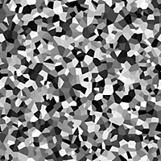

# セル 4

<table>
<tr style="border: 0;">
<td width="33.33%" style="border: 0;" valign="top">

{width="200px"}

<b>In:</b>テクスチャジェネレーター>ノイズ

</td>
<td width="100.00%" style="border: 0;" valign="top">

## 説明

<b>セル</b>の壁面雑音のバリエーションです。

各セルには単色が割り当てられます。単色はランダムに割り当てることも、入力画像からサンプリングすることもできます。

参照： [セル 1](../../../../../../compositing-graphs/nodes-reference-for-com/node-library/texture-generators/noises/cells-1/cells-1.md)、[セル 2](../../../../../../compositing-graphs/nodes-reference-for-com/node-library/texture-generators/noises/cells-2/cells-2.md)、[セル 3](../../../../../../compositing-graphs/nodes-reference-for-com/node-library/texture-generators/noises/cells-3/cells-3.md)

</td>
</tr>
</table>

## 入力

|  |  |
|:---|:---|
| <b>入力</b> <i>グレースケール</i> |  |

## 出力

|  |  |
|:---|:---|
| <b>出力</b> <i>グレースケール</i> | 生成されるノイズをグレースケールビットマップとして表します。 |

## パラメーター

|  |  |
|:---|:---|
| <b>スケール</b> <i>整数</i> | ノイズタイルの生成に使用するグリッドの区画。    値を大きくすると、描かれるタイルの数が増え、ノイズが高くなります。 |
| <b>障害</b> <i>フロート</i> | ノイズの成分を置き換えます。    これを使用してノイズをアニメートできます。 |
| <b>速度の乱れ</b> <i>フロート</i> | <b>Disorder</b>パラメーターによって適用されるディスプレイスメントの間隔を調整します。    これを使用して、ノイズをアニメートするときのディスプレイスメント速度をコントロールできます。 |
| <b>カラーソース</b> <i>整数</i> | セルに適用されるフラットな色のソース：<ul data-preserve-html="true"> <li data-preserve-html="true"><b><i>ランダム：</i></b>ノードのランダムシードによって制御されるランダムな色を使用します</li> <li data-preserve-html="true"><b><i>擬似乱数：</i></b>別のユーザーセット値によってシードされたランダムな色を使用します</li> <li data-preserve-html="true"><b><i>画像入力：</i></b>入力画像のセルの位置でサンプリングされた色を使用します</li> </ul> |
| <b>Pseudorandomシード</b> <i>整数</i>   *&#39;カラーソース&#39;が&#39;Pseudorandom&#39;に設定されている場合に使用できます* | ノードシードとは別にカラーのシードを変更できます。 |
| <b>非正方形の拡張</b> <i>ブール値</i> | 非正方形の画像では、生成されたタイルを正方形に保ち、ノイズの生成を画像の境界まで拡張します。 |

## 例

<table>
<tr style="border: 0;">
<td style="border: 0;" valign="top">

{zoomable="yes"}

</td>
<td style="border: 0;" valign="top">

{zoomable="yes"}

</td>
</tr>
</table>
