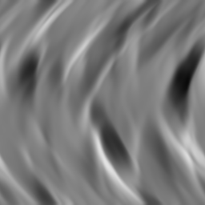

# 折り目

<table>
<tr style="border: 0;">
<td style="border: 0;" valign="top">

{width="128px"}

## 折り目

**インチ：** *テクスチャジェネレーター**/ノイズ*

**単純**

</td>
<td style="border: 0;" valign="top">

## 説明

このノードは、布地のようなノイズを生成します。 Heightmapと解釈できます

折り目は、大きな変動を伴う半方向ノイズが必要な場合に便利です。

## パラメーター

* **スケール**: *1 ～ 8*\
  エフェクトのグローバルスケールを設定します。
* **ワープの強度**: *0.0 ～ 128.0*&#x200B;曲げ/ワープ効果の強度を設定します。
* **障害**: *0.0 ～ 100.0*\
  ノイズの生成に使用するレイヤーをわずかにオフセットして、変化を加えます。
* **非正方形拡張**: *False/True*\
  スカッシュとストレッチを非正方形の比率で補正できます。

## サンプル画像

</td>
</tr>
</table>
