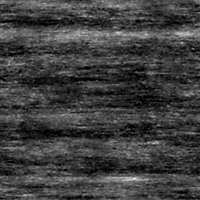
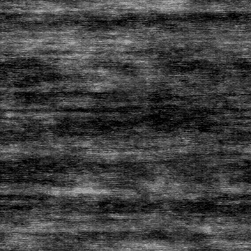
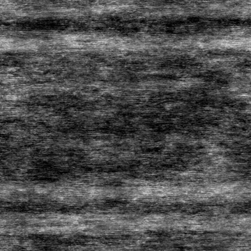

# 方向性ノイズ 2

<table>
<tr style="border: 0;">
<td style="border: 0;" valign="top">

<table>
<tr style="border: 0;">
<td width="33.33%" style="border: 0;" valign="top">

{width="200px"}

<b>In:</b>テクスチャジェネレーター>ノイズ

</td>
<td width="100.00%" style="border: 0;" valign="top">

## 説明

<b>方向性ノイズ</b>のノイズのバリエーション。

参照： [方向性ノイズ 1](../../../../../../compositing-graphs/nodes-reference-for-com/node-library/texture-generators/noises/directional-noise-1/directional-noise-1.md)、[方向性ノイズ 3](../../../../../../compositing-graphs/nodes-reference-for-com/node-library/texture-generators/noises/directional-noise-3/directional-noise-3.md)、[方向性ノイズ 4](../../../../../../compositing-graphs/nodes-reference-for-com/node-library/texture-generators/noises/directional-noise-4/directional-noise-4.md)

</td>
</tr>
</table>

## 出力

|  |  |
| --- | --- |
| <b>出力</b> *グレースケール* | 生成されるノイズをグレースケールビットマップとして表します。 |

## パラメーター

|  |  |
| --- | --- |
| <b>スケール</b>整数 | ノイズタイルの生成に使用するグリッドの区画。    値を大きくすると、描かれるタイルの数が増え、ノイズが高くなります。 |
| <b>障害</b>浮動小数点 | ノイズの成分を置き換えます。    これを使用してノイズをアニメートできます。 |
| <b>速度の乱れ</b>浮動小数点 | <b>Disorder</b>パラメーターによって適用されるディスプレイスメントの間隔を調整します。    これを使用して、ノイズをアニメートするときのディスプレイスメント速度をコントロールできます。 |
| <b>異方性の乱れ</b>浮動小数点 | <b>Disorder</b>パラメーターによって適用されるディスプレイスメントの方向の範囲を制御します。値を大きくすると、より狭く、より明確な方向になります。    方向は、<b>Disorder異方性角度</b>パラメーターで制御されます。 |
| <b>乱雑な異方性角度</b>浮動小数点 | &#39;Disorder 異方性&#39;パラメーターが0でない場合に、<b>Disorder</b>パラメーターによって適用されるディスプレイスメントの向きを制御します。 |
| <b>角度</b>浮動小数点 | ノイズの方向を設定するために使用する角度です。回転の回数で指定し、水平方向の右から開始します。 |
| <b>角度ランダム</b>浮動小数点 | <b>角度</b>の値に適用されるランダムな変動の最大量（ターン数）。 |
| <b>タイルのオフセット</b>浮動小数点2 | ノイズのレンダリングに使用される無限平面の部分の位置を制御します。 |
| <b>非正方形の展開</b>ブール値 | 非正方形の画像では、生成されたタイルを正方形に保ち、ノイズの生成を画像の境界まで拡張します。 |

## 例

<table>
<tr style="border: 0;">
<td style="border: 0;" valign="top">

{zoomable="yes"}

</td>
<td style="border: 0;" valign="top">

{zoomable="yes"}

</td>
</tr>
</table>

<table>
<tr style="border: 0;">
<td style="border: 0;" valign="top">

{zoomable="yes"}

</td>
<td style="border: 0;" valign="top">

{zoomable="yes"}

</td>
</tr>
</table>

</td>
<td style="border: 0;" valign="top">

</td>
<td style="border: 0;" valign="top">

</td>
</tr>
</table>
