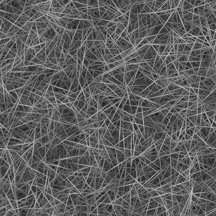

# 方向スクラッチ

<table>
<tr style="border: 0;">
<td width="33.33%" style="border: 0;" valign="top">

{width="200px"}

<b>In:</b>テクスチャジェネレーター>ノイズ

</td>
<td width="100.00%" style="border: 0;" valign="top">

## 説明

角度とサイズを調整できるスクラッチパターンのランダムな散布。

</td>
</tr>
</table>

## 出力

|  |  |
|:---|:---|
| <b>出力</b> <i>グレースケール</i> | 生成されるノイズをグレースケールビットマップとして表します。 |

## パラメーター

|  |  |
|:---|:---|
| <b>スケール</b> <i>整数</i> | ノイズタイルの生成に使用するグリッドの区画。    値を大きくすると、描かれるタイルの数が増え、ノイズが高くなります。 |
| <b>障害</b> <i>フロート</i> | ノイズの成分を置き換えます。    これを使用してノイズをアニメートできます。 |
| <b>速度の乱れ</b> <i>フロート</i> | <b>Disorder</b>パラメーターによって適用されるディスプレイスメントの間隔を調整します。    これを使用して、ノイズをアニメートするときのディスプレイスメント速度をコントロールできます。 |
| <b>異方性の乱れ</b> <i>フロート</i> | <b>Disorder</b>パラメーターによって適用されるディスプレイスメントの方向の範囲を制御します。値を大きくすると、より狭く、より明確な方向になります。    方向は、<b>Disorder異方性角度</b>パラメーターで制御されます。 |
| <b>anisotropy angleの乱れ</b> <i>フロート</i> | <b>Disorder 異方性</b>パラメーターが0ではない場合に、<b>Disorder</b>パラメーターによって適用されるディスプレイスメントの向きを制御します。 |
| <b>角度</b> <i>フロート</i> | スクラッチの方向を設定するために使用する角度です。ターン数および水平方向の右から始まります。 |
| <b>角度ランダム</b> <i>フロート</i> | <b>角度</b>の値に適用されるランダムな変動の最大量（ターン数）。 |
| <b>パターン適用量</b> <i>フロート</i> | 散布されるスクラッチパターンの量の乗数。 |
| <b>パターンサイズ</b> <i>浮動小数点2</i> | スクラッチパターンの境界ボックスのサイズです。    Y値はスクラッチの最大長を制御します。 |
| <b>パターンサイズランダム</b> <i>浮動小数点2</i> | スクラッチに適用されるダウンスケーリングのランダム量の乗数。    Y値は、スクラッチの長さに適用されます。 |
| <b>タイルのオフセット</b> <i>浮動小数点2</i> | ノイズのレンダリングに使用される無限平面の部分の位置を制御します。 |
| <b>非正方形の拡張</b> <i>ブール値</i> | 非正方形の画像では、生成されたタイルを正方形に保ち、ノイズの生成を画像の境界まで拡張します。 |

## 例

<table>
<tr style="border: 0;">
<td style="border: 0;" valign="top">

{zoomable="yes"}

</td>
<td style="border: 0;" valign="top">

{zoomable="yes"}

</td>
</tr>
</table>

<table>
<tr style="border: 0;">
<td style="border: 0;" valign="top">

{zoomable="yes"}

</td>
<td style="border: 0;" valign="top">

{zoomable="yes"}

</td>
</tr>
</table>

<table>
<tr style="border: 0;">
<td style="border: 0;" valign="top">

{zoomable="yes"}

</td>
<td style="border: 0;" valign="top">

</td>
</tr>
</table>
