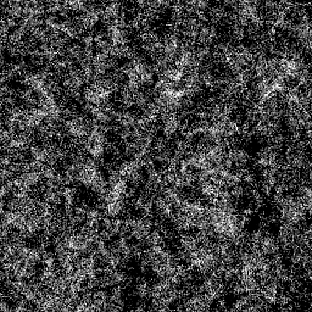
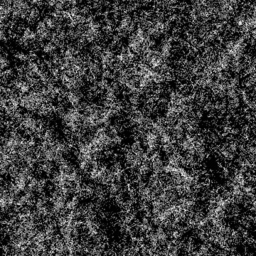

# DIRT 4

<table>
<tr style="border: 0;">
<td style="border: 0;" valign="top">

<table>
<tr style="border: 0;">
<td width="33.33%" style="border: 0;" valign="top">

{width="200px"}

<b>イン：</b> テクスチャジェネレーター> ノイズ

</td>
<td width="100.00%" style="border: 0;" valign="top">

## 説明

粒子の粗い<b>Dirt</b>ノイズのバリエーション。

参照： [Dirt 1](../../../../../../compositing-graphs/nodes-reference-for-com/node-library/texture-generators/noises/dirt-1/dirt-1.md)、[Dirt 2](../../../../../../compositing-graphs/nodes-reference-for-com/node-library/texture-generators/noises/dirt-2/dirt-2.md)、[Dirt 3](../../../../../../compositing-graphs/nodes-reference-for-com/node-library/texture-generators/noises/dirt-3/dirt-3.md)、[Dirt 5](../../../../../../compositing-graphs/nodes-reference-for-com/node-library/texture-generators/noises/dirt-5/dirt-5.md)、[Dirtのグラデーション](../../../../../../compositing-graphs/nodes-reference-for-com/node-library/texture-generators/noises/dirt-gradient/dirt-gradient.md)

</td>
</tr>
</table>

## 出力

|  |  |
| --- | --- |
| <b>出力</b> *グレースケール* | 生成されるノイズをグレースケールビットマップとして指定します。 |

## パラメーター

|  |  |
| --- | --- |
| <b>スケール</b> 整数 | ノイズタイルの作成に使用するグリッドの区画。    値を大きくすると、より多くのタイルが描画され、ノイズが濃くなります。 |
| <b>障害</b>浮動小数 | ノイズの成分を置き換えます。    これを使用してノイズをアニメートできます。 |
| <b>速度の乱れ</b>浮動小数 | <b>Disorder</b>パラメーターによって適用されるディスプレイスメントの間隔を調整します。    これを使用して、ノイズをアニメートするときのディスプレイスメント速度をコントロールできます。 |
| <b>異方性の障害</b>浮動小数 | <b>Disorder</b>パラメーターによって適用されるディスプレイスメントの方向の範囲を制御します。値を大きくすると、より狭く、より明確な方向になります。    方向は、<b>Disorder anisotropy angle</b>パラメーターによって制御されます。 |
| <b>anisotropy angleの障害</b>浮動小数 | <b>Disorder 異方性</b>パラメーターが0ではない場合に、<b>Disorder</b>パラメーターによって適用されるディスプレイスメントの向きを制御します。 |
| <b>タイルのオフセット</b>浮動小数2 | ノイズのレンダリングに使用される無限平面の部分の位置を制御します。 |
| <b>非正方形の展開</b>ブール値 | 非正方形の画像では、生成されたタイルを正方形に保ち、ノイズの生成を画像の境界まで拡張します。 |

## 例

<table>
<tr style="border: 0;">
<td style="border: 0;" valign="top">

{zoomable="yes"}

</td>
<td style="border: 0;" valign="top">

{zoomable="yes"}

</td>
</tr>
</table>

<table>
<tr style="border: 0;">
<td style="border: 0;" valign="top">

{zoomable="yes"}

</td>
<td style="border: 0;" valign="top">

{zoomable="yes"}

</td>
</tr>
</table>

</td>
<td style="border: 0;" valign="top">

</td>
<td style="border: 0;" valign="top">

</td>
</tr>
</table>
