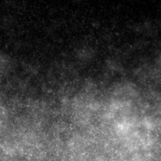
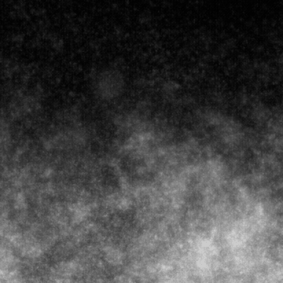

# Dirt勾配

<table>
<tr style="border: 0;">
<td width="33.33%" style="border: 0;" valign="top">

{width="200px"}

<b>イン：</b> テクスチャジェネレーター> ノイズ

</td>
<td width="100.00%" style="border: 0;" valign="top">

## 説明

方向の減衰グラデーションを備えた、粒状の<b>Dirt</b>ノイズのバリエーションです。

参照： [Dirt 1](../../../../../../compositing-graphs/nodes-reference-for-com/node-library/texture-generators/noises/dirt-1/dirt-1.md)、[Dirt 2](../../../../../../compositing-graphs/nodes-reference-for-com/node-library/texture-generators/noises/dirt-2/dirt-2.md)、[Dirt 3](../../../../../../compositing-graphs/nodes-reference-for-com/node-library/texture-generators/noises/dirt-3/dirt-3.md)、[Dirt 4](../../../../../../compositing-graphs/nodes-reference-for-com/node-library/texture-generators/noises/dirt-4/dirt-4.md)、[Dirt 5](../../../../../../compositing-graphs/nodes-reference-for-com/node-library/texture-generators/noises/dirt-5/dirt-5.md)

</td>
</tr>
</table>

## 出力

|  |  |
|:---|:---|
| <b>出力</b> <i>グレースケール</i> | 生成されるノイズをグレースケールビットマップとして指定します。 |

## パラメーター

|  |  |
|:---|:---|
| <b>障害</b> <i>浮動小数</i> | ノイズの成分を置き換えます。    これを使用してノイズをアニメートできます。 |
| <b>速度の乱れ</b> <i>浮動小数</i> | <b>Disorder</b>パラメーターによって適用されるディスプレイスメントの間隔を調整します。    これを使用して、ノイズをアニメートするときのディスプレイスメント速度をコントロールできます。 |
| <b>異方性の乱れ</b> <i>浮動小数</i> | <b>Disorder</b>パラメーターによって適用されるディスプレイスメントの方向の範囲を制御します。値を大きくすると、より狭く、より明確な方向になります。    方向は、<b>Disorder anisotropy angle</b>パラメーターによって制御されます。 |
| <b>anisotropy angleの乱れ</b> <i>浮動小数</i> | <b>Disorder 異方性</b>パラメーターが0ではない場合に、<b>Disorder</b>パラメーターによって適用されるディスプレイスメントの向きを制御します。 |
| <b>非正方形の拡張</b> <i>ブール値</i> | 非正方形の画像では、生成されたタイルを正方形に保ち、ノイズの生成を画像の境界まで拡張します。 |

## 例

<table style="table-layout:fixed">
    <tr style="border: 0;">
        <td style="border: 0;">
            
        </td>
        <td style="border: 0;">
            
        </td>
        <td style="border: 0;">
            
        </td>
    </tr>
    <tr style="border: 0;">
        <td style="border: 0;">
            
        </td>
        <td style="border: 0;"></td>
        <td style="border: 0;"></td>
    </tr>
</table>
