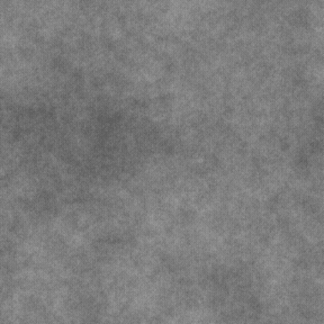

# フラクタル和ベース

<table>
<tr style="border: 0;">
<td style="border: 0;" valign="top">

<table>
<tr style="border: 0;">
<td width="33.33%" style="border: 0;" valign="top">

{width="200px"}

<b>In:</b>テクスチャジェネレーター>ノイズ

</td>
<td width="100.00%" style="border: 0;" valign="top">

## 説明

オクターブの範囲とバランスを調整できる、カスタマイズ可能なフラクタルノイズです。

<b>フラクタル和</b>ファミリのノイズはすべて、このノードに基づいています。

参照： [フラクタル和 1](../../../../../../compositing-graphs/nodes-reference-for-com/node-library/texture-generators/noises/fractal-sum-1/fractal-sum-1.md)、[フラクタル和 2](../../../../../../compositing-graphs/nodes-reference-for-com/node-library/texture-generators/noises/fractal-sum-2/fractal-sum-2.md)、[フラクタル和 3](../../../../../../compositing-graphs/nodes-reference-for-com/node-library/texture-generators/noises/fractal-sum-3/fractal-sum-3.md)、[フラクタル和 4](../../../../../../compositing-graphs/nodes-reference-for-com/node-library/texture-generators/noises/fractal-sum-4/fractal-sum-4.md)

</td>
</tr>
</table>

<table>
<tr style="border: 0;">
<td style="border: 0;" valign="top">

### 出力

</td>
<td style="border: 0;" valign="top">

### パラメーター

</td>
<td style="border: 0;" valign="top">

### 例

</td>
</tr>
</table>

## 出力

|  |  |
| --- | --- |
| <b>出力</b> *グレースケール* | 生成されるノイズをグレースケールビットマップとして表します。 |

## パラメーター

|  |  |
| --- | --- |
| <b>粗さ</b>浮動小数点 | ノイズのバランスがオクターブになります。    値を大きくすると、高い周波数のオクターブがより見やすくなります。 |
| <b>分 レベル</b>整数 | ノイズで使用される最小オクターブです。    値が大きいほど、ノイズ周波数は高くなります。 |
| <b>最大 レベル</b>整数 | ノイズで使用される最大オクターブです。    値が大きいほど、ノイズ周波数は高くなります。 |
| <b>障害</b>浮動小数点 | ノイズの成分を置き換えます。    これを使用してノイズをアニメートできます。 |
| <b>速度の乱れ</b>浮動小数点 | <b>Disorder</b>パラメーターによって適用されるディスプレイスメントの間隔を調整します。    これを使用して、ノイズをアニメートするときのディスプレイスメント速度をコントロールできます。 |
| <b>コントラスト</b>浮動小数点 | 最終結果のコントラスト。 |
| <b>グローバルの不透明度</b>浮動小数点 | 最終的な結果では、ノイズの不透明度が一緒に追加されます。    値を大きくすると、領域が白く焼ける場合があります。 |
| <b>非正方形の展開</b>ブール値 | 非正方形の画像では、生成されたタイルを正方形に保ち、ノイズの生成を画像の境界まで拡張します。 |

## 例

<table>
<tr style="border: 0;">
<td style="border: 0;" valign="top">

{zoomable="yes"}

</td>
<td style="border: 0;" valign="top">

{zoomable="yes"}

</td>
</tr>
</table>

</td>
<td style="border: 0;" valign="top">

</td>
<td style="border: 0;" valign="top">

</td>
</tr>
</table>
