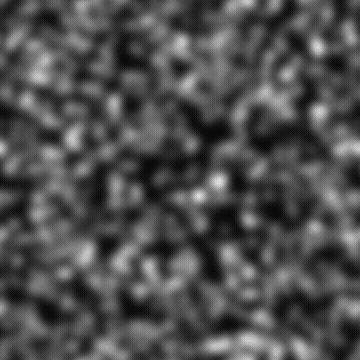

# ガウス雑音

<table>
<tr style="border: 0;">
<td style="border: 0;" valign="top">

<table>
<tr style="border: 0;">
<td width="33.33%" style="border: 0;" valign="top">

{width="200px"}

<b>In:</b>テクスチャジェネレーター>ノイズ

</td>
<td width="100.00%" style="border: 0;" valign="top">

## 説明

ベルカーブのように、正規分布に従って値が黒から白に変化するグラデーションの組み合わせから発生する滑らかなノイズです。

参照： [ガウスのスポット1](../../../../../../compositing-graphs/nodes-reference-for-com/node-library/texture-generators/noises/gaussian-spots-1/gaussian-spots-1.md)、[ガウスのスポット2](../../../../../../compositing-graphs/nodes-reference-for-com/node-library/texture-generators/noises/gaussian-spots-2/gaussian-spots-2.md)

</td>
</tr>
</table>

## 出力

|  |  |
| --- | --- |
| <b>出力</b> *グレースケール* | 生成されるノイズをグレースケールビットマップとして表します。 |

## パラメーター

|  |  |
| --- | --- |
| <b>スケール</b>整数 | ノイズタイルの生成に使用するグリッドの区画。    値を大きくすると、描かれるタイルの数が増え、ノイズが高くなります。 |
| <b>障害</b>浮動小数点 | ノイズの成分を置き換えます。    これを使用してノイズをアニメートできます。 |
| <b>速度の乱れ</b>浮動小数点 | <b>Disorder</b>パラメーターによって適用されるディスプレイスメントの間隔を調整します。    これを使用して、ノイズをアニメートするときのディスプレイスメント速度をコントロールできます。 |
| <b>異方性の乱れ</b>浮動小数点 | <b>Disorder</b>パラメーターによって適用されるディスプレイスメントの方向の範囲を制御します。値を大きくすると、より狭く、より明確な方向になります。    方向は、<b>Disorder異方性角度</b>パラメーターで制御されます。 |
| <b>乱雑な異方性角度</b>浮動小数点 | <b>Disorder 異方性</b>パラメーターが0ではない場合に、<b>Disorder</b>パラメーターによって適用されるディスプレイスメントの向きを制御します。 |
| <b>タイルのオフセット</b>浮動小数点2 | ノイズのレンダリングに使用される無限平面の部分の位置を制御します。 |
| <b>非正方形の展開</b> ブーリアン | 非正方形の画像では、生成されたタイルを正方形に保ち、ノイズの生成量を画像の境界まで拡張します。 |

## 例

<table>
<tr style="border: 0;">
<td style="border: 0;" valign="top">

{zoomable="yes"}

</td>
<td style="border: 0;" valign="top">

{zoomable="yes"}

</td>
</tr>
</table>

<table>
<tr style="border: 0;">
<td style="border: 0;" valign="top">

{zoomable="yes"}

</td>
<td style="border: 0;" valign="top">

{zoomable="yes"}

</td>
</tr>
</table>

</td>
<td style="border: 0;" valign="top">

</td>
<td style="border: 0;" valign="top">

</td>
</tr>
</table>
