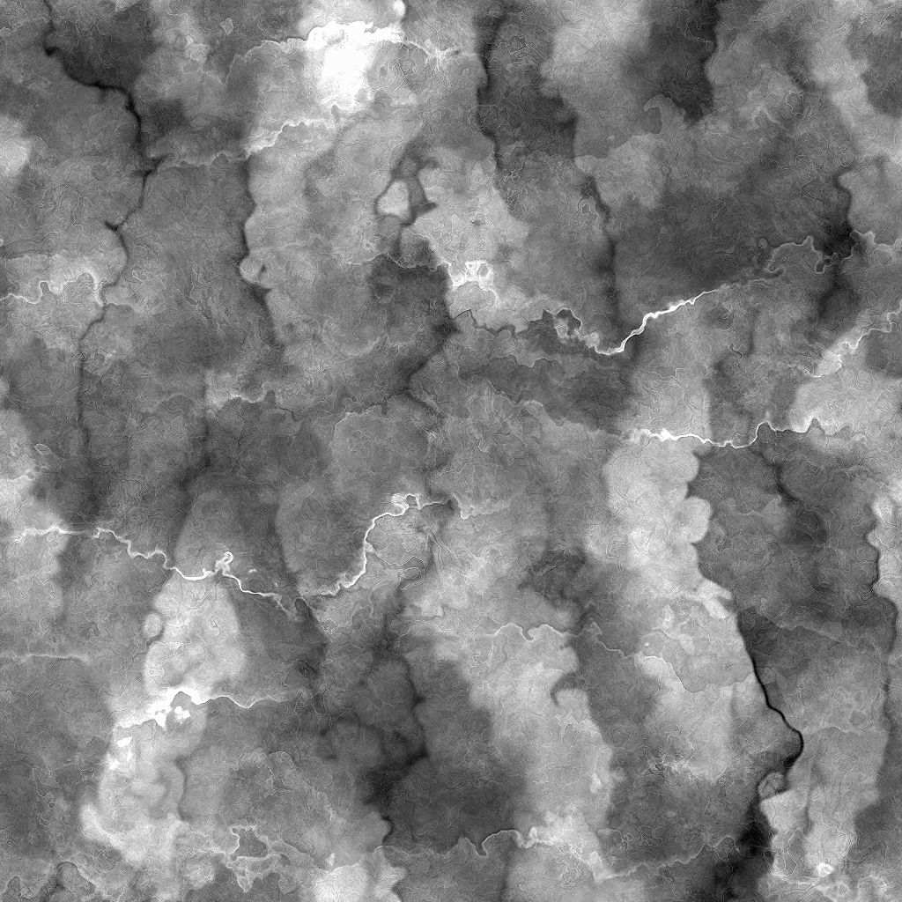

# 電流経年劣化大

<table>
<tr style="border: 0;">
<td width="41.60%" style="border: 0;" valign="top">

{width="200px"}

**インチ：** *テクスチャジェネレーター**/ノイズ*

**単純**

</td>
<td width="58.30%" style="border: 0;" valign="top">

## 説明

**経年劣化ガルバニックラージ**&#x200B;ノードは、亜鉛メッキ鋼のパターンに似た経年劣化マップを生成します。

</td>
</tr>
</table>

## パラメーター

* **バランス** *浮動小数*&#x200B;暗い値と明るい値のバランスを調整します。
* **コントラスト** *浮動小数*&#x200B;画像のコントラストを調整します。
* **反転** *ブール値*`1-x`操作を使用して画像の出力を反転します。
* **非正方形拡張** *ブーリアン*&#x200B;カボチャの補正を有効にし、非正方形の比率で伸縮します。
* アドバンス
  * **ワープの強さ** *浮動小数*&#x200B;主要なワープ効果の強さを調整します。
  * **リッジのディテールの不透明度** *フロート*&#x200B;明るいリッジの不透明度を調整します。
  * **シャープの適用度** *浮動小数*&#x200B;全体的なシャープ効果の適用度を調整します。

## サンプル画像

<table>
<tr style="border: 0;">
<td style="border: 0;" valign="top">

{width="256px"}

</td>
<td style="border: 0;" valign="top">

{width="256px"}

</td>
</tr>
</table>
