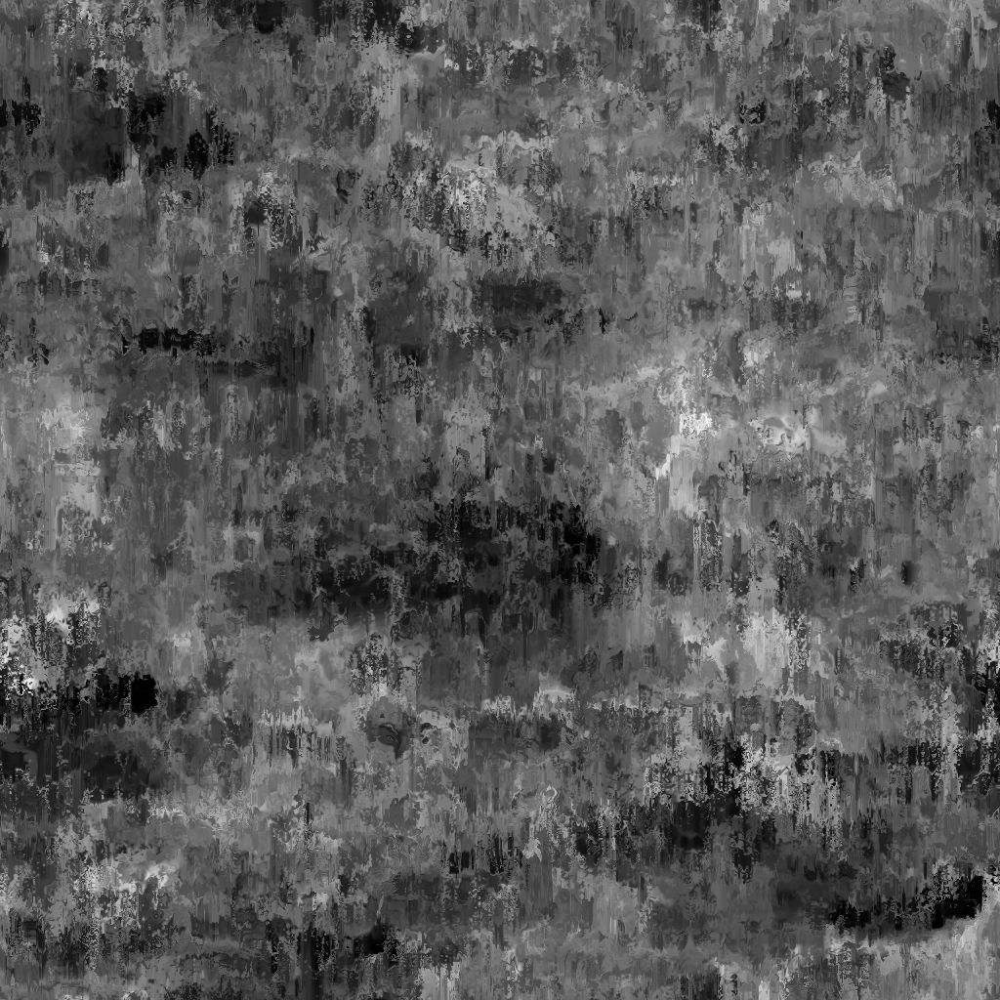

# 経年劣化漏えいペイント

<table>
<tr style="border: 0;">
<td width="33.33%" style="border: 0;" valign="top">

{width="200px"}

<b>In:</b>テクスチャジェネレーター>ノイズ

</td>
<td width="100.00%" style="border: 0;" valign="top">

## 説明

**経年劣化漏えいペイント**&#x200B;ノードは、漏れ落ちるペイントのような経年劣化マップを生成します。

</td>
</tr>
</table>

## パラメーター

|  |  |
|:---|:---|
| <b>残高</b> <i>フロート</i> | 暗い値と明るい値のバランスを調整します。 |
| <b>コントラスト</b> <i>フロート</i> | 画像のコントラストを調整します。 |
| <b>反転</b> <i>ブール値</i> | `1-x`操作を使用して画像の出力を反転します。 |
| <b>非正方形拡張</b> <i>ブール値</i> | スカッシュとストレッチを非正方形の比率で補正できます。 |
| <b>詳細</b> |  |
| <b>リーク強度</b> <i>フロート</i> | 滴りの密度と強さを調整します。 |
| <b>リークスケール</b> <i>整数</i> | ドリップの分離のスケールを調整します。 |
| <b>リーク角度ランダム</b> <i>フロート</i> | *最大角度*&#x200B;の滴をランダムに回転して、*ターン数*&#x200B;で調整します。 |
| <b>リークの鮮明さ</b> <i>フロート</i> | 滴る部分の鮮明さとシャープさを調整します。 |

## 例

<table style="margin-top: 32px; margin-bottom: 32px">
    <tr style="border: 0">
        <td style="border: 0; background: transparent">
            
        </td>
        <td style="border: 0; background: transparent">
            
        </td>
    </tr>
</table>
