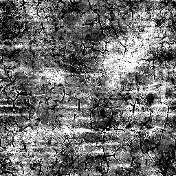

# 経年劣化マップ011

<table>
<tr style="border: 0;">
<td style="border: 0;" valign="top">

{width="128px"}

## 経年劣化マップ011

**インチ：** *テクスチャジェネレーター**/ノイズ*

**中級**

</td>
<td style="border: 0;" valign="top">

## 説明

これにより、複雑な結合されたNoisemapが生成されます。 これは詳細な手順として非常に便利ですが、これらは非常にパフォーマンスが高いため生成が遅くなることに注意してください。

## パラメーター

* **亀裂**: *0.0 ～ 1.0*
* **残高**: *0.0 ～ 1.0*\
  明るさの調整のように、結果のバランスを黒と白の間でシフトします。
* **コントラスト**: *0.0 ～ 1.0*\
  結果のコントラストを調整します。
* **反転**: *False/True*\
  結果を反転します。
* **ブラシパターン**: *0.0 ～ 1.0*\
  ブラシのアルファとして使用する場合に、エッジの周囲にマスクを追加します。
* **非正方形拡張**: *False/True*\
  スカッシュとストレッチを非正方形の比率で補正できます。

## サンプル画像

</td>
</tr>
</table>
