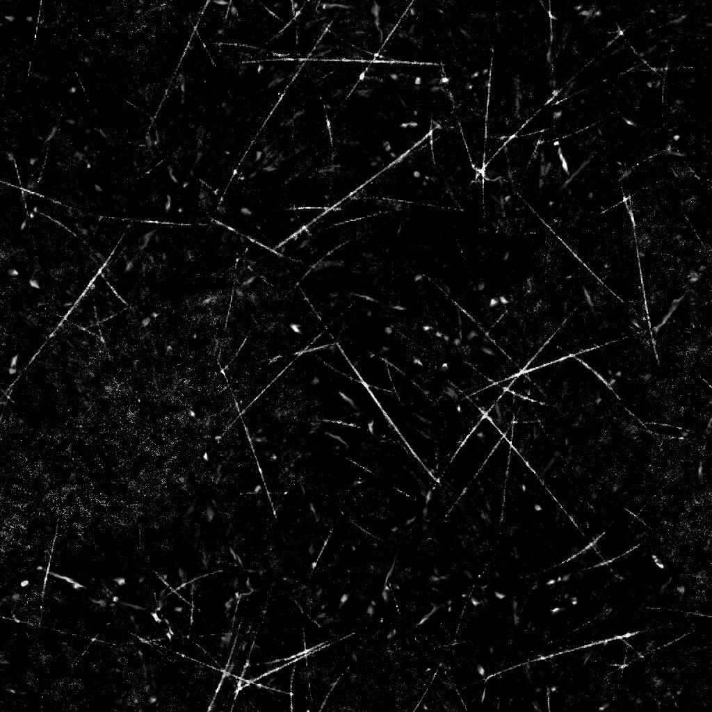

# Scratches粗い

<table>
<tr style="border: 0;">
<td width="33.33%" style="border: 0;" valign="top">

{width="200px"}

<b>内：</b> テクスチャジェネレータ> ノイズ

</td>
<td width="100.00%" style="border: 0;" valign="top">

## 説明

**Scratchesの粗い**&#x200B;ノードは、粗く傷ついた埃っぽい表面に似た経年劣化マップを生成します。

</td>
</tr>
</table>

## パラメーター

|  |  |
|:---|:---|
| <b>残高</b> <i>フロート</i> | 暗い値と明るい値のバランスを調整します。 |
| <b>コントラスト</b> <i>フロート</i> | 画像のコントラストを調整します。 |
| <b>反転</b> <i>ブール値</i> | `1-x`操作を使用して画像の出力を反転します。 |
| <b>非正方形拡張</b> <i>ブール値</i> | スカッシュとストレッチを非正方形の比率で補正できます。 |
| <b>詳細</b> |  |
| <b>スクラッチの数量</b> <i>フロート</i> | サーフェス上のスクラッチの量を調整します。 |
| <b>仮想記憶タイリング</b> <i>整数</i> | スクラッチに適用されるタイリングの量を調整します。 |
| <b>ぼかし（仮想記憶）</b> <i>浮動小数</i> | 傷のぼかしを調整します。 |
| <b>スクラッチの幅</b> <i>浮動小数</i> | スクラッチの幅を調整します。 |
| <b>スクラッチの長さ</b> <i>浮動小数</i> | スクラッチの長さを調整します。 |
| <b>仮想記憶マスク</b> <i>浮動小数</i> | 傷の一部に適用されるマスクの強度を調整します。 |
| <b>スクラッチの汚れ</b> <i>浮動小数</i> | スクラッチの汚れを調整して、シャープさと連続性を損ないます。 |
| <b>二重引っかき傷</b> <i>浮動小数</i> | 各スクラッチに沿って適用される2番目のスクラッチの不透明度を調整し、少しワープ効果を加えます。 |
| <b>スクラッチスポットの強度</b> <i>浮動小数</i> | 傷と一緒に適用される破損したスポットの強度を調整します。 |
| <b>スクラッチスポットタイリング</b> <i>整数</i> | 破損したスポットのタイリングを調整します。 |
| <b>Dustの適用度</b> <i>浮動小数</i> | Dustオーバーレイの適用度を調整します。 |
| <b>タイリング</b> <i>整数</i> | Dustオーバーレイのタイリングを調整します。 |
| <b>シャープの適用度</b> <i>フロート</i> | グローバルなシャープ効果の適用度を調整します。 |

## 例

<table style="margin-top: 32px; margin-bottom: 32px">
    <tr style="border: 0">
        <td style="border: 0; background: transparent">
            
        </td>
        <td style="border: 0; background: transparent">
            
        </td>
    </tr>
</table>
