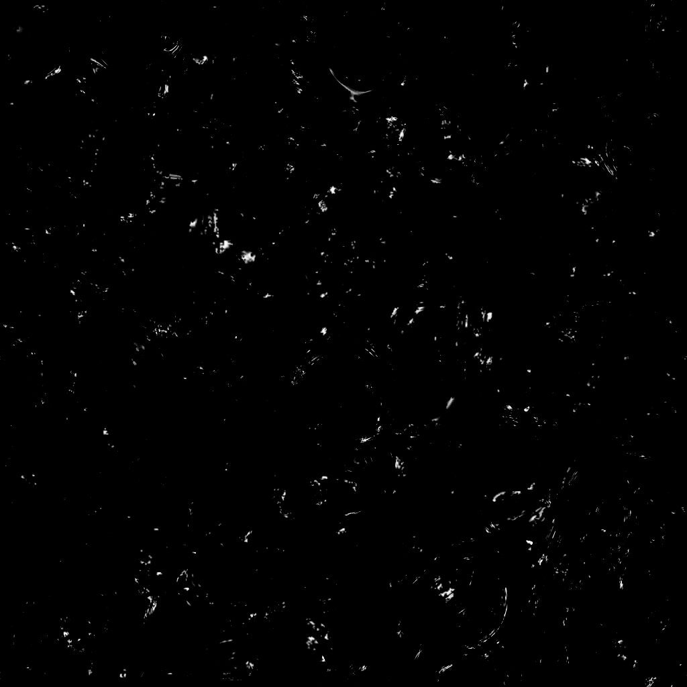

# 経年劣化スポットの汚れ

<table>
<tr style="border: 0;">
<td width="33.33%" style="border: 0;" valign="top">

{width="200px"}

<b>内：</b> テクスチャジェネレータ> ノイズ

</td>
<td width="100.00%" style="border: 0;" valign="top">

## 説明

**経年劣化スポットダーティ**&#x200B;ノードは、Dirtスポットに似た経年劣化マップを生成します。

</td>
</tr>
</table>

## パラメーター

|  |  |
|:---|:---|
| <b>残高</b> <i>フロート</i> | 暗い値と明るい値のバランスを調整します。 |
| <b>コントラスト</b> <i>フロート</i> | 画像のコントラストを調整します。 |
| <b>反転</b> <i>ブール値</i> | `1-x`操作を使用して画像の出力を反転します。 |
| <b>非正方形拡張</b> <i>ブール値</i> | スカッシュとストレッチを非正方形の比率で補正できます。 |
| <b>詳細</b> |  |
| <b>適用範囲</b> <i>フロート</i> | Dirt範囲を補正します。 |
| <b>スケール</b> <i>整数</i> | Dirtスポットのスケールを調整します。 *高い*&#x200B;値を指定すると、*より細かい*&#x200B;スポットが得られます。 |

## 例

<table style="margin-top: 32px; margin-bottom: 32px">
    <tr style="border: 0">
        <td style="border: 0; background: transparent">
            
        </td>
        <td style="border: 0; background: transparent">
            
        </td>
    </tr>
</table>
