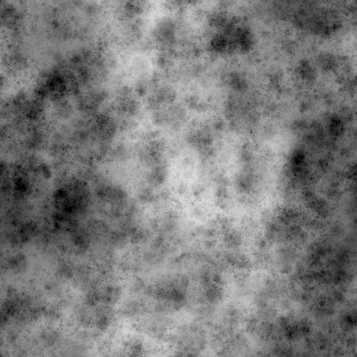
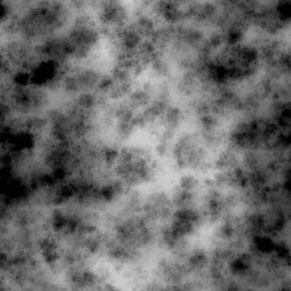

# うるおいノイズ2

<table>
<tr style="border: 0;">
<td width="33.33%" style="border: 0;" valign="top">

{width="200px"}

<b>In:</b>テクスチャジェネレーター>ノイズ

</td>
<td width="100.00%" style="border: 0;" valign="top">

## 説明

豊かでスポンジのような<b>湿気</b>のノイズのバリエーションです。

硬さとサイズが様々に異なり、ベースグレーから始まり、以下のカラーに分散され、追加または削除されるディスク。

関連項目： [湿気ノイズ1](../../../../../../compositing-graphs/nodes-reference-for-com/node-library/texture-generators/noises/moisture-noise/moisture-noise.md)

</td>
</tr>
</table>

## 出力

|  |  |
|:---|:---|
| <b>出力</b> <i>グレースケール</i> | 生成されるノイズをグレースケールビットマップとして表します。 |

## パラメーター

|  |  |
|:---|:---|
| <b>スケール</b> <i>整数</i> | ノイズタイルの生成に使用するグリッドの区画。    値を大きくすると、描かれるタイルの数が増え、ノイズが高くなります。 |
| <b>障害</b> <i>フロート</i> | ノイズの成分を置き換えます。    これを使用してノイズをアニメートできます。 |
| <b>速度の乱れ</b> <i>フロート</i> | <b>Disorder</b>パラメーターによって適用されるディスプレイスメントの間隔を調整します。    これを使用して、ノイズをアニメートするときのディスプレイスメント速度をコントロールできます。 |
| <b>異方性の乱れ</b> <i>フロート</i> | <b>Disorder</b>パラメーターによって適用されるディスプレイスメントの方向の範囲を制御します。値を大きくすると、より狭く、より明確な方向になります。    方向は、<b>Disorder異方性角度</b>パラメーターで制御されます。 |
| <b>anisotropy angleの乱れ</b> <i>フロート</i> | <b>Disorder 異方性</b>パラメーターが0ではない場合に、<b>Disorder</b>パラメーターによって適用されるディスプレイスメントの向きを制御します。 |
| <b>パターンサイズ</b> <i>浮動小数点2</i> | スキャッタパターンのサイズの乗数。1.0は元のスキャタリングサイズです。 |
| <b>パターンの角度</b> <i>フロート</i> | 散布パターンの方向を指定する角度です。指定する角度はパターンが水平から右に向かって回転する回数です。 |
| <b>パターン角度ランダム</b> <i>フロート</i> | <b>パターン角度</b>の値に適用されるランダムな変動の最大量（ターン数）。 |
| <b>グローバル不透明度</b> <i>フロート</i> | ノイズのすべての成分の不透明度。0.0の場合は基本が平坦なグレーになり、1.0の場合は、成分によって適用される完全な加算または減算の結果です。 |
| <b>タイルのオフセット</b> <i>浮動小数点2</i> | ノイズのレンダリングに使用される無限平面の部分の位置を制御します。 |
| <b>非正方形の拡張</b> <i>ブール値</i> | 非正方形の画像では、生成されたタイルを正方形に保ち、ノイズの生成を画像の境界まで拡張します。 |

## 例

<table>
<tr style="border: 0;">
<td style="border: 0;" valign="top">

{zoomable="yes"}

</td>
<td style="border: 0;" valign="top">

{zoomable="yes"}

</td>
</tr>
</table>

<table>
<tr style="border: 0;">
<td style="border: 0;" valign="top">

{zoomable="yes"}

</td>
<td style="border: 0;" valign="top">

{zoomable="yes"}

</td>
</tr>
</table>
