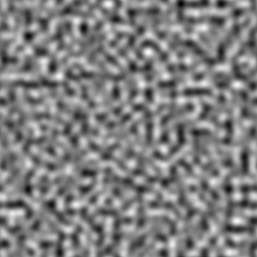

# パーリンノイズ

<table>
<tr style="border: 0;">
<td style="border: 0;" valign="top">

<table>
<tr style="border: 0;">
<td width="33.33%" style="border: 0;" valign="top">

{width="200px"}

<b>イン：</b> テクスチャジェネレーター> ノイズ

</td>
<td width="100.00%" style="border: 0;" valign="top">

## 説明

パーリンノイズ（グレースケール値の分布で広く使用されている）を生成します。

</td>
</tr>
</table>

## 出力

|  |  |
| --- | --- |
| <b>出力</b> *グレースケール* | 生成されるノイズをグレースケールビットマップとして指定します。 |

## パラメーター

|  |  |
| --- | --- |
| <b>スケール</b> 整数 | ノイズタイルの作成に使用するグリッドの区画。    値を大きくすると、より多くのタイルが描画され、ノイズが濃くなります。 |
| <b>障害</b>浮動小数 | ノイズの成分を置き換えます。    これを使用してノイズをアニメートできます。 |
| <b>速度の乱れ</b>浮動小数 | <b>Disorder</b>パラメーターによって適用されるディスプレイスメントの間隔を調整します。    これを使用して、ノイズをアニメートするときのディスプレイスメント速度をコントロールできます。 |
| <b>タイルのオフセット</b>浮動小数2 | ノイズのレンダリングに使用される無限平面の部分の位置を制御します。 |
| <b>非正方形の展開</b> ブーリアン | 非正方形の画像では、生成されたタイルを正方形に保ち、ノイズの生成量を画像の境界まで拡張します。 |

## 例

<table>
<tr style="border: 0;">
<td style="border: 0;" valign="top">

{zoomable="yes"}

</td>
<td style="border: 0;" valign="top">

{zoomable="yes"}

</td>
</tr>
</table>

</td>
<td style="border: 0;" valign="top">

</td>
<td style="border: 0;" valign="top">

</td>
</tr>
</table>
