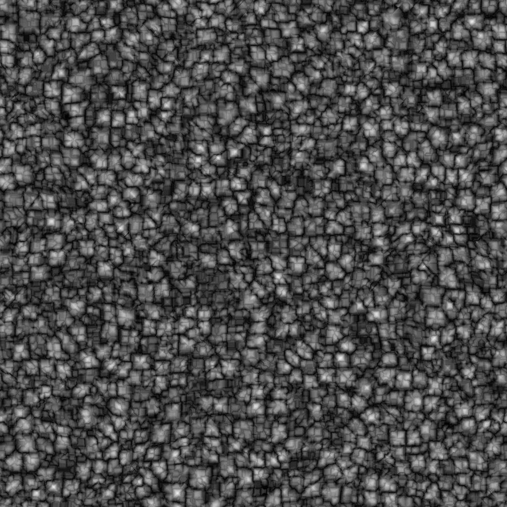

# ボロノイフラクタル

<table>
<tr style="border: 0;">
<td width="41.60%" style="border: 0;" valign="top">

{width="200px"}

**インチ：** *テクスチャジェネレーター* */ノイズ*

**中級**

</td>
<td width="58.30%" style="border: 0;" valign="top">

## 説明

**ボロノイフラクタル**&#x200B;ノードは、*Zダウンの正射投影*&#x200B;を使用して2D画像にマッピングされた&#x200B;*フラクタル* 3Dボロノイノイズを生成します。

このノードは、実際のノードではなく、[Cube GBuffers](../../../../../../compositing-graphs/nodes-reference-for-com/node-library/texture-generators/patterns/cube-3d-gbuffers/cube-3d-gbuffers.md)を入力としてテストできます（以下の図の例を参照）。

>[!WARNING]
>
> このノイズは、*GPUエンジンのみ* （**Direct**&#x200B;または&#x200B;**OpenGL**）で使用することを目的としています。 **ツール/エンジンの切り替え…**&#x200B;に移動するか、**F9**&#x200B;キーを押して、目的のエンジンを選択します。

</td>
</tr>
</table>

## パラメーター

* **反転** *ブール値*\
  出力イメージを反転します。
* **スケール** *浮動小数点*\
  フラクタルボロノイノイズのスケールを制御します。\
  *注意*: *任意の軸*&#x200B;で&#x200B;**タイル**&#x200B;が有効になっている場合、スケール調整は&#x200B;*段階的*&#x200B;です。 これは予期される動作です。
* **サイズ** *浮動小数点3*\
  **X**、**Y**&#x200B;および&#x200B;**Z**&#x200B;軸のフラクタルボロノイノイズのサイズを制御します。 値が均一でないと、*伸縮*&#x200B;効果が発生します。\
  *注意*: *任意の軸*&#x200B;で&#x200B;**タイル**&#x200B;が有効になっている場合、サイズ調整は&#x200B;*段階的*&#x200B;です。 これは予期される動作です。
* **オフセット** *浮動小数点3*\
  **X**、**Y**&#x200B;および&#x200B;**Z**&#x200B;軸のフラクタルボロノイノイズの&#x200B;*位置*&#x200B;にオフセットを適用します。
* **障害** *フロート3*\
  *ランダムオフセット*&#x200B;の強度は、**X**、**Y**&#x200B;および&#x200B;**Z**&#x200B;軸のノイズの各点に適用されます。
* **ゆがみの適用度** *浮動小数点*\
  フラクタルボロノイノイズに適用される&#x200B;*ワープエフェクト*&#x200B;の強度を制御します。
* **ゆがみスケール乗数** *浮動小数点*\
  **ゆがみの強さ**&#x200B;で制御されるワープ効果で使用される&#x200B;*変形パターン*&#x200B;のスケールを制御します。
* **最小レベル** *整数*\
  フラクタルパターンで使用される繰り返しの最小&#x200B;*レベル*&#x200B;です。 最小値/最大値の範囲が広いほど、より多くの周波数範囲で変化が生じる&#x200B;*豊富なパターン*&#x200B;になります。
* **最大レベル** *整数*\
  フラクタルパターンで使用される繰り返しの最大&#x200B;*レベル*&#x200B;です。 最小値/最大値の範囲が広いほど、より多くの周波数範囲で変化が生じる&#x200B;*豊富なパターン*&#x200B;になります。
* **粗さ** *浮動小数点*\
  フラクタルパターンの低&#x200B;*繰り返しレベル*&#x200B;の間の&#x200B;*バランス*&#x200B;を制御します。\
  *注意*: **0**&#x200B;の値を指定すると、出力は&#x200B;*行*&#x200B;ではなく、その後に他の低い値が続きます。 これは予期される動作です。\
  *注意2*：このパラメーターは、**描画モード**&#x200B;パラメーターが&#x200B;*追加*&#x200B;に設定されている場合にのみ使用できます。
* **空隙性** *浮動小数点*\
  適用されたフラクタルパターン&#x200B;*がスペースを塗りつぶす方法*&#x200B;を制御します。 *高い*&#x200B;値を指定すると、パターンのギャップが&#x200B;*少なくなり*、ノイズが&#x200B;*密度が高く*&#x200B;なります。
* **グローバルの不透明度** *浮動小数点*\
  フラクタルパーリンノイズ値の&#x200B;*範囲*&#x200B;を0から制御します。
* **角丸曲線** *浮動小数点*\
  ノイズの各点の周りに&#x200B;*勾配*&#x200B;を丸めて、*凸状*&#x200B;にします。\
  *注意*: **Style**&#x200B;パラメーターが&#x200B;*Edge*&#x200B;に設定されている場合、このパラメーターは使用できません。
* **距離スケール** *浮動小数点*\
  ノイズの各点の周囲の&#x200B;*グラデーションの距離*&#x200B;を調整します。
* **距離モード** *整数*\
  ノイズの各点の周囲の距離グラデーションを&#x200B;*計算*&#x200B;するようにメソッドを設定します：
  * *ユークリッド*
  * *マンハッタン*
  * *チェビシェフ*
  * *ミンコフスキー*
* **ミンコフスキー数** *浮動小数点*\
  ミンコフスキー距離の次数&#x200B;*p*。 距離グラデーションを象限に分割すると、この数値は次のように象限に影響します。
  * pは&#x200B;*正確* 1：直線
  * pは1より&#x200B;*低い*&#x200B;です：凹型
  * pは1より&#x200B;*大きい*&#x200B;です：凸\
    対象の値：\
    *- 1.0*:マンハッタンの距離\
    *- 2.0*:ユークリッドの距離\
    *– 無限大*:チェビシェフの距離\
    *注意*：このパラメーターは、**Distance Mode**&#x200B;パラメーターが&#x200B;*Minkowski*&#x200B;に設定されている場合にのみ使用できます。
* **描画モード** *整数*\
  スペース内の&#x200B;*重なり合うセル*&#x200B;の値をブレンドする方法を設定します：
  * *追加*：値を追加します
  * *最大*: *最高*&#x200B;の値を保持します
  * *分*: *最小値*&#x200B;の値を保持します
* **スタイル** *整数*&#x200B;フラクタルボロノイノイズが空間内の一連の点に基づいていることを考慮して、フラクタルボロノイノイズのデータ&#x200B;*レンダリング方法*&#x200B;を設定します。
  * *F1*：空間内の&#x200B;*最も近い点*&#x200B;までの距離
  * *F2*：空間内の&#x200B;*番目に近い点*&#x200B;までの距離
  * *F2-F1*- *F1\* F2 *-* F1/F2 *-*&#x200B;エッジ&#x200B;*:スペース内のノイズの各セル*&#x200B;間の*エッジ
  * *ランダムな色*:スペース内のノイズの各セルに&#x200B;*ランダムなフラットカラー*&#x200B;を割り当てます
* **エッジのThickness** *フロート*&#x200B;フラクタルボロノイノイズのセル間で検出されるエッジのThicknessを調整します。 X、Y、およびZ軸でエッジが検出されるため、セルの&#x200B;*深度*&#x200B;によっては、一部の厚みが他よりも速く増加する場合があります。\
  *注意*：このパラメーターは、**Style**&#x200B;パラメーターが&#x200B;*Edge*&#x200B;に設定されている場合にのみ使用できます。
* **ランダムカラーシードモード** *整数*\
  セルごとの色選択のランダムシードを&#x200B;*取得*&#x200B;する方法を設定します：
  * *グローバルランダムシード*:ノードによって継承されたシード&#x200B;*を使用します*
  * *手動シード*: *個別*&#x200B;シードを使用します\
    *注意*：このパラメーターは、**Style**&#x200B;パラメーターが&#x200B;*Random color*&#x200B;に設定されている場合にのみ使用できます。
* **ランダムカラーシード** *整数*\
  セルごとのカラー選択に使用する個別のランダムシード。\
  *注意*：このパラメーターを使用できるのは、**Style**&#x200B;パラメーターを&#x200B;*ランダムな色*&#x200B;に設定し、**ランダムカラーシードモード**&#x200B;パラメーターを&#x200B;*手動シード*&#x200B;に設定した場合のみです。
* **タイル表示を有効にする** *ブール値*\
  フラクタルボロノイノイズを調整して、結果のパターンがX、Y、Z軸で&#x200B;*繰り返す*&#x200B;ようにします。

## サンプル画像

<table>
<tr style="border: 0;">
<td style="border: 0;" valign="top">

{width="512px"}

</td>
<td style="border: 0;" valign="top">

{width="512px"}

</td>
<td style="border: 0;" valign="top">

{width="256px"}

</td>
<td style="border: 0;" valign="top">

{width="256px"}

</td>
<td style="border: 0;" valign="top">

{width="256px"}

</td>
<td style="border: 0;" valign="top">

{width="256px"}

</td>
<td style="border: 0;" valign="top">

{width="256px"}

</td>
<td style="border: 0;" valign="top">

{width="256px"}

</td>
</tr>
</table>
