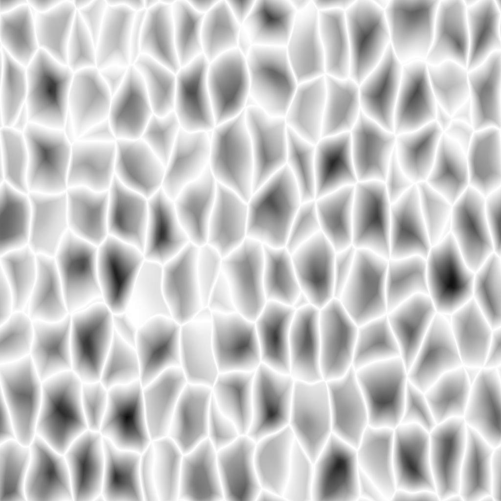

# ボロノイ

<table>
<tr style="border: 0;">
<td width="33.33%" style="border: 0;" valign="top">

{width="200px"}

<b>内：</b> テクスチャジェネレータ> ノイズ

</td>
<td width="100.00%" style="border: 0;" valign="top">

## 説明

**Voronoi**&#x200B;ノードは、*Zダウンの正射投影*&#x200B;を使用して2Dイメージにマップされた3D Voronoiノイズを生成します。

このノードは、実際のノードではなく、[Cube GBuffers](../../../../../../compositing-graphs/nodes-reference-for-com/node-library/texture-generators/patterns/cube-3d-gbuffers/cube-3d-gbuffers.md)を入力としてテストできます（以下の図の例を参照）。

>[!WARNING]
>
> このノイズは、*GPUエンジンのみ* （**Direct**&#x200B;または&#x200B;**OpenGL**）で使用することを目的としています。 **ツール/エンジンの切り替え…**&#x200B;に移動するか、**F9**&#x200B;キーを押して、目的のエンジンを選択します。

</td>
</tr>
</table>

## パラメーター

|  |  |
|:---|:---|
| <b>反転</b> <i>ブール値</i> | 出力イメージを反転します。 |
| <b>スケール</b> <i>フロート</i> | ボロノイノイズのスケールを制御します。  *注意*: *任意の軸*&#x200B;で&#x200B;**タイリング**&#x200B;が有効になっている場合、スケール調整は&#x200B;*ステップ*&#x200B;です。 これは予期される動作です。 |
| <b>サイズ</b> <i>浮動小数点3</i> | **X**、**Y**&#x200B;および&#x200B;**Z**&#x200B;軸のボロノイノイズのサイズを制御します。 値が均一でないと、*伸縮または収縮*&#x200B;効果が発生します。  *注意*: *任意の軸*&#x200B;で&#x200B;**タイリング**&#x200B;が有効になっている場合、サイズの調整は&#x200B;*段階的*&#x200B;になります。 これは予期される動作です。 |
| <b>オフセット</b> <i>浮動小数点3</i> | **X**、**Y**&#x200B;および&#x200B;**Z**&#x200B;軸のボロノイノイズの&#x200B;*位置*&#x200B;にオフセットを適用します。 |
| <b>障害</b> <i>浮動小数点3</i> | *ランダムオフセット*&#x200B;の強度は、**X**、**Y**&#x200B;および&#x200B;**Z**&#x200B;軸のノイズの各点に適用されます。 |
| <b>ゆがみの適用度</b> <i>フロート</i> | ボロノイノイズに適用される&#x200B;*ワープ効果*&#x200B;の強さを制御します。 |
| <b>ゆがみスケール乗数</b> <i>フロート</i> | **ゆがみの強さ**&#x200B;で制御されるワープ効果で使用される&#x200B;*変形パターン*&#x200B;のスケールを制御します。 |
| <b>角丸曲線</b> <i>フロート</i> | ノイズの各点の周りに&#x200B;*勾配*&#x200B;を丸めて&#x200B;*凸型*&#x200B;にします。  *注意*: **Style**&#x200B;パラメーターが&#x200B;*Edge*&#x200B;に設定されている場合、このパラメーターは使用できません。 |
| <b>距離スケール</b> <i>フロート</i> | ノイズの各点の周囲の&#x200B;*グラデーションの距離*&#x200B;を調整します。 |
| <b>距離モード</b> <i>整数</i> | ノイズの各点の周囲の&#x200B;*グラデーションの計算*&#x200B;に設定します：  - *ユークリッド* - *マンハッタン* - *チェビシェフ* - *ミンコフスキー* |
| <b>ミンコフスキー数</b> <i>フロート</i> | ミンコフスキー距離の次数&#x200B;*p*。 距離グラデーションを象限に分割すると、この数は次のように象限に影響します。  - pは&#x200B;*正確* 1：直線 - pは&#x200B;*低* 1より：凹 - pは&#x200B;*大* 1より：凸  対象の値：  - *1.0*:マンハッタン距離 - *2.0*:ユークリッド距離&#x200B;*無限大*:チェビシェフ距離&#x200B;  *注意*：このパラメーターは、**距離モード**&#x200B;パラメーターが&#x200B;*ミンコフスキー*&#x200B;に設定されている場合にのみ使用できます。  |
| <b>スタイル</b> <i>整数</i> | Voronoiノイズのデータ&#x200B;*をレンダリングするノイズを設定します。このメソッドは、空間内の一連のポイントに基づいています：  -* F1 *:スペース内の*&#x200B;最も近いポイント&#x200B;*までの距離 -* F2 *:スペース内の* 2番目に近いポイント&#x200B;*までの距離 -* F2-F1\*F2* - *f1/F2* - *エッジ*：空間内のノイズの各セル&#x200B;*の間にある*&#x200B;エッジ - *ランダムな色*: *ランダムなフラットな色*&#x200B;を空間内のノイズの各セルに割り当てます&#x200B;** * |
| <b>エッジThickness</b> <i>フロート</i> | ボロノイノイズのセル間で検出されるエッジのThicknessを調整します。 X、Y、およびZ軸で辺が検出されました。セルの&#x200B;*深度*&#x200B;によっては、一部の太さが他よりも速く増加する場合があります。  *注意*：このパラメーターは、**Style**&#x200B;パラメーターが&#x200B;*Edge*&#x200B;に設定されている場合にのみ使用できます。 |
| <b>ランダムカラーシードモード</b> <i>整数</i> | セルごとのカラー選択のランダムシードを&#x200B;*取得*&#x200B;するメソッドを設定します：   - *グローバルランダムシード*:ノードから継承&#x200B;*シードを使用します -*&#x200B;手動シード&#x200B;*:*&#x200B;個別&#x200B;*シードを使用します  *&#x200B;注意&#x200B;*：このパラメーターは、**Style**&#x200B;パラメーターが*&#x200B;ランダムカラー&#x200B;*に設定されている場合にのみ使用できます。* |
| <b>ランダムカラーシード</b> <i>整数</i> | セルごとのカラー選択に使用する個別のランダムシードです。  *注意*：このパラメーターは、**Style**&#x200B;パラメーターが&#x200B;*ランダムカラー*&#x200B;に設定されていて、**ランダムカラーシードモード**&#x200B;パラメーターが&#x200B;***手動シード***&#x200B;に設定されている場合にのみ使用できます。 |
| <b>非正方形拡張</b> <i>ブール値</i> | スカッシュとストレッチを非正方形の比率で補正できます。 |

## 例

<table style="margin-top: 32px; margin-bottom: 32px">
    <tr style="border: 0">
        <td style="border: 0; background: transparent">
            
        </td>
        <td style="border: 0; background: transparent">
            
        </td>
        <td style="border: 0; background: transparent">
            
        </td>
        <td style="border: 0; background: transparent">
            
        </td>
        <td style="border: 0; background: transparent">
            
        </td>
        <td style="border: 0; background: transparent">
            
        </td>
    </tr>
</table>
