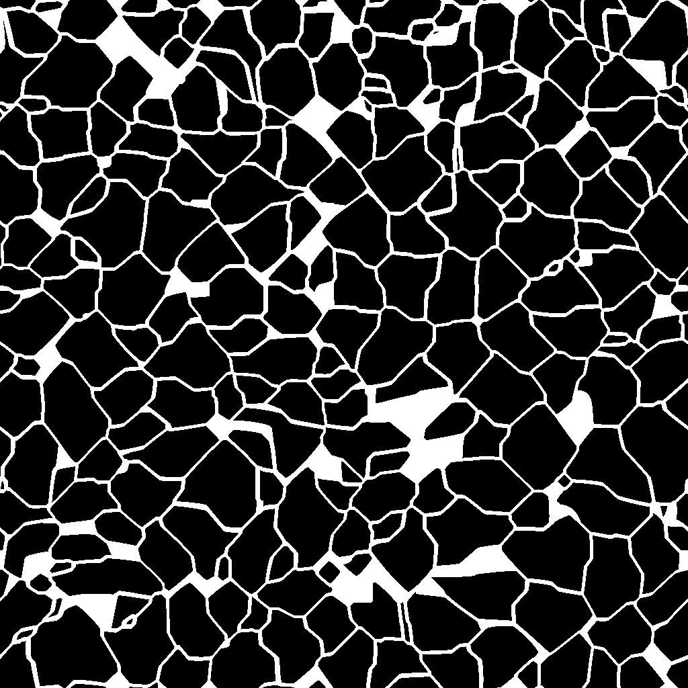

# ボロノイ

<table>
<tr style="border: 0;">
<td width="41.60%" style="border: 0;" valign="top">

{width="200px"}

**イン：** *テクスチャジェネレーター* */ノイズ*

**中級**

</td>
<td width="58.30%" style="border: 0;" valign="top">

## 説明

**Voronoi**&#x200B;ノードは、*Zダウン投影*&#x200B;を使用して2Dイメージにマップされた3D Voronoi ノイズを生成します。

このノードは、実際のノードではなく、[Cube GBuffers](../../../../../../compositing-graphs/nodes-reference-for-com/node-library/texture-generators/patterns/cube-3d-gbuffers/cube-3d-gbuffers.md)を入力としてテストできます（以下の図の例を参照）。

>[!WARNING]
>
> このノイズは、*GPU エンジンのみ* （例： **Direct**&#x200B;または&#x200B;**OpenGL**）で使用することを目的としています。 **ツール/エンジンの切り替え…**&#x200B;に移動するか、**F9**&#x200B;キーを押して、目的のエンジンを選択します。

</td>
</tr>
</table>

## パラメーター

* **反転** *ブーリアン*\
  出力イメージを反転します。
* **スケール** *浮動小数*\
  ボロノイノイズのスケールを制御します。\
  *注意*: **タイリング**&#x200B;が&#x200B;*任意の軸*&#x200B;で有効になっている場合、スケール調整は&#x200B;*段階的*&#x200B;です。 これは予期される動作です。
* **サイズ** *浮動小数3*\
  **X**、**Y**&#x200B;および&#x200B;**Z**&#x200B;軸のボロノイノイズのサイズを制御します。 値が均一でないと、*伸縮または収縮*&#x200B;効果が発生します。\
  *注意*: **タイリング**&#x200B;が&#x200B;*任意の軸*&#x200B;で有効になっている場合、サイズの調整は&#x200B;*段階的*&#x200B;です。 これは予期される動作です。
* **オフセット** *浮動小数3*\
  **X**、**Y**&#x200B;および&#x200B;**Z**&#x200B;軸のボロノイノイズの&#x200B;*position*&#x200B;にオフセットを適用します。
* **障害** *浮動小数3*\
  *ランダムオフセット*&#x200B;の強さは、**X**、**Y**&#x200B;および&#x200B;**Z**&#x200B;軸のノイズの各ポイントに適用されます。
* **ゆがみの強度** *浮動小数*\
  ボロノイノイズに適用される&#x200B;*ワープ効果*&#x200B;の強さを制御します。
* **ゆがみスケール乗数** *浮動小数点*\
  **ゆがみの強さ**&#x200B;で制御されるワープ効果で使用される&#x200B;*変形パターン*&#x200B;のスケールを制御します。
* **角丸カーブ** *浮動小数*\
  *勾配*&#x200B;をノイズの各点の周りに丸めて、*凸型*&#x200B;にします。\
  *注意* : **Style**&#x200B;パラメーターが&#x200B;*Edge*&#x200B;に設定されている場合、このパラメーターは使用できません。
* **距離スケール** *浮動小数点*\
  ノイズの各点の周囲の&#x200B;*グラデーションの距離*&#x200B;を調整します。
* **ディスタンスモード** *整数*\
  ノイズの各点の周囲の&#x200B;*距離グラデーションの計算*&#x200B;を行うように設定します：
  * *ユークリッド*
  * *マンハッタン*
  * *チェビシェフ*
  * *ミンコフスキー*
* **ミンコフスキー数** *浮動小数*\
  ミンコフスキー距離の次数&#x200B;*p*。 距離グラデーションを象限に分割すると、この数値は次のように象限に影響します。
  * pは&#x200B;*正確* 1：直線
  * pは1より&#x200B;*低い*&#x200B;です：凹型
  * pは1より&#x200B;*大きい*&#x200B;です：凸\
    対象の値：\
    *- 1.0*:マンハッタンの距離\
    *- 2.0*:ユークリッドの距離\
    *– 無限大*:チェビシェフの距離\
    *注意*：このパラメーターは、**Distance Mode**&#x200B;パラメーターが&#x200B;*Minkowski*&#x200B;に設定されている場合にのみ使用できます。
* **スタイル** *整数* Voronoi ノイズの&#x200B;*データのレンダリング*&#x200B;方法を設定します。ノイズは空間内の一連の点に基づいていることを考慮します。
  * *F1*：空間内の&#x200B;*最も近い点*&#x200B;までの距離
  * *F2*：空間内の&#x200B;*番目に近い点*&#x200B;までの距離
  * *F2-F1*- *F1\* F2 *-* F1/F2 *-*&#x200B;エッジ&#x200B;*:スペース内のノイズの各セル*&#x200B;の間の*エッジ
  * *ランダムな色*:スペース内のノイズの各セルに&#x200B;*ランダムなフラットカラー*&#x200B;を割り当てます
* **エッジのThickness** *浮動小数*&#x200B;ボロノイノイズのセル間で検出されるエッジのThicknessを調整します。 X、Y、およびZ軸でエッジが検出されるため、セルの&#x200B;*深度*&#x200B;によっては、一部の厚みが他よりも速く増加する場合があります。\
  *注意*：このパラメーターは、**Style**&#x200B;パラメーターが&#x200B;*Edge*&#x200B;に設定されている場合にのみ使用できます。
* **ランダムカラーシードモード** *整数*\
  セルごとのカラー選択のランダムシードを&#x200B;*取得*&#x200B;する方法を設定します：
  * *グローバルランダムシード*:ノードによって継承されたシード&#x200B;*を使用します*
  * *手動シード*: *個別*&#x200B;シードを使用します\
    *注意*：このパラメーターは、**Style**&#x200B;パラメーターが&#x200B;*Random color*&#x200B;に設定されている場合にのみ使用できます。
* **ランダムカラーシード** *整数*\
  セルごとのカラー選択に使用する必要がある不連続のランダムシードです。\
  *注意*：このパラメーターを使用できるのは、**Style**&#x200B;パラメーターを&#x200B;*ランダムな色*&#x200B;に設定し、**ランダムカラーシードモード**&#x200B;パラメーターを&#x200B;***手動シード***&#x200B;に設定した場合のみです。
* **非正方形拡張** *ブーリアン*\
  カボチャと伸縮の補正を非正方形の比率で有効にします。

## サンプル画像

<table>
<tr style="border: 0;">
<td style="border: 0;" valign="top">

{width="256px"}

</td>
<td style="border: 0;" valign="top">

{width="256px"}

</td>
<td style="border: 0;" valign="top">

{width="256px"}

</td>
<td style="border: 0;" valign="top">

{width="256px"}

</td>
<td style="border: 0;" valign="top">

{width="256px"}

</td>
<td style="border: 0;" valign="top">

{width="256px"}

</td>
</tr>
</table>
