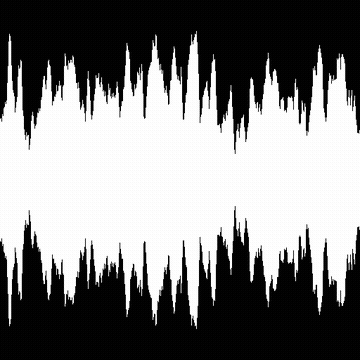

# 波形1

<table>
<tr style="border: 0;">
<td style="border: 0;" valign="top">

<table>
<tr style="border: 0;">
<td width="33.33%" style="border: 0;" valign="top">

{width="200px"}

<b>イン：</b> テクスチャジェネレーター> ノイズ

</td>
<td width="100.00%" style="border: 0;" valign="top">

## 説明

ユーザーが選択したパターンの水平方向の配置で、波形に似たシェイプにスタックされます。

</td>
</tr>
</table>

## 出力

|  |  |
| --- | --- |
| <b>出力</b> *グレースケール* | 生成されるノイズをグレースケールビットマップとして指定します。 |

## パラメーター

|  |  |
| --- | --- |
| <b>サンプル</b> 整数 | 波形を描くためにX軸に沿って配置されるパターンの量。値を小さくすると、段階的な外観になります。 |
| <b>関数</b>の整数 | 波形の描画に使用する関数。   これにより、各サンプルに配置されるパターンの垂直方向のサイズが制御されます。<ul data-preserve-html="true"> <li data-preserve-html="true"><i>値のノイズ:</i>値のランダムな分布</li> <li data-preserve-html="true"><i>コサイン：</i>値はコサイン関数の進行に従います</li> <li data-preserve-html="true"><i>カスタム関数：</i>ユーザーが作成した関数を使用して値を制御します</li> </ul> |
| <b>カスタム関数</b> 浮動小数 *&#39;関数&#39;が&#39;カスタム関数&#39;に設定されている場合に使用できます* | 各サンプルに配置されたパターンの垂直サイズを計算します。   使用可能な変数：<ul data-preserve-html="true"> <li data-preserve-html="true"><b>pos</b> (<i>float</i>) X軸上のパターンの位置です。 これは、パターンの選択に使用できます。</li> </ul> |
| <b>ラフネス</b>の浮動小数 | クリーンで滑らかな波形を、より粗く均等に分布した波形で補間します。    これは、ホワイトノイズに対してクリーンな信号と考えることができます。 |
| <b>スケール</b>整数 | 画像に表示される波形の水平方向の範囲です。 |
| <b>最小振幅</b>  浮動小数 | 波形の最小値（またはThickness）。 |
| <b>最大振幅</b>  浮動小数 | 波形の最大値（またはThickness）。 |
| <b>ノイズ</b>の浮動小数 | 波形にノイズを適用します。ノイズは、垂直スパンからランダムに差し引かれます。 |
| <b>位置</b>整数 | 画像内での波形の位置です。<ul data-preserve-html="true"> <li data-preserve-html="true"><i>中央：</i>原点は画像の垂直方向の中心です</li> <li data-preserve-html="true"><i>下：</i>原点は画像の下部です</li> </ul> |
| <b>パターン</b>整数 | 波形の各サンプルに配置されるパターン。 |
| <b>パターンバリエーション</b>の浮動小数 | 一部のパターンに使用できる追加の調整。 |
| <b>障害</b>浮動小数点 | 波形値を置き換えます。    これを使用してアニメーション化できます。 |
| <b>速度の乱れ</b>浮動小数点 | <b>Disorder</b>パラメーターによって適用されるディスプレイスメントの間隔を調整します。    これを使用して、波形をアニメーション化するときのディスプレイスメント速度を制御できます。 |

## 例

<table>
<tr style="border: 0;">
<td style="border: 0;" valign="top">

{zoomable="yes"}

</td>
<td style="border: 0;" valign="top">

</td>
</tr>
</table>

</td>
<td style="border: 0;" valign="top">

</td>
<td style="border: 0;" valign="top">

</td>
</tr>
</table>
