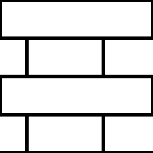

# レンガ2

<table>
<tr style="border: 0;">
<td style="border: 0;" valign="top">

{width="128px"}

## レンガ2

**イン：** *テクスチャジェネレーター**/パターン*

**単純**

</td>
<td style="border: 0;" valign="top">

## 説明

シンプルなレンガのパターン。詳細については、[レンガジェネレータ](../../../../../../compositing-graphs/nodes-reference-for-com/node-library/texture-generators/patterns/brick-generator/brick-generator.md)または[Tile Generator](../../../../../../compositing-graphs/nodes-reference-for-com/node-library/texture-generators/patterns/tile-generator/tile-generator.md)を参照してください。

## パラメーター

* **タイリング**: *1 - 16*\
  結果をタイルする回数を設定します。
* **エッジの滑らかさ**: *0.0 ～ 1.0*&#x200B;粗いエッジと滑らかなエッジのブレンド。
* **間隔の幅**: *0.0 ～ 1.0*&#x200B;間隔（間隔サイズ）を設定します。
* **非正方形拡張**: *False/True*\
  スカッシュとストレッチを非正方形の比率で補正できます。

## サンプル画像

</td>
</tr>
</table>
