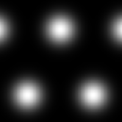

# ガウス2

<table>
<tr style="border: 0;">
<td style="border: 0;" valign="top">

{width="128px"}

## ガウス2

**イン：** *テクスチャジェネレーター**/パターン*

**単純**

</td>
<td style="border: 0;" valign="top">

## 説明

単純なガウスの塗りパターン。

## パラメーター

* **タイリング**: *1 - 16*\
  結果をタイルする回数を設定します。
* **非正方形拡張**: *False/True*\
  スカッシュとストレッチを非正方形の比率で補正できます。

## サンプル画像

</td>
</tr>
</table>
