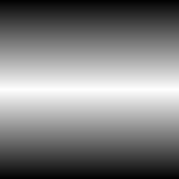

# 線形グラデーション3

<table>
<tr style="border: 0;">
<td width="33.33%" style="border: 0;" valign="top">

<b>イン：</b>テクスチャジェネレーター>パターン

</td>
<td width="100.00%" style="border: 0;" valign="top">

## 説明

最も高度な線形グラデーション。 [線形グラデーション2](../../../../../../compositing-graphs/nodes-reference-for-com/node-library/texture-generators/patterns/gradient-linear-2/gradient-linear-2.md)の丸みを帯びたパイプのようなプロファイルの代わりに、このノードはシャープな直線の勾配を返し、さらに中間点をさらに制御します。

</td>
</tr>
</table>

## パラメーター

|  |  |
|:---|:---|
| <b>タイル表示</b> <i>1 - 16</i> | 結果をタイルする回数を設定します。 |
| <b>位置</b> <i>0.0 - 1.0</i> | グラデーションの中点または頂点の位置を設定します。 |
| <b>回転</b> <i>0, 90°</i> | 方向を左右から上下に、またはその逆に変更します。 |

## 例

<table style="margin-top: 32px; margin-bottom: 32px">
    <tr style="border: 0">
        <td style="border: 0; background: transparent">
            
        </td>
    </tr>
</table>
