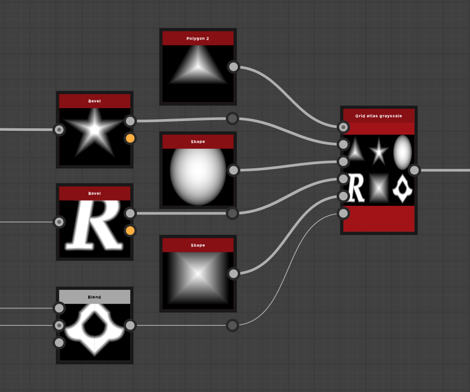

# グリッドアトラスグレースケール

<table>
<tr style="border: 0;">
<td width="33.33%" style="border: 0;" valign="top">

<b>イン：</b>ジェネレーター>パターン

</td>
<td width="100.00%" style="border: 0;" valign="top">

## 説明

XYサイズを調整できるグリッドに、最大16個のグレースケール画像をパックします。 出力アトラス画像は、[シェイプスプラッタv2](../shape-splatter-v2/shape-splatter-v2.md)または[シェイプスプラッタマッパーグレースケール](../shape-splatter-v2-mapper-grayscale/shape-splatter-v2-mapper-grayscale.md)ノードからサンプリングできます。

[グリッドアトラスの色](../grid-atlas-color/grid-atlas-color.md)も参照してください。

</td>
</tr>
</table>

## 入力

|                             |                                |
|:----------------------------|:-------------------------------|
| <b>入力1</b> *グレースケール* | グレースケール画像入力#1。 |
| <b>入力2</b> *グレースケール* | グレースケール画像入力#2。 |
| <b>入力3</b> *グレースケール* | グレースケール画像入力#3。 |
| <b>入力4</b> *グレースケール* | グレースケール画像入力#4。 |
| <b>入力5</b> *グレースケール* | グレースケール画像入力#5。 |
| <b>入力6</b> *グレースケール* | グレースケール画像入力#6。 |
| <b>入力7</b> *グレースケール* | グレースケール画像入力#7。 |
| <b>入力8</b> *グレースケール* | グレースケール画像入力#8。 |
| <b>入力9</b> *グレースケール* | グレースケール画像入力#9。 |
| <b>入力10</b> *グレースケール* | グレースケール画像入力#10。 |
| <b>入力11</b> *グレースケール* | グレースケール画像入力#11。 |
| <b>入力12</b> *グレースケール* | グレースケール画像入力#12。 |
| <b>入力13</b> *グレースケール* | グレースケール画像入力#13。 |
| <b>入力14</b> *グレースケール* | グレースケール画像入力#14。 |
| <b>入力15</b> *グレースケール* | グレースケール画像入力#15。 |
| <b>入力16</b> *グレースケール* | グレースケール画像入力#16。 |

## 出力

|               |                                  |
|:--------------|:---------------------------------|
| <b>出力</b> | 出力グレースケールグリッドアトラス。 |

## パラメーター

|                                   |                                                                                                                                                                                                                                                                                                                                                                    |
|:----------------------------------|:-------------------------------------------------------------------------------------------------------------------------------------------------------------------------------------------------------------------------------------------------------------------------------------------------------------------------------------------------------------------|
| <b>グリッドサイズX</b> *整数* | X軸上のグリッドのサイズです。 X軸上で圧縮される画像の数です。 |
| <b>グリッドサイズY</b> *整数* | Y軸上のグリッドのサイズです。 Y軸上の画像のパック数です。 |
| <b>出力サイズモード</b> *整数* | ノードの&#39;Output size&#39;基本パラメーターに従って出力イメージのサイズを定義する方法：   - <b>手動： </b>サイズをそのまま使用してください。 - <b>自動比率： </b>イメージサイズを最小限にするには、グリッドサイズに応じてイメージ比率を調整してください。 3つの行または列を使用する非正方形グリッドに対して変形が発生します(例： (3, 2)、(4, 3) |

## 例

 
<i>グラフのコンテキストのグリッドアトラスグレースケールノード</i>
